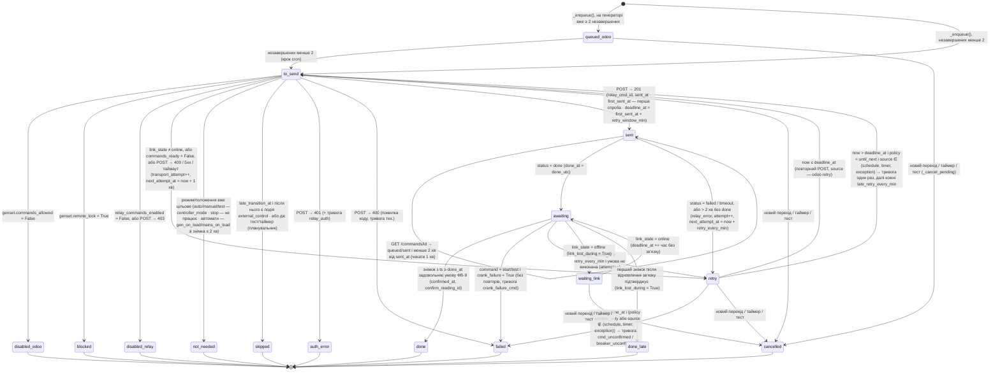
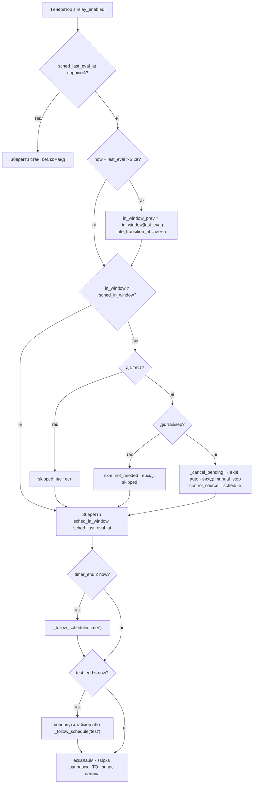
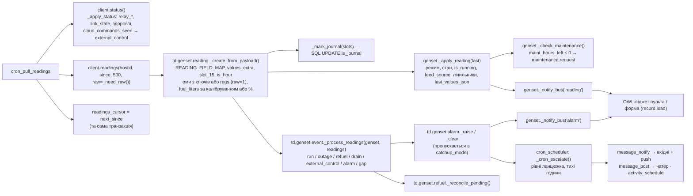

# ТЕХНІЧНЕ РІШЕННЯ «Генератор SmartGen: моніторинг і керування в Odoo (erp.todo.ltd)»

+38 (073) 871 53 13
sale@todo.ltd
www.todo.ltd

Від 07.10.2026 року

**Статус:** Погодження клієнта
**Файл:** `smartgen/ТР_SmartGen_генератор.md` · версія 1.2 (07.10.2026: ТР погоджено замовником, заповнено розділ АРХІТЕКТУРА, точкові уточнення розділу 2 для узгодження з архітектурою; версія 1.1 — відповіді замовника на відкриті питання; 07.10 (вечір) — уточнення замовника: оми датчиків і калібрування рівня палива — ФВ-25, ФВ-31, AC-68, AC-69, оцінка +6 год; 07.10 (ніч) — уточнення інтеграції, прийняті менеджером, лише текст без перенумерації: 1.2, ФВ-7, ФВ-9, ФВ-12, ФВ-13, ФВ-15, ФВ-41, ФВ-43, сценарій 9, AC-07, AC-09, AC-18, AC-19, AC-23, AC-25, AC-26, AC-35, AC-38, AC-59, AC-61, AC-66, 2.2, 2.3.8, 2.3.9, 2.6.3, 2.8.1–2.8.4, 2.8.6, 2.9, А.10; перелік — `SPEC.md` §4.1)

## ЗАГАЛЬНА ІНФОРМАЦІЯ

| **Найменування модифікації** | Генератор SmartGen: моніторинг і керування в Odoo (модуль `td_genset`) |
| --- | --- |
| **Проект** | ToDo — внутрішня інфраструктура офісу (об'єкт «Садова вулиця», Київ) |
| **Система** | Odoo 18.0 Enterprise, база `o18-artel-prod`, https://erp.todo.ltd (перевірено 07.10.2026, читанням) |
| **Замовник/Ініціатор:** | Тимур Нижниковський (ToDo) |
| **Номер запиту** | _уточнити: окремої задачі в erp.todo.ltd на 07.10.2026 не знайдено (пошук за «генератор», «SmartGen», «Садов», «ретранслятор»); завести задачу і вписати ID_ |
| **Прийнято** | Т. Нижниковський, 07.10.2026 (погоджено в чаті, розробку розпочато) |
| **Підготовлено** | Т. Нижниковський (чернетка за матеріалами `smartgen/`) |
| **Відповідальний архітектор** | ToDo (архітектура підготовлена 07.10.2026) |

### Оцінка (люд./год.)

| **Етап робіт** | **План люд./год.** | **Коментар** |
| --- | --- | --- |
| Технічне рішення | 24 | цей документ, розбіжності мокап ↔ API, звірка з Odoo 18, QA-перевірка |
| Архітектура | 16 | ARCHITECTURE: структура таблиць, індекси, стан-машина команд, схема cron, контракт OWL-віджета, план міграцій |
| Розробка | 218 | Етап 1 «Моніторинг» 82 · Етап 2 «Керування» 84 · Етап 3 «Паливо і ТО» 52 (деталізація — таблиця нижче) |
| Тестування | 64 | unit-тести з моками HTTP (16), сценарії локального стенду 409/403/401/перезапуск (16), приймання AC-01…AC-67 на клоні проду (24), мобільна верстка (8) |
| Інструкція | 8 | тест-сценарій приймання ТК-01…ТК-14, інструкція для чергового/адміністратора |
| **Всього** | **330** | діапазон 291–371 год; розбивка за етапами дозволяє здавати і вводити в експлуатацію поетапно |

**Деталізація «Розробка» за блоками:**

| Блок | Етап | Год. | Що входить |
| --- | --- | --- | --- |
| Р1. Каркас модуля, групи, довідники, налаштування (`td.genset.config`, `res.config.settings` для токена) | 1 | 12 | моделі, `ir.model.access.csv`, категорія і групи з `implied_ids`, меню, переклади `uk_UA` |
| Р2. Клієнт ретранслятора (`td.genset.relay.client`) | 1 | 10 | `requests` з таймаутами, маскування токена, маппінг кодів 400/401/403/404/409/5xx, обробка `null`/відсутніх ключів |
| Р3. Забір показань, курсор, ідемпотентність, журнал 15 хв, стан генератора | 1 | 24 | cron з `_notify_progress`, `td.genset.reading` з усіма значеннями знімка полями (ФВ-41), оми датчиків з ключів `*_sensor_ohm` або з сирого образу (`raw=1`, AC-68), шаблон експорту «Усі значення», оновлення полів `td.genset`, чистка |
| Р4. Моніторинг зв'язку і здоров'я ретранслятора | 1 | 8 | `/status`, стан «онлайн/немає зв'язку», тривоги `registers_known=0`, API недоступний, 401 |
| Р5. Події з показань (робота, відключення, заправка, падіння рівня, керування не з Odoo, тривоги контролера) | 1 | 16 | стан-машина подій, догон без лавини тривог |
| Р6. Тривоги, ескалація, тихі години, «Прийняв» | 1 | 12 | `td.genset.alarm`, `message_notify`, cron ескалації, правила за рівнями |
| Р7. Подання етапу 1 (форма без пульта, списки, graph/pivot, календар подій, kanban), мобільна верстка | 1 | — | входить у Р1–Р6 (по 2–3 год на блок) |
| Р8. Команди: `td.genset.command`, стан-машина, транспортні повтори, підтвердження, блокування, «Ручний + Стоп», автомати-перемикачі | 2 | 28 | cron команд, `_trigger()`, SELECT … FOR UPDATE SKIP LOCKED |
| Р9. Розклад, дні-винятки, таймер, тест, переходи, пропущені переходи, DST | 2 | 20 | cron планувальника, алгоритм «лише на переходах» |
| Р10. Пульт — OWL-віджет (кнопки, прилади, схема живлення, таймер), майстер підтвердження, живе оновлення через bus | 2 | 28 | `registry.category("view_widgets")`, `bus.listener.mixin`, адаптивна верстка 390 px |
| Р11. Подання етапу 2 (вкладки Розклад/Тривоги/Журнал команд, майстри) | 2 | 8 | форми, кнопки, умовна видимість за групами |
| Р12. Паливо: каністри, місця, рух запасу, заправки, звірка з рівнем, витрата, калібрування датчика | 3 | 32 | моделі, майстри «Заправити генератор»/«Надходження», kanban каністр, KPI, таблиця калібрування Ом → L і перерахунок історії (AC-69) |
| Р13. ТО по мотогодинах: обладнання `maintenance.equipment`, авто-заявки, закриття, підрядник | 3 | 12 | команда ТО, стадії, поле підрядника на `maintenance.request` |
| Р14. Аналітика: KPI на формі, стандартні графіки/зведені таблиці | 3 | 8 | обчислювані поля за 7/30 днів, дії graph/pivot з фільтрами |

**Допущення, від яких залежить оцінка:** один генератор і один ретранслятор; команди на робочому контролері тестуються лише після дозволу замовника; поведінка `stop` на контролері буде уточнена до етапу 2 (не впливає на оцінку, лише на правило підтвердження); дашборд «Аналітика» у стилі мокапа (KPI-плитки, стрічка 7 днів) робиться стандартними graph/pivot — окремий OWL-дашборд оцінюється додатково (≈ 24 год) і в оцінку не входить.

### Джерела і пріоритет

1. `smartgen/relay_api.md` — довідник API ретранслятора (відповіді зняті з робочого API 07.10.2026) — істина щодо інтеграції.
2. `smartgen/TODO.md`, розділ 1 — рішення замовника від 07.10.2026 — мають пріоритет над розділом 9 `relay_api.md` (06.10.2026); кожна розбіжність зафіксована в розділі 1.5.
3. `smartgen/mockup_odoo_genset.html` (мокап v17) та знімки `smartgen/shots/*.png` — інтерфейс і поведінка; словники `FIELD`/`COLS` — чернетка моделі даних.
4. `smartgen/README.md`, `smartgen/protocol_coverage.md` — покриття протоколів HGM6100N v1.7 і CMM366A/B v1.2.
5. Стандарти ToDo: шаблон «Технічне рішення» (AIKB, «3. Шаблони»), приклади ТР (ДЕМЗ, Трител, Хайтек), скіли `tr-usecases-acceptance`, `tr-odoo-tech-design`, `tr-review`.
6. Офіційна документація і вихідний код Odoo **18.0** (версія проду; посилання біля кожного пункту розділу 2).

---

# ТЕХНІЧНЕ РІШЕННЯ

## 1. Загальний опис процесу та функціональні вимоги.

### 1.1. Загальний опис процесу

**AS-IS.** Біля офісу ToDo («Садова вулиця», Київ) стоїть дизель-генератор з контролером SmartGen HGM6120N і модулем зв'язку CMM366B-4G. Керують ним із застосунку SmartGen або кнопками на панелі. Між модулем і хмарою SmartGen стоїть ретранслятор (VPS, `gen-relay.todo.ltd`), який збирає всі показання контролера, зберігає знімки 180 днів і віддає їх через HTTPS API; через той самий API можна надсилати команди (перевірено на живому контролері 07.10.2026: `manual`, `auto` — ~3 с). В Odoo (erp.todo.ltd) генератора немає: немає історії, аналітики, журналу команд, сповіщень і розкладу; хто і коли перемикав режим — не фіксується; паливо і ТО обліковуються поза системою.

**TO-BE.** Новий модуль `td_genset` («Генератори») в Odoo 18 Enterprise на erp.todo.ltd:

- кожну хвилину забирає знімки показань з ретранслятора (pull, лише вихідний HTTPS з сервера Odoo на `gen-relay.todo.ltd:443`), зберігає їх, веде журнал кожні 15 хв за київським часом, будує події (робота, відключення мережі, заправка, падіння рівня, керування не з Odoo, тривоги контролера, зв'язок) і тривоги з ескалацією в Odoo (Обговорення/вхідні, мобільний застосунок);
- керує генератором через розклад (дні тижня + вікна, дні-винятки), таймер «робота поза графіком» (один на генератор, до 24 год), кнопки пульта (Авто, Ручний, Пуск, Стоп, Тест, автомати генератора/мережі) — команди надсилаються **лише на переходах**, кожна команда підтверджується за показаннями, повторюється й за потреби породжує тривогу; журнал команд обов'язковий;
- веде облік палива (бак за датчиком контролера в літрах, каністри, рух запасу, заправки зі звіркою за рівнем, витрата) і технічне обслуговування за мотогодинами через стандартний модуль «Обслуговування» (`maintenance`, встановлений на проді);
- має три ролі (Співробітник / Адміністратор / Тех. адміністратор), мобільну верстку і живе оновлення форми.

**Схема взаємодії:**

```
Контролер HGM6120N ──USB── CMM366B-4G ──4G──▶ ретранслятор gen-relay.todo.ltd ──▶ хмара SmartGen
                                                       │  SQLite: знімки (180 днів), команди
                                                       ▼  HTTPS API (Bearer-токен)
                                     Odoo 18 erp.todo.ltd — модуль td_genset (pull раз на 1 хв; POST команд)
                                       ├─ td.genset.reading / event / alarm / command / schedule …
                                       ├─ сповіщення: чатер, вхідні, мобільний застосунок (mail_mobile)
                                       └─ maintenance.equipment / maintenance.request (ТО)
```

**Ключові обмеження, які формують рішення:**

1. Ретранслятор нічого не надсилає в Odoo сам; вхідний доступ до Odoo не потрібен. Усе — pull з cron.
2. Модуль зв'язку читає з контролера лише сигнали 0–77 і регістри 0–44, 46–55 — інших ключів у `values` **не буде** (розділ 1.5).
3. Генератором керує не лише Odoo (застосунок SmartGen, кнопки панелі). Фактичний режим — завжди з показань; Odoo не є єдиним джерелом команд.
4. `done` у ретрансляторі означає лише «контролер прийняв запис Modbus», а не «режим змінився»: підтвердження — лише за знімком з `time_utc ≥ done_utc`.
5. Планувальник Odoo (`ir.cron`) працює з точністю до 1 хвилини; у воркерах не можна чекати (`sleep`) — усе, що триває довше за секунди, робиться стан-машиною із записом стану в базу і коротким кроком cron.
6. Усі часи в API — секунди Unix UTC; розклад — за Europe/Kyiv з переходами на літній/зимовий час.

### 1.2. Терміни та семантика даних (обов'язкові правила інтерпретації)

| Термін / поле | Правило |
| --- | --- |
| Знімок (reading) | Один запис `/readings` з унікальним `id` ретранслятора (`relay_id`). Пишеться раз на 60 с, поки модуль на зв'язку, і одразу при зміні стану (`reason = change`). |
| Є мережа | `values.mains_normal == true` (сигнал 65). **Не** `mains_status` — при нормальній мережі контролер віддає 2. Немає мережі — `mains_blackout` (69) або `mains_fault` (64). |
| Живлення об'єкта | `mains_on_load` (6) → «Мережа»; `gen_on_load` (7) → «Генератор»; обидва `false` → «Немає живлення». |
| Режим контролера | `values.controller_mode`: `auto` / `manual` / `stop` / `test`; `null` — невідомо або горить кілька сигналів → показувати «невідомо», команд не підтверджувати. |
| Генератор працює | `genset_status ∉ {0, 15}` **або** `speed > 0`. Код 14 «Stop Failure» — аварія і теж «працює». Під навантаженням — `gen_on_load == true`. |
| Стан агрегату | `genset_status` 0–15 за таблицею 5.3 `relay_api.md`; у статусбарі групується: 0 → «Очікування», 1–7 → «Пуск», 8–9 → «Робота», 10–15 → «Зупинка» (14 — червоним «Невдала зупинка»). |
| Норма для зупиненого генератора | `gen_undervoltage` (74) і `gen_underfrequency` (76) = `true`, коли генератор стоїть — **не** аварія. Тривоги за сигналами «генератор не в нормі» (`gen_overvoltage` 73, `gen_undervoltage` 74, `gen_overfrequency` 75, `gen_underfrequency` 76, `gen_overcurrent` 77) — лише коли агрегат вийшов на режим: `genset_status ∈ {8, 9}` (уточнення 07.10, ніч: під час пуску і зупинки напруга й частота ще/уже не в нормі). |
| `null` у `values` | «Немає даних» (контролер віддає 32766, на панелі «###») — показувати «немає даних», у журнал писати NULL, у графіки не включати. |
| Немає ключа у `values` | Значення невідоме (наприклад, одразу після запуску ретранслятора) — обробляти як «немає даних»; поля «з версії 1.1.3» (`*_sensor_ohm`, `controller_sw/hw`) можуть бути відсутні — модуль працює без них; оми датчиків до 1.1.3 беруться з сирого образу `regs` (`raw=1`, регістри 18/20/22 ÷ 10). |
| `ats_status` | Код без розшифровки (у протоколі таблиці немає) — показувати як число. |
| `aux_input_2`, `aux_output_4` | Показувати як «Вхід 2» / «Вихід 4» без інтерпретації. |
| Пропуск між знімками | Не було зв'язку (або не працював ретранслятор). **Не інтерполювати**; на графіках — розрив; у подіях — «немає даних». |
| Паливо в літрах | Без калібрування: `fuel_level` (%) × об'єм бака (поле генератора, типово 145 L, не константа); роздільна здатність 1 % ≈ 1,45 L. З калібруванням датчика (таблиця Ом → L на генераторі, ФВ-31) і наявним `fuel_sensor_ohm` у знімку — лінійна інтерполяція за омами (≈ 0,1–0,2 L); джерело фіксується в `fuel_source`. Усі пороги по паливу — у літрах, ≥ 2 % об'єму бака. |
| Оми датчиків | Контролер віддає рівень палива і регістром 21 (%), і регістром 22 (опір датчика, крок 0,1 Ом; 188,6 Ом ≈ 94 %); так само 17 °C / 18 Ом і 19 kPa / 20 Ом. Оми точніші за відсотки приблизно на порядок. У знімку — `fuel_sensor_ohm`, `water_temp_sensor_ohm`, `oil_pressure_sensor_ohm`: з ключів `*_sensor_ohm` (ретранслятор ≥ 1.1.3) або з сирого образу `GET /readings?raw=1` → `regs["22"\|"18"\|"20"] / 10` (1.1.1). Оми температури і тиску — лише показ і діагностика обриву датчика; логіка на них не будується. |
| Час | У базі — UTC (`fields.Datetime`); у подання — у часовому поясі користувача; розклад і журнал 15 хв — за `Europe/Kyiv`. |

### 1.3. Ролі (рішення замовника від 07.10.2026, пріоритет над §9 `relay_api.md` «керують усі»)

| Роль (група Odoo) | Що бачить | Що може |
| --- | --- | --- |
| **Співробітник** (`td_genset.group_user`) | усе: генератори, показання, аналітику, події, заправку, налаштування (лише перегляд) | робота поза графіком: запустити таймер, подовжити (+15/+30/+60), зупинити; «Прийняв» на тривозі — лише якщо є в ланцюжку ескалації |
| **Адміністратор** (`td_genset.group_admin`, включає Співробітника) | те саме | + розклад і дні-винятки; + «Заправка»: заправити генератор, надходження палива, каністри, місця зберігання |
| **Тех. адміністратор** (`td_genset.group_tech`, включає Адміністратора) | те саме | + пульт (Авто, Ручний, Пуск, Стоп, Тест), автомати генератора і мережі; + заявки ТО; + налаштування модуля, генератори, ланцюжок ескалації; «Прийняв» завжди |
| **Системний адміністратор Odoo** (`base.group_system`) | стандартні Налаштування | лише він вводить/змінює адресу ретранслятора і токен (стандартний механізм `res.config.settings` → `ir.config_parameter`) |

Генератори видно всім без record rules (рішення 1.3). Матриця дій — розділ 2.5.

### 1.4. Функціональні вимоги

Нумерація ФВ-N наскрізна; кожна вимога має сценарій та/або критерій приймання (розділ «Сценарії використання та критерії приймання») і технічне втілення (розділ 2).

#### А. Генератори і підключення

**ФВ-1. Картка генератора.** Довідник генераторів (`td.genset`): назва, адреса, відповідальний, модель контролера (HGM6120N; HGM6110N — як варіант довідника), номінальна потужність (kW), об'єм бака (L), тип палива, регламент ТО (перше ТО через N мотогодин, далі кожні M мотогодин або K місяців), ідентифікатор модуля `hostid`, перемикач «Опитувати ретранслятор». Один генератор на старті (рішення 1.10), структура — для кількох.

**ФВ-2. Підключення до ретранслятора.** Адреса API і токен зберігаються в системних параметрах (`td_genset.relay_url`, `td_genset.relay_token`) і вводяться вручну на проді системним адміністратором у стандартних Налаштуваннях; у коді, репозиторії, логах, повідомленнях і текстах помилок токена немає. Кнопка «Перевірити зв'язок» у картці генератора викликає `GET /status` і показує версію ретранслятора, стан модуля, `commands_ready`.

#### Б. Показання і стан

**ФВ-3. Забір показань.** Раз на хвилину cron забирає `GET /readings?since=<курсор>&limit=500` сторінками до вичерпання; кожен знімок зберігається один раз (унікальний `relay_id`); курсор зберігається в тій самій транзакції, що й знімки; мережева помилка/5xx — вихід без зміни курсору, наступний запуск продовжує. Після простою Odoo (години, тижні) модуль «доганяє» історію без лавини тривог: тривоги створюються лише за **поточним** станом після догону, події — за всією послідовністю.

**ФВ-4. Поточний стан генератора.** На картці: режим контролера, хто керує (розклад / таймер / вручну / тест / не з Odoo), наступна подія, зв'язок (онлайн + «N с тому» / немає зв'язку з часу), живлення об'єкта, прилади (оберти, потужність, тиск оливи, температура ОР), параметри (струми, напруги генератора і мережі, частоти, cos φ, АКБ, D+, паливо в літрах), лічильники (мотогодини, пуски, kWh), активні тривоги. Значення `null` → «немає даних».

**ФВ-5. Вкладка «Поточні дані».** Усі ключі `values` останнього знімка: значення 03H з підписами й одиницями, сигнали 01H згруповано (режим/стан, аварійні зупинки, попередження, мережа, генератор, входи/виходи) з підсвіткою активних; блок «Ретранслятор» (версія, `snapshot_sec`, `commands_enabled`, `registers_known`/`coils_known`, останні команди з хмари SmartGen). Ключів, яких немає в API, не показуємо (розділ 1.5).

**ФВ-6. Журнал показань кожні 15 хв.** Запис для списку «Показання» — останній знімок кожного 15-хвилинного інтервалу за київським часом; інші знімки зберігаються як «сирі» (для подій/графіків) і чистяться за терміном (ФВ-40). Список: час, режим, агрегат, живлення, напруги/частоти, струми, P, cos φ, навантаження, оберти, ОР, олива, паливо (L), АКБ, D+, мотогодини, пуски, kWh, тривоги; фільтри «Сьогодні», «Генератор працював», «Без мережі», «Погодинно»; групування; graph/pivot.

**ФВ-7. Зв'язок.** Раз на хвилину `GET /status`: `devices[].online == false` довше N хв (налаштування, типово 3) або немає нових знімків довше N хв → стан «Немає зв'язку», пульт недоступний, останні дані показуються сірими з часом; через M хв (типово 10) після переходу в «Немає зв'язку» (тобто ≈ N + M хв без даних; уточнення 07.10, ніч) — тривога «немає зв'язку» за ланцюжком; відновлення → подія і повідомлення «зв'язок відновлено (не було даних N хв)». API недоступний (таймаут/5xx) довше 10 хв або `401` → тривога тех. адміністратору.

**ФВ-8. Здоров'я ретранслятора.** `registers_known == 0` або `coils_known == 0`, `409 command format not learned yet`, `relay.commands_enabled == false` при спробі команди → тривога тех. адміністратору з текстом причини; у картці — бейдж «керування вимкнено на ретрансляторі».

#### В. Команди і пульт

**ФВ-9. Перелік команд і підтвердження.** Команди: `auto`, `manual`, `start`, `stop`, `test`, `gen_close_open`, `mains_close_open`. Кожна команда вважається виконаною лише після підтвердження за знімком з `time_utc ≥ done_utc`:

| Команда | Підтвердження |
| --- | --- |
| `auto` / `manual` / `test` | `controller_mode` дорівнює цільовому; `manual` у пакеті «Ручний + Стоп» — `controller_mode ∈ {manual, stop}`: «Стоп» переводить контролер у режим Стоп (уточнення 07.10, ніч) |
| `stop` | контролер почав зупинку: `genset_status ∈ {10, 11, 12, 13, 15, 0}` (охолодження → зупинка) і `gen_on_load == false` — навантаження знято. Рішення замовника 07.10: на «Стоп» контролер переходить в охолодження і знімає навантаження, тому чекати повної зупинки для підтвердження не потрібно. Повна зупинка (`genset_status ∈ {0, 15}`, `speed == 0`) — подія «Зупинено»; `14 Stop Failure` — критична тривога «Генератор не зупинився». Для вже зупиненого `stop` не надсилається (ФВ-10) |
| `start` | знімок зі станом `genset_status ∈ {5, 6, 7, 8, 9}` — двигун запустився (уточнення 07.10, ніч); оберти `speed > 0` — додаткова ознака, якщо відомі, але самі пуск не підтверджують: під час прокрутки (стан 3) оберти вже є; поки триває пуск (стани 1–4), повторного POST немає; якщо після `done_utc` з'явився `crank_failure` — `failed` без повторів + тривога «Невдалий пуск» |
| `gen_close_open` / `mains_close_open` | `gen_on_load` / `mains_on_load` змінилися на цільове значення |

**ФВ-10. Команди лише на переходах.** Перед надсиланням: якщо `controller_mode` уже дорівнює цільовому — команду не надсилати, у журнал — «Не потрібно: уже <режим>» (уточнення 08.10, приймання: «уже цільовий» — лише за знімком, не старшим за 2 хв і новішим за виконання попередньої команди генератора, збереженим або `GET /latest`; інакше команда чекає наступного кроку). Якщо режим змінили ззовні (застосунок SmartGen, панель) — Odoo **не повертає** його примусово: фіксує подію «Керування не з Odoo», ставить «Керує: не з Odoo» до наступного переходу розкладу/таймера.

**ФВ-11. Два рівні повторів.** *Транспортний*: `409` (модуль перепідключається кожні 4–25 хв на кілька секунд), `5xx`, таймаут → повтор щохвилини (крок cron) протягом вікна (типово 10 хв). *Підтвердження*: `done`, але режим не змінився → повтор кожні N хв (типово 2) протягом M хв (типово 10), потім тривога «Команда «X» не підтверджена за M хв» рівня «критична» з текстом: джерело, час, кількість спроб, «перевірте на об'єкті: режим панелі, блокування, зв'язок модуля з контролером». `failed`/`timeout` від ретранслятора (`controller rejected`, `no reply in 30 s`, `modem disconnected`, `relay restarted`) → повтор у межах того самого вікна. `403` → не повторювати, стан «Керування вимкнено», тривога тех. адміністратору. `401` → стан «Помилка доступу», тривога тех. адміністратору.

**ФВ-12. Зв'язок зник до підтвердження.** Команда переходить у стан «Очікує: немає зв'язку»; після відновлення зв'язку перевіряється за першим новим знімком: підтверджено → «Підтверджено після відновлення зв'язку», ні → повтори за ФВ-11 (вікно відлічується заново від відновлення). Уточнення 07.10 (ніч): повтор підтвердження — лише за знімком з `time_utc ≥ done_utc`, що показує незмінений режим; поки таких знімків немає — чекати (зв'язок є, а знімка немає довше «повтор кожні N хв» + 1 хв — повтор); на час «Немає зв'язку» вікно повторів подовжується.

**ФВ-13. Черга ретранслятора.** Не більше 5 команд у черзі; Odoo тримає не більше 2 незавершених POST на генератор («Ручний + Стоп»); нові команди чекають завершення попередніх (стан «У черзі Odoo»). «Ручний + Стоп» — два POST поспіль без очікування (ретранслятор виконує по черзі з паузою 2 с); порядок — `manual`, потім `stop`. Уточнення 07.10 (ніч): мета пакета — режим Стоп: обидві команди надсилаються і тоді, коли режим уже Ручний (`manual` підтверджується режимом Ручний або Стоп); якщо контролер уже в режимі Стоп — обидві «Не потрібно: уже Стоп».

**ФВ-14. Автомати — перемикачі.** `gen_close_open`/`mains_close_open` — перемикачі, не «замкнути/розімкнути». Перед надсиланням Odoo читає поточне положення з останнього знімка (не старшого за 2 хв; інакше — чекати свіжого знімка); надсилає лише якщо положення не цільове. Кнопки «Замкнути/Розімкнути» показують цільову дію за поточним станом; доступні лише тех. адміністратору; підтвердження з явним попередженням: розімкнення мережі без генератора під навантаженням — «об'єкт залишиться без живлення»; замикання автомата генератора — лише коли генератор у стані 8–9. Невдала зміна положення → тривога критична.

**ФВ-15. Блокування керування.** Пульт, розклад і таймер не надсилають команд, якщо `remote_lock == true` (сигнал 4) — команда отримує стан «Не надіслано: блокування» і повідомлення в чатер; якщо немає зв'язку — ручні команди пульта недоступні (кнопки неактивні з поясненням), команди розкладу/таймера — за ФВ-21; якщо `commands_ready == false` — не надсилати, транспортний повтор. Уточнення 07.10 (ніч): при `remote_lock` і при вимкненому перемикачі «Дозволити команди» плитки пульта лишаються активними для тех. адміністратора з банером-поясненням, а команда записується в журнал зі станом «Не надіслано: блокування» / «Не надіслано: команди вимкнено в Odoo»; неактивні плитки — без зв'язку, без прав і коли керування вимкнено на ретрансляторі (`403`, `commands_enabled = false`).

**ФВ-16. Журнал команд.** Кожна спроба — запис: час, хто (користувач або «Розклад»/«Таймер»/«Тест»/«Система»), джерело, команда, `id` команди ретранслятора, стан ретранслятора, кількість спроб, результат (підтверджено / не потрібно / пропущено (діє таймер/тест) / повтор / не підтверджено — тривога / очікує: немає зв'язку / підтверджено після відновлення / блокування / керування вимкнено / помилка доступу), час підтвердження. У `requested_by` ретранслятора передається ім'я й id користувача Odoo (або «Odoo: розклад»), у `source` — `odoo:button` / `odoo:schedule` / `odoo:timer` / `odoo:test` / `odoo:exception` / `odoo:retry`.

**ФВ-17. Пульт.** Плитки Авто / Пуск / Ручний / Стоп / Тест з підсвіткою поточного стану, стан агрегату і відлік затримки (`genset_status_delay`), прилади, схема живлення (генератор — навантаження — мережа) з положенням автоматів і кнопками автоматів. Кожна команда — через діалог підтвердження з текстом наслідку (Пуск/Тест — попередження «переконайтеся, що біля генератора немає людей»; Стоп — «генератор зніме навантаження, перейде в охолодження і зупиниться; навантаження повернеться на мережу», а якщо мережі немає (`mains_normal = false`) — «Мережі немає: після зупинки офіс залишиться без живлення», AC-67); Ручний/Пуск/Стоп під час таймера — попередження «таймер буде скасовано»; «Пуск», коли контролер не в режимі Ручний, — пакет «Ручний» + «Пуск» з попередженням «Генератор буде переведено в Ручний і запущено» (уточнення 08.10, приймання). Для Співробітника й Адміністратора пульт у режимі перегляду з поясненням «пульт і автомати доступні тех. адміністратору». Живе оновлення без перезавантаження сторінки.

#### Г. Розклад, таймер, тест, винятки

**ФВ-18. Розклад.** Рядки «день тижня, початок → Авто, кінець → Ручний + Стоп, увімкнено»; кілька рядків на день; час київський; кінець пізніше за початок; рядки одного дня не перетинаються. На початку вікна — `auto`; наприкінці — `manual` + `stop`. Команди надсилаються лише на переходах (ФВ-10); у межах вікна режим не контролюється примусово.

**ФВ-19. Дні-винятки.** Дата + дія «Не запускати» (вікон у цей день немає) або «Інший час» (одне вікно початок–кінець замість розкладу); діє лише на цю дату; одна дата — один запис; минулі дати архівуються автоматично через 30 днів.

**ФВ-20. Таймер «Робота поза графіком».** Один на генератор; тривалість від 1 хв до 24 год; «Застосувати» → `auto`, «Керує: таймер»; після закінчення → стан за розкладом (у вікні → нічого не надсилати, якщо вже Авто; поза вікном → Ручний + Стоп). +15/+30/+60 хв — без зупинки, не більше 24 год від поточного моменту; «Зупинити таймер» → стан за розкладом. Таймер важливіший за кінець вікна (кінець пропускається із записом «Пропущено: діє таймер»); початок вікна під час таймера — команда не потрібна (запис «Не потрібно: уже Авто за таймером»). Ручний/Пуск/Стоп з пульта скасовують таймер; Тест лише призупиняє. Подовжити або зупинити може будь-який Співробітник; у картці видно хто і коли запустив. Уточнення 08.10 (приймання): «Зупинити таймер» спершу обробляє перехід розкладу, що вже настав, поки таймер діє (запис «Пропущено: діє таймер»), потім — стан за розкладом; перехід і повернення до розкладу не дублюють незавершену команду з тією самою метою, створену ≤ 5 хв тому (запис «Не потрібно» — «Вже надіслано: <джерело>»).

**ФВ-21. Перехід, пропущений без зв'язку або під час простою Odoo.** Команда переходу створюється в момент переходу (або при першому запуску планувальника після простою, якщо перехід припав на простій) і повторюється за ФВ-11. Політика після вікна повторів — **«Повторювати до наступного переходу»** (рішення замовника 07.10): тривога через 10 хв, далі спроба кожні 5 хв, доки не підтвердиться або не настане наступний перехід/таймер, який її скасовує. Налаштування «Пропущений перехід» лишає запасний варіант «Лише вікно повторів» (після тривоги не повторювати). Перед запізнілим надсиланням діє ФВ-10: якщо після часу переходу зафіксовано «Керування не з Odoo» — команду пропустити з записом і повідомленням. Відмінність від мокапа («черга на ретрансляторі») — розділ 1.5.

**ФВ-22. Тест.** Кнопка «Тест» питає: «З навантаженням» (`test`, 05H 0002) або «Без навантаження» (`manual` + `start`). Через N хв (налаштування, типово 3) система повертає генератор у режим за таймером або розкладом (Авто — `auto`; поза розкладом — `manual` + `stop`). Під час тесту початок/кінець вікна пропускаються із записом «Пропущено: іде тест», таймер призупинений (його кінець переноситься на час завершення тесту, якщо він настав під час тесту). Авто або Стоп з пульта завершують тест раніше.

**ФВ-23. Наступна подія.** На картці — найближча дія: «сьогодні, 18:30 → Ручний + Стоп», «кінець таймера о 21:00 → далі за розкладом», «кінець тесту о 10:05 → далі Авто за розкладом», «Розклад вимкнено».

**ФВ-24. Час і перехід на літній/зимовий час.** Розклад — локальний київський час; у ніч переходу на літній час (03:00→04:00) переходи, що припадають на неіснуючу годину, виконуються о 04:00; у ніч переходу на зимовий (04:00→03:00) повторна година не породжує повторних команд (один перехід на календарний день-час).

#### Д. Події

**ФВ-25. Автоматичні події з показань** (список «Події», фільтри за типом, календар, графік):

| Подія | Початок / кінець | Атрибути |
| --- | --- | --- |
| Робота генератора | `is_running` false→true / true→false | тривалість, kWh (приріст `energy_kwh`), пік kW (max `active_power`), паливо ΔL, кількість спроб пуску (переходи 3→4), мінімальна АКБ під час прокрутки (status 3), причина (зникла мережа / тест / кнопка / не з Odoo), підсумок |
| Відключення мережі | `mains_normal` true→false / false→true | тривалість, вид (`mains_blackout` / `mains_loss_phase` / `mains_fault`), чи підхопив генератор (перекриття з «Робота»), час до підхоплення |
| Заправка | стрибок `fuel_liters` угору ≥ порога (типово 10 L) між сусідніми знімками або в межах 10 хв | ΔL, рівень до/після, зв'язок із записом заправки (ФВ-33) |
| Падіння рівня без роботи | зниження ≥ порога (типово 10 L) за ≤ 60 хв при `is_running == false` | ΔL, рівень до/після; + тривога «можливий злив» |
| Керування не з Odoo | зміна `controller_mode` / автоматів без активної команди Odoo з цим цільовим станом, або новий запис у `cloud_commands_seen` | старий → новий режим, джерело (застосунок SmartGen / панель) |
| Тривога контролера | фронт сигналів 01H (0–2, 8–39, 44–47, 64, 66–68, 73, 75, 77) | сигнал, рівень, тривалість |
| Зв'язок | немає зв'язку / відновлено | тривалість |
| Немає даних | пропуск між знімками > 3 хв | тривалість (для графіків; тривог не породжує — вони з ФВ-7) |

Усі події і пороги по паливу (заправка, падіння без роботи, низький рівень, звірка заправки) працюють із `fuel_liters` незалежно від джерела літрів (`fuel_source`: за датчиком (Ом) / за % контролера — ФВ-31). Події відкриті, поки тривають (кінець порожній). Під час догону історії події створюються заднім числом, тривоги — лише за поточним станом (ФВ-3).

**ФВ-26. Надійність пуску.** Для кожної події «Робота»: кількість спроб (переходи `genset_status` 3 «Crank» → 4 «Crank Rest»), найнижча `battery_v` серед знімків зі станом 3. Точність: знімки за зміною стану робляться при зміні `genset_status`, тому просадка АКБ ловиться лише знімками на межах станів (а не мінімум під час усієї прокрутки) — показник орієнтовний, що зазначається в підказці поля. Порада «ймовірно слабшає АКБ» — якщо за період напруга при прокрутці впала більше ніж на 0,8 V і були повторні пуски.

#### Е. Тривоги і сповіщення

**ФВ-27. Тривоги.** Рівні: критична / попередження / інформація. Джерела і рівень за замовчуванням:

| Рівень | Джерела |
| --- | --- |
| Критична | `common_shutdown` і аварійні зупинки (9–23, 44–47), `stop_failure_warning` / стан 14, `emergency_stop`, падіння рівня без роботи, команда не підтверджена, зміна автомата не підтверджена, немає зв'язку (після M хв), `crank_failure` |
| Попередження | `common_warning`, попередження 24–39 (крім 27), `remote_lock`, низький рівень палива (`low_fuel_warning` або < 20 % бака), АКБ (`battery_undervoltage_warning`, `charging_failure_warning`), датчики (`null`/обрив), ТО (термін за мотогодинами), мінімальний запас у каністрах, здоров'я ретранслятора (ФВ-8), керування не з Odoo |
| Інформація | пуски, зупинки, заправки, зв'язок відновлено, команди підтверджено, початок/кінець таймера і тесту |

Тривога активна, доки умова триває; знімається автоматично при зникненні умови (запис «знято о …»); «Прийняв» зупиняє ескалацію, але не знімає тривогу.

**ФВ-28. Сповіщення лише в Odoo** (рішення 1.7): повідомлення в чатері генератора (підписники), сповіщення у вхідні («Обговорення») адресатам ланцюжка і push у мобільний застосунок (на проді `mail_mobile` з увімкненим OCN). Email, Telegram, SMS — поза межами цього ТР.

**ФВ-29. Ланцюжок ескалації.** Один на всі генератори (рішення 1.8): рівні «1. Черговий (одразу) → 2. Відповідальний (через 10 хв) → 3. Керівник (через 30 хв)» — користувачі й затримки налаштовуються; рівень N сповіщається, якщо тривогу ще не прийняли. Правила за рівнем тривоги: «Завжди» / «Крім тихих годин» / «Лише в чаті»; тихі години (типово 22:00–07:00): усе, що не «Завжди», надсилається о кінці тихих годин. Кнопка «Надіслати тестове сповіщення».

**ФВ-30. «Прийняв».** Доступно учаснику ланцюжка або тех. адміністратору (рішення 1.1); фіксує хто/коли, зупиняє ескалацію, пише в чатер.

#### Ж. Паливо

**ФВ-31. Бак, оми датчика і калібрування.** Контролер віддає рівень палива двома регістрами: 21 — відсотки (ціле; крива датчика задана в налаштуваннях контролера) і 22 — опір датчика в омах з кроком 0,1 Ом (зараз 188,6 Ом ≈ 94 %); оми точніші за відсотки приблизно на порядок. Аналогічно 17 °C / 18 Ом (температура) і 19 kPa / 20 Ом (тиск оливи). Кожен знімок зберігає `fuel_sensor_ohm`, `water_temp_sensor_ohm`, `oil_pressure_sensor_ohm` (float, 0,1 Ом): з ключів `*_sensor_ohm`, якщо вони є (ретранслятор ≥ 1.1.3), інакше з сирого образу `GET /readings?raw=1` → `regs["22"\|"18"\|"20"] / 10`; поки `relay.version` у `/status` < 1.1.3 (або ключів немає) забір іде з `raw=1`, з образу беруться лише ці три регістри, решта `regs`/`coils` не зберігається; налаштування «Читати сирі регістри»: auto / так / ні (типово auto). Оми показуються на картці («Поточні дані», поруч із % і літрами) і в експорті. **Літри:** за замовчуванням `fuel_level` % × об'єм бака генератора. Необов'язкова таблиця калібрування датчика на генераторі (`td.genset.fuel.calibration`: точки Ом → L, ≥ 2 точки, монотонна, лінійна інтерполяція, за межами — крайні точки; `@api.constrains` на монотонність): якщо вона заповнена і в знімку є `fuel_sensor_ohm`, `fuel_liters` рахується за нею (роздільна здатність ≈ 0,1–0,2 L), інакше за %; поле `fuel_source` у знімку і на картці: «за датчиком (Ом)» / «за % контролера». Усі події і пороги (заправка, падіння без роботи, низький рівень, звірка заправки) працюють з `fuel_liters` незалежно від джерела; допуск звірки заправки при калібруванні — 1 L замість 2 % бака. Кнопка «Перерахувати літри» перераховує історію за новою таблицею. Таблицю заповнює тех. адміністратор із кривої датчика контролера (Ом → % × об'єм бака) або за реальними заправками (Ом до/після відомого об'єму) — підказка в UI. Оми температури і тиску зберігаються і показуються (діагностика обриву датчика — сигнали 44/45 і 35/36 уже є), логіка на них не будується. KPI «У баку», «У каністрах», «Разом», «вистачить на ≈ N год» (за середньою витратою за 30 днів), «Мінімальний запас» (налаштування; нижче — бейдж «бракує N L» і попередження).

**ФВ-32. Каністри і місця зберігання.** Каністра — запис: номер (К-01…), об'єм (10 або 20 L, довільний 5–60), скільки в ній, місце зберігання; стан (повна/часткова/порожня) обчислюється. Операції: надходження (нові каністри або наповнення наявних; ціна за літр, постачальник), коригування (інвентаризація), переміщення, списання. Кожна операція — запис у «Рух запасу» із залишком. Місце не можна видалити, поки в ньому є каністри.

**ФВ-33. Заправка генератора.** Майстер: з каністр (обрати, заливаються часткові першими, не більше вільного об'єму бака) або з іншого джерела (назва, літри). Запис заправки отримує стан «Очікує показання»; система звіряє з подією «Заправка» (ФВ-25) у вікні ±2 год: підтверджено (різниця ≤ 2 % бака; при заповненому калібруванні — ≤ 1 L) / «за рівнем: +N L» (різниця більша — показати обидва) / «не підтверджено» (стрибка не було протягом 2 год → попередження). Ознака контролера «зміна >5 %» (03H 0100) недоступна — замінена порівнянням рівнів (розділ 1.5).

**ФВ-34. Витрата.** За період 7/30 днів: витрачено L (сума ΔL подій «Робота»), L/год, L/kWh, L на добу, вартість за останньою ціною; графік витрати по днях; точність — ±1 % бака на подію.

#### З. Технічне обслуговування

**ФВ-35. ТО за мотогодинами в Odoo.** Лічильник ТО контролера (`maint_h/maint_min` = 0, вимкнений) не використовується. Odoo рахує: перше ТО через `maint_first_hours` (типово 30) мотогодин від пуску в експлуатацію, далі кожні `maint_interval_hours` (типово 250) **або** `maint_interval_months` (типово 12) — що настане раніше; відлік від мотогодин/дати закриття попередньої заявки. На картці: мотогодини, «До ТО: N год» / «прострочено на N год», прогрес.

**ФВ-36. Заявки ТО.** Генератор — обладнання стандартного модуля «Обслуговування» (`maintenance.equipment`, створюється автоматично при створенні генератора, категорія «Генератори», команда ТО «Генератори»). Коли «До ТО» ≤ 0 — Odoo створює превентивну заявку `maintenance.request` з переліком робіт (заміна оливи, фільтри, АКБ і клеми …), виконавець — відповідальний за об'єкт, **підрядник — контакт у заявці** (поле `td_partner_id`, рішення 1.4), + попередження «Термін ТО». Закриття заявки (стадія з ознакою «виконано») фіксує мотогодини і дату → новий відлік. Повторна заявка не створюється, поки є відкрита. Smart-кнопка «До ТО» відкриває заявки обладнання.

#### И. Налаштування

**ФВ-37. Налаштування модуля** (окрема сторінка «Генератори → Налаштування», редагує тех. адміністратор; інші — перегляд): пульт (повтор кожні N хв протягом M хв; тривалість тесту), зв'язок (зв'язок втрачено через N хв; тривога через M хв; політика пропущеного переходу), журнал (інтервал 15 хв; термін зберігання сирих знімків), сповіщення (правила за рівнями; тихі години; ланцюжок), паливо (мінімальний запас; об'єм каністри; ціна і постачальник за замовчуванням; поріг заправки; поріг «падіння без роботи»; місця зберігання), ТО (регламент за замовчуванням для нових генераторів). Адреса і токен ретранслятора — лише у стандартних Налаштуваннях Odoo (системний адміністратор).

**ФВ-38. Ролі.** Групи застосунку «Генератори» призначаються стандартно (Налаштування → Користувачі); сторінка «Ролі доступу» мокапа замінюється таблицею прав у цьому ТР і стандартним екраном користувача.

#### К. Безпека, експлуатація, дані

**ФВ-39. Безпека.** Токен — тільки в `ir.config_parameter` (доступ `base.group_system`), ніколи не в логах/повідомленнях/винятках (клієнт маскує заголовок `Authorization`); TLS-перевірка не вимикається; таймаут 15–20 с; Odoo нічого не слухає ззовні (жодного контролера/маршруту для ретранслятора; лише pull). Будь-яка команда — реальна дія на генераторі офісу: кнопки — за правами, з підтвердженням і журналом.

**ФВ-40. Зберігання й чистка.** Сирі знімки (усі, крім журнальних 15-хвилинних і `reason = change`) зберігаються N днів (типово 90), далі видаляються щоденним cron; журнальні записи, `change`-знімки, події, тривоги, команди — безстроково. Кожен знімок зберігає всі відомі значення типізованими полями (ФВ-41); JSON — лише для ключів, яких модуль ще не знає (нові версії ретранслятора).

**ФВ-41. Експорт.** Стандартний експорт списків «Показання» та «Події». Рішення замовника 07.10: у «Показаннях» доступні **всі значення знімка** — кожен регістр 03H і сигнал 01H з `values` (`relay_api.md` 5.1–5.2, ~125 полів) окремою колонкою з українською назвою й одиницями (у т. ч. оми датчиків `fuel_sensor_ohm`, `water_temp_sensor_ohm`, `oil_pressure_sensor_ohm` і `fuel_source`), сигнали — `True`/`False` (стандартний експорт Odoo; уточнення 07.10, ніч); готовий шаблон експорту «Усі значення» (`ir.exports`). Ключі, яких модуль ще не знає (нові версії ретранслятора), — колонка «Інші значення (JSON)».

**ФВ-42. Порожні стани.** Новий генератор без підключення — картка з підказкою «вкажіть hostid і ввімкніть опитування»; підключено, але даних ще немає — «очікуємо перший знімок»; немає каністр / немає заявок ТО — стандартні порожні списки з кнопкою створення.

**ФВ-43. Мобільна верстка.** Усі сторінки працюють у мобільному застосунку Odoo і в браузері на 390 px без горизонтальної прокрутки сторінки (прокручуються лише таблиці); на телефоні пульт показується першим. Мобільне компонування вмикається за стандартним порогом Odoo — ширина ≤ 767,98 px (уточнення 07.10, ніч).

**ФВ-44. Розробка і тестування.** На робочий API — лише читання, поки замовник не дозволить інше; команди — лише на локальному стенді (`relay_api.md` §10); unit-тести з моками HTTP, сценарії стенду (409, 403, 401, перезапуск ретранслятора, відновлення курсору), приймання за AC; план впровадження і відкату (розділ 2.15).

### 1.5. Розбіжності й рішення (мокап ↔ API ↔ рішення замовника)

Пріоритет: рішення замовника 07.10 (`TODO.md` §1) > `relay_api.md` (факти API) > §9 `relay_api.md` (06.10) > мокап v17. Колонка «Рішення»: **З API** — беремо як є; **Odoo** — обчислюємо в Odoo; **Прибрати** — елемент мокапа вилучається; **Ретранслятор** — потрібне доопрацювання ретранслятора (розділ 1.6), до нього елемент не показується.

| # | Елемент мокапа / вимога | Що є в API / рішення замовника | Рішення в ТР |
| --- | --- | --- | --- |
| 1 | Хто керує: §9 «керують усі співробітники» | Рішення 07.10: три групи; Співробітник — лише таймер | **Odoo**: групи `group_user/admin/tech` (ФВ-38, розділ 2.2); пульт і автомати — тех. адміністратор |
| 2 | «Прийняв» лише для учасника ланцюжка (мокап до v15) | Рішення 1.1: учасник ланцюжка **або** тех. адміністратор | **Odoo** (ФВ-30) |
| 3 | Налаштування для не-тех | Рішення 1.2: видно, лише читання | **Odoo**: власна сторінка налаштувань `td.genset.config` (не `res.config.settings`, бо вона доступна лише адміністраторам Odoo), адреса/токен — у стандартних Налаштуваннях (розділи 2.3.8, 2.3.10) |
| 4 | Видимість генераторів | Рішення 1.3: усі бачать усе | без record rules |
| 5 | Підрядник ТО | Рішення 1.4: контакт у заявці | поле `td_partner_id` на `maintenance.request` (ФВ-36) |
| 6 | Таймер | Рішення 1.5: один на генератор, до 24 год, подовжити/зупинити може будь-хто | ФВ-20 |
| 7 | Тест | Рішення 1.6: з навантаженням (`test`) або без (`manual`+`start`), через 3 хв повернення | ФВ-22 |
| 8 | Канали сповіщень (мокап: «Telegram, SMS — пізніше») | Рішення 1.7: лише Odoo | ФВ-28; інші канали — поза межами |
| 9 | Ланцюжок | Рішення 1.8: один на всі генератори | ФВ-29 |
| 10 | Каністри 20 L | Рішення 1.9: бувають і 10 L | ФВ-32, об'єм 5–60 L |
| 11 | Повтор непідтвердженої команди (§9: «повтор до 10 хв») | мокап v17: кожні 2 хв протягом 10 хв (налаштування) | ФВ-11: два рівні повторів; крок cron 1 хв, тому транспортний повтор — щохвилини (замість 10–30 с за §7.3 `relay_api.md`) |
| 12 | Команди без зв'язку: мокап — «у чергу на ретрансляторі / пропустити» | Ретранслятор не має черги для відключеного модуля: POST → `409 modem is not connected`; `/status.commands_ready=false` → не надсилати | **Odoo** (ФВ-21): запис команди зі станом «очікує» + повтори; політика «до наступного переходу» — рішення замовника 07.10 |
| 13 | Фазові кути 92–97 | модуль читає регістри 0–44, 46–55 — ключів немає | **Прибрати** з «Поточних даних» |
| 14 | Облік палива контролером 98–112, ознака «зміна >5 %» (03H 0100) як підтвердження заправки/зливу | ключів немає | **Прибрати**; заправку/злив визначаємо в Odoo порівнянням `fuel_level` між знімками з порогами (ФВ-25, ФВ-33); позначка «підтверджено контролером» → «підтверджено за рівнем» |
| 15 | Модель контролера (регістр 71), годинник 72–78, дата ПЗ 79–81, сумісна версія 113–114, точні I/P/Q/S 2500–2511 | ключів немає | **Прибрати**; модель контролера — довідникове поле картки; час — `relay.time_utc` і `ts` знімка; струми/потужності — регістри 14–16, 26–29, 52–55 |
| 16 | Опори датчиків (18/20/22), версії ПЗ/апаратна (50/51) | ключі `*_sensor_ohm`, `controller_sw/hw` з'являться у 1.1.3 (на сервері 1.1.1); оми вже доступні сирими через `GET /readings?raw=1` (`regs["22"] = 1886` → 188,6 Ом) | **Odoo** (рішення 07.10, вечір): оми зберігаються в кожному знімку — з ключів, якщо є, інакше з `regs` ÷ 10; літри — за калібруванням Ом → L, якщо таблиця заповнена (ФВ-31, AC-68, AC-69); версії ПЗ — показувати, якщо ключ є |
| 17 | Сигнал 78 `scheduled_not_run`; сигнали серії N 54, 62, 63, 70, 71, 79 | 78–79 поза діапазоном модуля; 54/62/63/70/71 ретранслятор не розшифровує | **Ретранслятор** (п. 1.6-3); до того не показуються |
| 18 | Входи модуля CMM366B (AccessAlarm, FireAlarm, AlarmInput, InhbitRemote): тривоги, блокування пульта | в API відсутні | **Ретранслятор** (п. 1.6-2); блокування пульта — лише за `remote_lock` (сигнал 4) |
| 19 | GPS/координати модуля | в API немає; GPS шле нереальні координати | **Прибрати**; адреса — текстове поле |
| 20 | Картка модуля: hostname, moduletype, порт/швидкість, online/offline rate, data_mode, пароль модуля, «що опитуємо» | в API немає (крім `hostid`, `online`, `seconds_since_seen`, `long_connection`) | **Прибрати** з налаштувань генератора; лишаються `hostid` і довідкове текстове поле «Підключення модуля (примітка)»; технічні дані ретранслятора показуються з `/status` лише для читання |
| 21 | Налаштування «Зв'язок з модулями»: адреса liveData/historic, передача за замовчуванням, синхронізація часу | конфігурація ретранслятора/хмари, не Odoo | **Прибрати**; блок «Ретранслятор» у «Поточних даних» показує `relay.*`, `config.*` з `/status` |
| 22 | «Зв'язок втрачено, якщо немає даних довше 3 хв» | `online` ретранслятора = повідомлення за 90 с; знімки раз на 60 с | **Odoo** (ФВ-7): `online=false` ≥ N хв (типово 3) **або** немає знімків ≥ N хв; тривога через M хв (типово 10, §8.2 `relay_api.md`; у мокапі 5 — беремо 10, налаштовується) |
| 23 | «До ТО» з лічильника контролера (03H 0030–0031), стадія заявки «Перевірка лічильника», «скинути лічильник на панелі» | лічильник = 0 (вимкнений), скидання по протоколу неможливе | **Odoo** (ФВ-35/36): ТО за `run_hours`; стадія «Перевірка лічильника» **прибирається**; пункт чек-листа «скинути лічильник» — довідковий |
| 24 | «Пуски і стан АКБ»: спроби й просадка АКБ | знімки за зміною `genset_status`; постійні знімки раз на 60 с | **Odoo** (ФВ-26) з позначкою точності «за знімками на межах станів» |
| 25 | Аналітика: KPI-плитки, стрічка «наявність живлення за 7 днів» | — | Етап 1: стандартні graph/pivot на подіях і показаннях (ФВ-6, ФВ-25, ФВ-34); KPI — обчислювані поля на картці (вкладка «Аналітика»); OWL-дашборд у стилі мокапа — варіант поза оцінкою (розділ «Варіанти рішення») |
| 26 | Підтвердження `stop` | §11 `relay_api.md`: поведінка контролера після Manual→Stop не перевірена | Рішення 07.10: на «Стоп» контролер переходить в охолодження і знімає навантаження → підтвердження за початком зупинки і `gen_on_load=false` (ФВ-9); на стенді/об'єкті при запуску етапу 2 — лише перевірка |
| 27 | Таблиця «Користувачі» на сторінці «Ролі доступу» | — | стандартний екран Налаштування → Користувачі (ФВ-38) |
| 28 | Режим «Тест» у полі «Режим» | `controller_mode == 'test'` є в API | **З API** |
| 29 | Команда автомата у HGM6110N «лише автомат генератора» (мокап) | у «Садовій» HGM6120N | довідник моделей контролера з ознакою «є автомат мережі»; для HGM6110N кнопка «Автомат мережі» прихована |
| 30 | Поле `active` у рядках розкладу («Активне») | в Odoo `active=False` ховає запис (архів) | поле називається `enabled` («Увімкнено»), а не `active` |
| 31 | Експорт показань: сирі регістри чи людиночитні | `TODO.md` §2 — не вирішено | ФВ-41: рішення 07.10 — усі значення знімка, кожне окремою колонкою з назвою й одиницями |
| 32 | Чатер: «Записати примітку», активність «долити паливо» | `TODO.md` §2 | стандартні `mail.thread` + `mail.activity.mixin` на генераторі; активність «Долити паливо» створюється автоматично при попередженні «низький рівень» (ФВ-27) |

### 1.6. Доопрацювання ретранслятора (окремий бек-лог, поза оцінкою цього ТР)

Модуль Odoo працює без цих змін; після їх появи відповідні елементи вмикаються (ключі перевіряються на наявність).

1. Встановити версію ≥ 1.1.3 (опори датчиків 18/20/22, `controller_sw`/`controller_hw`).
2. Виводити входи модуля CMM366B з `reqdatachange` (`AccessAlarm`, `FireAlarm`, `AlarmInput`, `InhbitRemote`) у `values` (наприклад, `module_access_alarm`, `module_fire_alarm`, `module_alarm_input`, `module_inhibit_remote`) і робити знімок `change` при їх зміні — тоді в Odoo: тривоги «Пожежна сигналізація» (критична), «Доступ до приміщення» (попередження), «Тривожний вхід» (критична), «Заборона дистанційного керування» (блокування пульта, як `remote_lock`).
3. Розшифровувати сигнали 54, 62, 63, 70, 71 (аварійні зупинки серії N) і, якщо модуль дозволяє розширити `para_command`, читати сигнали 78–79 та регістри 71 (модель), 72–78 (годинник), 98–112 (облік палива контролером), 92–97, 2500–2511.
4. У `/status.devices[]` віддавати параметри реєстрації модуля (`hostname`, `moduletype`, `modulePort`, `moduleBaud`, `online_rate`, `offline_rate`, `data_mode`) — лише для показу.
5. `GET /commands?since=` — додати `next_since` (як у `/readings`) для однакового курсора.
6. Знімок `change` також при зміні `fuel_level` на ≥ 2 % — точніший час заправок/зливів (зараз — раз на 60 с, достатньо).
7. Зафіксувати в `relay_api.md` §7.1 поведінку `stop`: за словами замовника (07.10) контролер переходить в охолодження і знімає навантаження; звірити зі знімками при першій команді на стенді/об'єкті.

### 1.7. Межі цього ТР і етапи впровадження

**Входить:** модуль `td_genset` для Odoo 18 (Enterprise на erp.todo.ltd; встановлюється і на Community) за ФВ-1…ФВ-44; інтеграція з ретранслятором v1.1.1+ (pull + команди); ТО через стандартний `maintenance`; сповіщення лише в Odoo.

**Етапи здачі (кожен — окремо встановлюється і приймається):**

| Етап | Зміст | Що отримує замовник |
| --- | --- | --- |
| 1. Моніторинг (без керування) | ФВ-1…ФВ-8, ФВ-25…ФВ-30, ФВ-37 (частково), ФВ-39…ФВ-43 | картка з поточними даними, журнал 15 хв, події, тривоги з ескалацією, графіки; на робочий API — лише читання, тож етап безпечно вмикається на проді без дозволу на команди |
| 2. Керування | ФВ-9…ФВ-24 | пульт, розклад, винятки, таймер, тест, журнал команд; дозвіл на команди надано 07.10; вмикається на проді після перевірки на стенді |
| 3. Паливо і ТО | ФВ-31…ФВ-36, ФВ-34 | каністри, заправки, витрата, ТО за мотогодинами |

**Не входить:** OWL-дашборд «Аналітика» у стилі мокапа (варіант); канали сповіщень поза Odoo; доопрацювання ретранслятора (1.6); облік палива у модулі «Склад» (варіант Б, розділ «Варіанти рішення»); керування кількома ретрансляторами (один токен/адреса); бухгалтерське відображення закупівель палива.

### 1.8. Відкриті питання і рішення замовника (07.10.2026)

| № | Питання | Рішення | Стан |
| --- | --- | --- | --- |
| 1 | Версія і середовище проду | Odoo 18.0 Enterprise, база `o18-artel-prod`, потрібні модулі встановлені (перевірено читанням). Власний сервер ToDo, не Odoo.sh; вихідний HTTPS на `gen-relay.todo.ltd:443` відкритий. Кількість воркерів і `limit_time_real_cron` звірити під час розгортання | Закрито |
| 2 | Поведінка `stop` на контролері | На «Стоп» контролер переходить в охолодження і знімає навантаження. Команда підтверджується за початком зупинки і `gen_on_load=false`; повна зупинка — подія «Зупинено» (ФВ-9). Якщо мережі немає — попередження в діалозі (ФВ-17, AC-67) | Закрито |
| 3 | Політика пропущеного переходу (ФВ-21) | «Повторювати до наступного переходу»: тривога через 10 хв, далі кожні 5 хв; пропустити, якщо після переходу було керування не з Odoo | Закрито |
| 4 | Отримувачі тривог (ланцюжок) | Заповнюється в базі під час впровадження (`td.genset.notify.level`) | Закрито |
| 5 | Пороги | Заправка ≥ 10 L; падіння без роботи 10 L за 60 хв; низький рівень 20 % бака; мінімальний запас 100 L — значення за замовчуванням, змінюються в налаштуваннях | Закрито |
| 6 | Тривога про втрату зв'язку | Стан «Немає зв'язку» — через 3 хв, тривога — через 10 хв | Закрито |
| 7 | OWL-дашборд «Аналітика» | Етап 1 — стандартні graph/pivot; дашборд — окремою задачею після накопичення даних (≈ 24 год, поза оцінкою) | Закрито |
| 8 | Експорт «Показань»/«Подій» | Усі значення знімка, кожне окремою колонкою з українською назвою й одиницями (ФВ-41) | Закрито |
| 9 | Облік палива | Власні моделі (варіант А); `stock` не використовується | Закрито |
| 10 | Один ретранслятор/токен на всі генератори | Так: один `relay_url`/`relay_token`, `hostid` — у картці генератора | Закрито |
| 11 | Дозвіл на команди на робочому API | Надано 07.10.2026 (Т. Нижниковський). Перемикач «Дозволити команди» лишається як стоп-кран; вмикається після перевірки етапу 2 на стенді | Закрито |
| 12 | Хто веде заявки ТО | Модуль створює команду `maintenance.team` «Генератори», учасники — тех. адміністратори | Закрито |
| 13 | Номер запиту (задача в erp.todo.ltd) | Задачу заведемо пізніше; до того «Номер запиту» і реєстр ТР не заповнюються | Відкладено |
| 14 | `kw_http_request_log` на проді | Підтверджено 07.10: конфлікту немає, `td_genset` використовує власний клієнт на `requests`, токен у лог не потрапляє | Закрито |
| 15 | Точність рівня палива (оми датчика) | Рішення 07.10 (вечір, менеджер за ТР, замовника повідомлено): у кожному знімку зберігати оми датчиків (регістр 22 — паливо, 18 — температура, 20 — тиск; крок 0,1 Ом) з ключів `*_sensor_ohm` або з сирого образу `raw=1`; необов'язкова калібрувальна таблиця Ом → L на генераторі — за її наявності літри рахуються за нею, допуск звірки заправки 1 L; «Перерахувати літри» для історії; оцінка +6 год (Р3 +2, Р12 +4) — ФВ-31, AC-68, AC-69 | Закрито |

## Сценарії використання та критерії приймання

### USER STORY

- **Як** співробітник ToDo (Співробітник), **я хочу** бачити стан генератора і запускати його поза графіком з телефона, **щоб** під час відключення світла офіс мав живлення, а я не їздив до щитової.
- **Як** відповідальний за об'єкт (Адміністратор), **я хочу** задавати розклад роботи в Авто і вести заправки, **щоб** генератор не запускався вночі даремно, а запас палива був під контролем.
- **Як** тех. адміністратор, **я хочу** керувати генератором з пульта з підтвердженням кожної команди і бачити журнал, **щоб** будь-яка дія була перевірена за показаннями і зафіксована.
- **Як** черговий з ланцюжка ескалації, **я хочу** отримувати тривоги в Odoo на телефон і підтверджувати їх кнопкою «Прийняв», **щоб** ескалація не йшла далі, коли я вже реагую.

**Передумови:** модуль `td_genset` встановлено на erp.todo.ltd; адреса і токен ретранслятора введені системним адміністратором; картка генератора «Садова вулиця» створена з `hostid`, опитування увімкнено; ланцюжок ескалації заповнено; користувачам призначено групи.

### Сценарії використання

#### Сценарій 1: Черговий дивиться стан з телефона
- **Дія:** О. Коваль (Співробітник) відкриває «Генератори → Генератор» у мобільному застосунку Odoo о 14:03.
- **Поведінка системи:**
  1. Картка відкривається без горизонтальної прокрутки; першим блоком — пульт у режимі перегляду з підказкою «пульт і автомати доступні тех. адміністратору».
  2. Показано: Режим «Авто», Керує «Розклад», Наступна подія «сьогодні, 18:30 → Ручний + Стоп», Зв'язок «Онлайн · 14 с тому», Живлення «Мережа», паливо «138 L», АКБ «27,8 V».
  3. Через хвилину (новий знімок) значення оновлюються без перезавантаження.

#### Сценарій 2: Робота поза графіком з подовженням
- **Дія:** у суботу о 10:00 (поза розкладом, режим «Ручний») Співробітник вводить 2 год 30 хв і натискає «Застосувати», підтверджує.
- **Поведінка системи:**
  1. Створено команду `auto` (джерело «Таймер», хто — користувач); у журналі «Надіслано»; через ~1–2 хв — «Підтверджено» (знімок з `controller_mode = auto`, `time_utc ≥ done_utc`).
  2. На картці: «Керує: Таймер», таймер «02:29:10 · до 12:30, потім Ручний + Стоп · запустив О. Коваль о 10:00».
  3. О 11:50 інший Співробітник натискає «+60 хв» → «до 13:30», запис у чатері.
  4. О 13:30 таймер завершується: поза вікном → команди `manual` і `stop` (два POST поспіль), «Керує: Розклад», обидві підтверджені.

#### Сценарій 3: Таймер важливіший за кінець вікна
- **Дія:** у вівторок о 17:00 запущено таймер на 3 год (до 20:00). О 18:30 — кінець вікна розкладу.
- **Поведінка системи:**
  1. О 18:30 команда «Ручний + Стоп» не надсилається; у журналі — «Пропущено: діє таймер до 20:00»; у чатері — «Кінець вікна: команду пропущено — діє таймер».
  2. О 20:00 таймер закінчується → поза вікном → `manual` + `stop`.

#### Сценарій 4: Початок вікна під час таймера
- **Дія:** таймер з 07:00 до 10:00; о 08:45 — початок вікна.
- **Поведінка системи:** команда `auto` не надсилається, запис «Не потрібно: уже Авто за таймером»; о 10:00 таймер закінчується, зараз вікно → нічого не надсилається (режим уже Авто), «Керує: Розклад».

#### Сценарій 5: Тест з навантаженням
- **Дія:** тех. адміністратор натискає «Тест», у діалозі обирає «З навантаженням», підтверджує.
- **Поведінка системи:**
  1. Команда `test` надіслана і підтверджена (`controller_mode = test`); «Керує: Тест»; бейдж «Тест з навантаженням · ще 2:40 · потім Авто за розкладом».
  2. Знімки показують стани 1→3→5→6→7→8→9, `gen_on_load = true`; подія «Робота генератора» відкрита з причиною «Тест · <користувач>».
  3. Через 3 хв система надсилає `auto` (у вікні) → підтверджено; генератор охолоджується і зупиняється за логікою контролера; подія закривається з kWh, піком, ΔL.

#### Сценарій 6: Контролер не підтверджує команду
- **Дія:** о 18:30 розклад надсилає `manual` + `stop`; ретранслятор повертає `done`, але наступні знімки показують `controller_mode = auto` (на панелі увімкнено блокування).
- **Поведінка системи:**
  1. Через 2 хв після `done` — повторний POST `manual` (спроба 2), далі спроби 3–5 кожні 2 хв.
  2. Через 10 хв — стан «Не підтверджено — тривога»; тривога критична «Команда «Ручний» не підтверджена за 10 хв» з текстом причини; сповіщення рівню 1 ланцюжка у вхідні та на телефон; через 10 хв без «Прийняв» — рівню 2.
  3. У «Поточних даних» видно `remote_lock = true` → у картці бейдж «Дистанційне керування заблоковано на контролері»; наступні команди отримують стан «Не надіслано: блокування» без повторів.

#### Сценарій 7: Модуль перепідключається в момент команди
- **Дія:** Співробітник запускає таймер; POST повертає `409 modem is not connected right now`.
- **Поведінка системи:** команда у стані «Повтор: модуль не на зв'язку (спроба 1)»; через 1 хв повторний POST → `201` → `done` → підтверджено; користувач бачить повідомлення «Команду прийнято, очікуємо підтвердження» і далі «Підтверджено» без перезавантаження.

#### Сценарій 8: Зв'язок зник до підтвердження
- **Дія:** команда `auto` надіслана, `done` отримано, далі `online = false` 25 хв.
- **Поведінка системи:**
  1. Через 3 хв — стан генератора «Немає зв'язку», пульт недоступний, дані сірі з часом; через 10 хв — тривога «Немає зв'язку з модулем».
  2. Команда — «Очікує: немає зв'язку» (без повторів).
  3. Після відновлення: перший знімок показує `auto` → команда «Підтверджено після відновлення зв'язку»; тривога знята, повідомлення «Зв'язок відновлено після 25 хв без даних».

#### Сценарій 9: Режим змінили із застосунку SmartGen
- **Дія:** у вікні розкладу (Авто) відповідальний із застосунку SmartGen переводить генератор у Ручний.
- **Поведінка системи:** знімок `change` з `controller_mode = manual`; активних команд Odoo з ціллю `manual` немає, у `cloud_commands_seen` новий запис → подія «Керування не з Odoo: Авто → Ручний (застосунок SmartGen)», «Керує: не з Odoo», повідомлення-попередження в чатер; система **не** повертає Авто до наступного переходу (кінець вікна о 18:30 → надсилаються обидві команди «Ручний + Стоп», `manual` підтверджується режимом Ручний або Стоп; якби контролер уже був у режимі Стоп — обидві «Не потрібно: уже Стоп»; уточнення 07.10, ніч).

#### Сценарій 10: Відключення мережі поза розкладом
- **Дія:** у неділю о 05:24 зникає мережа на 3 год 16 хв; режим «Ручний».
- **Поведінка системи:** подія «Відключення мережі» 05:24–08:40 з підсумком «Генератор не запускався — поза розкладом (режим Ручний)»; подія «Робота» не створюється; інформаційне повідомлення в чатер (за правилом «Інформація»); тривог немає (у налаштуваннях «Без мережі поза розкладом» — інформація).

#### Сценарій 11: Відключення у вікні з підхопленням
- **Дія:** у середу о 11:51 зникає мережа; режим «Авто».
- **Поведінка системи:** через 25 с знімки показують стани пуску, `gen_on_load = true`; події: «Відключення мережі 11:51–13:47, генератор підхопив за 25 с» і «Робота генератора 11:51–13:50 · 1 год 59 хв · 10,3 kWh · пік 8,4 kW · −6 L · пуск з 1-ї спроби»; показання за цей час у фільтрі «Генератор працював».

#### Сценарій 12: Заправка з каністр і звірка
- **Дія:** Адміністратор о 14:33 натискає «Заправити генератор», обирає К-11, К-12, К-01, К-02, К-03, К-04 (разом 86 L при вільних 94 L), підтверджує.
- **Поведінка системи:**
  1. Запис заправки «+86 L, з каністр К-11…К-04, стан: очікує показання»; рух запасу −86 L (каністри спорожнені, часткові першими); у чатері «Заправка: 86 L».
  2. Наступні знімки: `fuel_level` 35 % → 95 % → подія «Заправка +87 L (51 → 138 L)»; запис заправки → «підтверджено за рівнем: +87 L» (різниця 1 L ≤ 2 % бака).
  3. Якщо протягом 2 год стрибка немає — попередження «Заправку 86 L не підтверджено датчиком».

#### Сценарій 13: Падіння рівня без роботи
- **Дія:** вночі 02:40–03:05 рівень падає 46 % → 38 % (−12 L), генератор стоїть.
- **Поведінка системи:** подія «Падіння рівня палива −12 L (67 → 55 L)», тривога критична «Рівень палива впав на 12 L без роботи двигуна — можливий злив, перевірте бак»; правило «Критичні — завжди» → сповіщення попри тихі години; рівень 1 натискає «Прийняв» — ескалація зупинена, у чатері запис.

#### Сценарій 14: ТО за мотогодинами
- **Дія:** мотогодини досягають 30 год 00 хв (перше ТО через 30 год).
- **Поведінка системи:** створено заявку ТО «ТО-1 після обкатки (30 мотогодин)» на обладнанні «Генератор · Садова вулиця», виконавець — відповідальний, підрядник порожній (заповнюється вручну), чек-лист робіт в описі; попередження «Термін ТО» і активність на картці; smart-кнопка «До ТО: прострочено». Після переведення заявки в стадію «Виконано» картка показує «До ТО: 250 год», наступна заявка — через 250 мотогодин або 12 місяців.

#### Сценарій 15: Догон після простою Odoo
- **Дія:** Odoo не працював 5 днів; за цей час було 2 відключення мережі, 1 робота генератора, 1 короткий обрив зв'язку, 1 тривога низького тиску оливи, яка вже минула.
- **Поведінка системи:** cron забирає ~7 500 знімків сторінками по 500 (кожна сторінка — окрема транзакція з курсором), події створені заднім числом з правильними часами; тривоги **не** створюються за минулими станами (лише якщо умова триває на останньому знімку); сповіщень за минулі події немає, у чатері — один запис «Догнано історію: 5 днів, 7 512 знімків, 5 подій».

#### Сценарій 16: Немає даних / порожні стани
- **Дія:** створено новий генератор без `hostid`.
- **Поведінка системи:** картка показує підказку «Вкажіть hostid і ввімкніть опитування»; пульт, таймер і розклад неактивні; показання/події порожні; жодних помилок у логах cron (генератор без опитування пропускається).

#### Сценарій 17: Права
- **Дія:** Співробітник намагається змінити розклад, Адміністратор — натиснути «Стоп», Співробітник поза ланцюжком — «Прийняв».
- **Поведінка системи:** рядки розклад/винятки лише для читання (кнопок «Додати рядок» немає); плитки пульта недоступні з поясненням; «Прийняв» не показується, замість нього текст «прийняти може учасник ланцюжка або тех. адміністратор»; виклик методів напряму (RPC) повертає помилку доступу, записи не змінюються.

### Критерії приймання (Acceptance Criteria)

Формат: `AC-NN — назва (вимога: ФВ-x)` · **УМОВА / КОЛИ / ТОДІ / ТА**. Позначення: **Корист. С** — Співробітник, **Корист. А** — Адміністратор, **Корист. Т** — тех. адміністратор, **Стенд** — локальний ретранслятор із симулятором (`relay_api.md` §10).

#### Підключення, забір показань, стан

###### AC-01 — Токен і адреса лише в системних параметрах (вимога: ФВ-2, ФВ-39)
- **УМОВА** системний адміністратор відкрив Налаштування → Генератори
- **КОЛИ** він зберігає адресу `https://…/api/v1` і токен
- **ТОДІ** значення збережені в `ir.config_parameter` `td_genset.relay_url` / `td_genset.relay_token`
- **ТА** поле токена показується як пароль; у логах сервера, чатері, тексті помилок і відповіді «Перевірити зв'язок» токен не з'являється; Корист. Т без групи системного адміністратора цих полів не бачить.

###### AC-02 — Перевірка зв'язку (вимога: ФВ-1, ФВ-2)
- **УМОВА** адреса і токен введені, генератор має `hostid`
- **КОЛИ** Корист. Т натискає «Перевірити зв'язок»
- **ТОДІ** показано версію ретранслятора, `online`, `seconds_since_seen`, `commands_enabled`, `commands_ready`, `registers_known/coils_known`
- **ТА** при `401` — повідомлення «Ретранслятор відхилив токен»; при недоступності — «Ретранслятор недоступний (таймаут 20 с)», без трасування у відповіді.

###### AC-03 — Знімки забираються раз на хвилину, без дублів (вимога: ФВ-3)
- **УМОВА** на стенді є 1 200 знімків, курсор генератора = 0
- **КОЛИ** cron «Генератори: забір показань» виконується
- **ТОДІ** створено 1 200 записів показань з унікальними `relay_id`, курсор = найбільший `id`
- **ТА** повторний запуск не створює дублів (0 нових записів), а штучне повторення сторінки (той самий `since`) не падає і не дублює.

###### AC-04 — Курсор і знімки в одній транзакції (вимога: ФВ-3)
- **УМОВА** стенд віддає 3 сторінки по 500
- **КОЛИ** на другій сторінці виникає помилка мережі (стенд зупинено)
- **ТОДІ** збережено рівно 500 знімків першої сторінки і курсор = `next_since` першої сторінки
- **ТА** після відновлення стенду наступний запуск продовжує з курсору без пропусків.

###### AC-05 — Поточний стан на картці (вимога: ФВ-4)
- **УМОВА** останній знімок: `controller_mode=auto`, `mains_normal=true`, `mains_on_load=true`, `genset_status=0`, `fuel_level=95`, об'єм бака 145 L
- **КОЛИ** користувач відкриває картку
- **ТОДІ** Режим «Авто», Живлення «Мережа», агрегат «Очікування», Паливо «138 L» (95 % × 145, округлення до 1 L), Зв'язок «Онлайн · N с тому».

###### AC-06 — «Немає даних» і відсутні ключі (вимога: ФВ-4, ФВ-5, 1.2)
- **УМОВА** у знімку `oil_pressure = null`, ключа `water_temp_sensor_ohm` немає
- **КОЛИ** картка і вкладка «Поточні дані» відкриті
- **ТОДІ** тиск оливи показано як «немає даних» (прилад затемнено), у базі поле NULL; рядок «Опір датчика температури» відсутній
- **ТА** у графіку тиску для цього знімка точки немає.

###### AC-07 — Семантика мережі та генератора (вимога: 1.2)
- **УМОВА** знімок: `mains_status=2`, `mains_normal=true`; генератор стоїть, `gen_undervoltage=true`
- **КОЛИ** оновлюється стан
- **ТОДІ** «Є мережа» = так (за `mains_normal`), тривоги за `gen_undervoltage` немає
- **ТА** якщо `genset_status=9` і `gen_undervoltage=true` → попередження «Низька напруга генератора». Уточнення 07.10 (ніч): усі сигнали «генератор не в нормі» (`gen_overvoltage`, `gen_undervoltage`, `gen_overfrequency`, `gen_underfrequency`, `gen_overcurrent`) дають тривогу лише при `genset_status ∈ {8, 9}`; назви — як тут: «Висока/Низька напруга генератора», «Висока/Низька частота генератора», «Перевантаження генератора за струмом».

###### AC-08 — Журнал 15 хв за київським часом (вимога: ФВ-6)
- **УМОВА** за добу є 1 440 знімків + 12 за зміною стану
- **КОЛИ** відкрито список «Показання» без фільтрів
- **ТОДІ** показано 96 записів за добу — останній знімок кожного інтервалу 00:00–00:15 … 23:45–24:00 за Europe/Kyiv (у т. ч. в дні переходу на літній/зимовий час — 92/100 записів)
- **ТА** фільтр «Погодинно» лишає 24 записи (інтервали, що починаються о :00).

###### AC-09 — Зв'язок втрачено і відновлено (вимога: ФВ-7)
- **УМОВА** налаштування: втрачено через 3 хв, тривога через 10 хв; стенд: модуль зупинено
- **КОЛИ** минає 3 хв без знімків і `online=false`
- **ТОДІ** стан «Немає зв'язку з HH:MM», пульт недоступний, значення сірі з підписом «дані на HH:MM»; через 10 хв після переходу в «Немає зв'язку» (≈ 13 хв без даних; уточнення 07.10, ніч) — тривога критична «Немає зв'язку з модулем» рівню 1
- **ТА** після запуску модуля: стан «Онлайн», тривога знята, повідомлення «Зв'язок відновлено після N хв без даних», подія «Зв'язок» закрита.

###### AC-10 — API недоступний або токен неправильний (вимога: ФВ-7, ФВ-11)
- **УМОВА** ретранслятор зупинено (5xx/таймаут) або токен змінено (`401`)
- **КОЛИ** cron працює 10 хв
- **ТОДІ** тривога тех. адміністратору «Ретранслятор недоступний 10 хв» / «Ретранслятор відхилив токен (401)»
- **ТА** cron не деактивується (винятки перехоплені, кожен запуск завершується без помилки), курсор не змінюється.

###### AC-11 — Здоров'я ретранслятора (вимога: ФВ-8)
- **УМОВА** `/status` повертає `registers_known=0`
- **КОЛИ** cron обробляє статус
- **ТОДІ** тривога-попередження тех. адміністратору «Ретранслятор не розбирає дані (registers_known=0)»; при `commands_enabled=false` — бейдж «Керування вимкнено на ретрансляторі», плитки пульта неактивні.

#### Команди

###### AC-12 — Команда з пульта: підтвердження, журнал, підтвердження за знімком (вимога: ФВ-9, ФВ-16, ФВ-17)
- **УМОВА** Корист. Т, режим «Ручний», зв'язок є, `commands_ready=true`
- **КОЛИ** він натискає «Авто» і підтверджує діалог «Перевести в режим Авто? Генератор запуститься сам, якщо зникне мережа.»
- **ТОДІ** створено запис журналу: хто, джерело «Кнопка», команда «Авто», стан «Надіслано», `id` команди ретранслятора; `requested_by` = «<Ім'я> (res.users <id>)», `source` = `odoo:button`
- **ТА** після знімка з `controller_mode=auto` і `time_utc ≥ done_utc` стан «Підтверджено», у чатері «Команда Авто. Підтверджено контролером», картка оновилась без перезавантаження.

###### AC-13 — Команда не надсилається, якщо режим уже цільовий (вимога: ФВ-10)
- **УМОВА** `controller_mode=auto`
- **КОЛИ** розклад або користувач ініціює `auto`
- **ТОДІ** POST не виконується; запис «Не потрібно: уже Авто».

###### AC-14 — Повтори підтвердження і тривога (вимога: ФВ-11)
- **УМОВА** Стенд «контролер не виконує команди» (`done`, режим не змінюється); налаштування 2 хв / 10 хв
- **КОЛИ** надіслано `manual`
- **ТОДІ** POST повторюється на 2, 4, 6, 8, 10-й хвилині (усього 5 спроб, кожна в журналі «Спроба N з 5 · без підтвердження»)
- **ТА** після вікна — стан «Не підтверджено — тривога» і тривога критична з текстом «Кнопка, HH:MM. Спроб: 5, режим контролера не змінився. Перевірте на об'єкті: режим панелі, блокування, зв'язок модуля з контролером.».

###### AC-15 — Транспортний повтор при 409/5xx/таймауті (вимога: ФВ-11)
- **УМОВА** Стенд повертає `409 modem is not connected right now`
- **КОЛИ** команда надсилається
- **ТОДІ** стан «Повтор: модуль не на зв'язку (спроба 1)», наступна спроба через 1 хв; після `201` — звичайний хід
- **ТА** якщо 409/5xx триває все вікно повторів — тривога як в AC-14 з причиною «модуль не на зв'язку».

###### AC-16 — 403: керування вимкнено (вимога: ФВ-11)
- **УМОВА** Стенд запущено без `RELAY_COMMANDS_ENABLED=1`
- **КОЛИ** надсилається будь-яка команда
- **ТОДІ** стан «Керування вимкнено на ретрансляторі», без повторів; тривога тех. адміністратору; плитки пульта неактивні з поясненням до зміни `commands_enabled`.

###### AC-17 — failed / timeout / relay restarted (вимога: ФВ-11)
- **УМОВА** ретранслятор перезапущено між `sent` і `done`
- **КОЛИ** cron читає `/commands/<id>` → `failed`, `error: relay restarted`
- **ТОДІ** команда повторюється у межах вікна (нова спроба, новий `id`), у журналі причина «ретранслятор перезапущено».

###### AC-18 — Зв'язок зник до підтвердження (вимога: ФВ-12)
- **УМОВА** `done` отримано, далі `online=false`
- **КОЛИ** минає вікно повторів без знімків
- **ТОДІ** тривоги «не підтверджено» немає; стан «Очікує: немає зв'язку»
- **ТА** після першого знімка: режим цільовий → «Підтверджено після відновлення зв'язку»; інакше — повтори з новим вікном. Уточнення 07.10 (ніч): повтор — лише за знімком з `ts ≥ done_utc`, що показує незмінений режим; без знімків — чекати; «Немає зв'язку» → «Очікує: немає зв'язку», вікно (`deadline_at`) подовжується на час без зв'язку; зв'язок є, а знімка немає довше `retry_every_min` + 1 хв → повтор.

###### AC-19 — «Ручний + Стоп» (вимога: ФВ-13)
- **УМОВА** кінець вікна, генератор у Авто
- **КОЛИ** планувальник виконує перехід
- **ТОДІ** два POST поспіль (`manual`, потім `stop`) без очікування між ними, у журналі два записи з одним ключем пакета
- **ТА** `manual` підтверджується `controller_mode ∈ {manual, stop}` («Стоп» переводить контролер у режим Стоп); `stop` — знімком після `done_utc`, де `genset_status ∈ {10…13, 15, 0}` (охолодження або зупинка) і `gen_on_load=false`; повна зупинка — подія «Зупинено». Уточнення 07.10 (ніч): обидві команди надсилаються і в режимі Ручний; якщо контролер уже в режимі Стоп — обидві «Не потрібно: уже Стоп».

###### AC-20 — Ліміт черги (вимога: ФВ-13)
- **УМОВА** на генераторі вже є 2 незавершені команди («Ручний + Стоп» у стані «Надіслано»)
- **КОЛИ** користувач надсилає ще одну
- **ТОДІ** вона отримує стан «У черзі Odoo» і надсилається після завершення попередніх; на ретрансляторі ніколи не більше 2 команд від Odoo одночасно (`409 N commands already waiting` не виникає).

###### AC-21 — Автомат як перемикач (вимога: ФВ-14)
- **УМОВА** Корист. Т, `mains_on_load=true`, останній знімок 40 с тому
- **КОЛИ** він натискає «Розімкнути» біля «Автомат мережі» і підтверджує діалог з попередженням «Генератор не живить об'єкт: живлення зникне повністю»
- **ТОДІ** надсилається `mains_close_open`; підтвердження — знімок з `mains_on_load=false`
- **ТА** якщо положення вже цільове — POST не виконується («Не потрібно»); якщо останній знімок старший за 2 хв — команда чекає свіжого знімка, користувачу повідомлення «очікуємо показання».

###### AC-22 — Замикання автомата генератора лише під час роботи (вимога: ФВ-14)
- **УМОВА** `genset_status=0`
- **КОЛИ** Корист. Т натискає «Замкнути» біля «Автомат генератора»
- **ТОДІ** повідомлення «Генератор ще не в режимі роботи. Спочатку «Пуск».», команда не створюється.

###### AC-23 — Блокування на контролері (вимога: ФВ-15)
- **УМОВА** `remote_lock=true`
- **КОЛИ** розклад/таймер/пульт ініціюють команду
- **ТОДІ** POST не виконується; запис «Не надіслано: блокування», повідомлення в чатер; на картці бейдж «Дистанційне керування заблоковано на контролері»; попередження за ланцюжком один раз на вмикання блокування. Уточнення 07.10 (ніч): плитки пульта для Корист. Т лишаються активними з банером-поясненням, натискання записує команду «Не надіслано: блокування».

###### AC-24 — Пульт недоступний без зв'язку і без прав (вимога: ФВ-15, ФВ-17)
- **УМОВА** стан «Немає зв'язку» або користувач не Корист. Т
- **КОЛИ** відкрито картку
- **ТОДІ** плитки і кнопки автоматів неактивні, показано причину («Немає зв'язку з модулем — команди неможливо доставити» / «Ваша роль — Співробітник: пульт і автомати доступні тех. адміністратору»)
- **ТА** виклик серверного методу команди через RPC від Корист. С/А повертає помилку доступу, запис команди не створюється.

###### AC-25 — Пуск з попередженням і скасування таймера (вимога: ФВ-17, ФВ-20)
- **УМОВА** діє таймер; Корист. Т натискає «Пуск»
- **КОЛИ** відкривається діалог
- **ТОДІ** текст містить «Переконайтеся, що біля генератора немає людей…» і «Запущений таймер роботи поза графіком буде скасовано»
- **ТА** після підтвердження таймер скасовано (запис у чатері «Таймер скасовано командою Пуск»), команда `start` надіслана, підтвердження — знімок зі станом `genset_status ∈ {5…9}` (оберти — додатково, якщо відомі; уточнення 07.10, ніч). Уточнення 08.10 (приймання): контролер виконує «Пуск» лише в режимі Ручний — якщо режим не Ручний (у т. ч. Авто за таймером), надсилається пакет «Ручний» + «Пуск», у діалозі «Генератор буде переведено в Ручний і запущено.».

###### AC-26 — Відмова пуску (вимога: ФВ-9)
- **УМОВА** після `start` знімки показують `crank_failure=true`
- **КОЛИ** cron перевіряє підтвердження
- **ТОДІ** команда «Не виконано: невдалий пуск» без подальших повторів; тривога критична «Невдалий пуск». Уточнення 07.10 (ніч): прокрутка (стан 3, `speed > 0`) пуск не підтверджує; `crank_failure` у будь-якому знімку після `done_utc` → «Не виконано» (`failed`) без повторів.

###### AC-27 — Контроль не з Odoo (вимога: ФВ-10, ФВ-25)
- **УМОВА** у вікні розкладу режим Авто, активних команд немає
- **КОЛИ** приходить знімок `change` з `controller_mode=manual` (і/або новий запис у `cloud_commands_seen`)
- **ТОДІ** подія «Керування не з Odoo: Авто → Ручний (застосунок SmartGen)», «Керує: не з Odoo», попередження в чатер
- **ТА** Odoo не надсилає `auto` до наступного переходу.

#### Розклад, винятки, таймер, тест

###### AC-28 — Переходи розкладу (вимога: ФВ-18)
- **УМОВА** рядок «Пн 08:45–18:30, увімкнено», понеділок, режим Ручний
- **КОЛИ** київський час стає 08:45
- **ТОДІ** протягом 1 хв створено команду `auto` (джерело «Розклад», `source=odoo:schedule`); о 18:30 — `manual` + `stop`
- **ТА** між 08:46 і 18:29 жодних команд не надсилається, навіть якщо режим змінено ззовні.

###### AC-29 — Валідація рядків розкладу (вимога: ФВ-18)
- **УМОВА** Корист. А додає рядок «Вт 18:00–09:00» або рядок, що перетинає наявний «Вт 08:45–18:30»
- **КОЛИ** зберігає
- **ТОДІ** помилка «Кінець має бути пізніше за початок» / «Вікна одного дня не можуть перетинатися», запис не збережено.

###### AC-30 — Дні-винятки (вимога: ФВ-19)
- **УМОВА** виняток «31.12.2026 — Інший час 08:45–14:00» і «01.01.2027 — Не запускати»
- **КОЛИ** настають ці дати
- **ТОДІ** 31.12 переходи о 08:45 (`auto`) і 14:00 (`manual`+`stop`), звичайне вікно не діє; 01.01 — жодного переходу
- **ТА** друга спроба додати виняток на 31.12.2026 → помилка «На цю дату виняток уже є».

###### AC-31 — Таймер: запуск, межі, подовження, зупинка (вимога: ФВ-20)
- **УМОВА** Корист. С, поза вікном, режим Ручний
- **КОЛИ** вводить 0 год 0 хв або 25 год → помилка «Вкажіть тривалість від 1 хв до 24 год»; вводить 2 год 30 хв і підтверджує
- **ТОДІ** `auto` надіслано, «Керує: Таймер», показано «до HH:MM · запустив <хто> о HH:MM»
- **ТА** «+60 хв» подовжує, але не далі ніж 24 год від поточного моменту (інакше повідомлення «Таймер уже на максимумі — 24 год»); «Зупинити таймер» → поза вікном `manual`+`stop`, у вікні — нічого (режим лишається Авто), «Керує: Розклад».

###### AC-32 — Таймер пріоритетніший за кінець вікна; початок вікна під час таймера (вимога: ФВ-20)
- **УМОВА** таймер до 20:00; кінець вікна 18:30; інший день — таймер 07:00–10:00, початок вікна 08:45
- **КОЛИ** настають 18:30 / 08:45
- **ТОДІ** 18:30: команд немає, запис «Пропущено: діє таймер до 20:00»; 08:45: запис «Не потрібно: уже Авто за таймером»
- **ТА** о 20:00 — `manual`+`stop`; о 10:00 — нічого (у вікні), «Керує: Розклад».

###### AC-33 — Тест: вибір режиму, повернення, пропуск переходів (вимога: ФВ-22)
- **УМОВА** Корист. Т натискає «Тест»
- **КОЛИ** у діалозі не обрано варіант — кнопка «Підтвердити» неактивна; обрано «Без навантаження»
- **ТОДІ** надіслано `manual`, потім `start`; «Керує: Тест», бейдж «Тест без навантаження · ще M:SS · потім <стан>»
- **ТА** через 3 хв: у вікні/за таймером → `auto`; поза → `manual`+`stop`; перехід розкладу під час тесту — запис «Пропущено: іде тест»; кінець таймера під час тесту переноситься на кінець тесту.

###### AC-34 — Пропущений перехід під час простою (вимога: ФВ-21)
- **УМОВА** Odoo зупинено 18:00–19:00, кінець вікна 18:30, політика «Повторювати до наступного переходу»
- **КОЛИ** о 19:00 планувальник запускається
- **ТОДІ** створено `manual`+`stop` з позначкою «із запізненням (перехід 18:30)»; якщо між 18:30 і 19:00 зафіксовано «Керування не з Odoo» — команда «Пропущено: керування не з Odoo після переходу» + повідомлення.

###### AC-35 — Пропущений перехід без зв'язку (вимога: ФВ-21)
- **УМОВА** модуль не на зв'язку з 18:20 до 19:40, перехід 18:30
- **КОЛИ** команда повторюється 10 хв без успіху
- **ТОДІ** тривога «Команда «Ручний» не підтверджена за 10 хв (модуль не на зв'язку)»; за політикою «до наступного переходу» спроби тривають кожні 5 хв; о 19:41 — `201`, `done`, підтверджено «після відновлення зв'язку»; за політикою «лише вікно повторів» — після тривоги спроб немає. Перехід — пакет «Ручний + Стоп»: надсилаються обидві команди, `manual` підтверджується режимом Ручний або Стоп (уточнення 07.10, ніч).

###### AC-36 — Наступна подія (вимога: ФВ-23)
- **УМОВА** різні стани (розклад / таймер / тест / розклад вимкнено)
- **КОЛИ** відкрито картку
- **ТОДІ** поле показує відповідно «сьогодні, 18:30 → Ручний + Стоп» / «21:00 → кінець таймера · далі за розкладом» / «10:05 → кінець тесту · далі Авто за розкладом» / «Розклад вимкнено».

###### AC-37 — Перехід на літній/зимовий час (вимога: ФВ-24)
- **УМОВА** рядок «Нд 03:30–04:30»; ніч 29.03.2026 (03:00→04:00) і 25.10.2026 (04:00→03:00)
- **КОЛИ** планувальник працює ці ночі
- **ТОДІ** 29.03: `auto` надіслано о 04:00 (перша дійсна хвилина), `manual`+`stop` о 04:30; 25.10: кожен перехід виконано один раз, повторна година не породжує других команд.

#### Події, тривоги, сповіщення

###### AC-38 — Подія «Робота генератора» (вимога: ФВ-25, ФВ-26)
- **УМОВА** послідовність знімків: status 0→1→3→4→3→5→…→9 (`gen_on_load=true`, `battery_v` під час 3: 22,1 і 21,9) →10→15→0; `energy_kwh` 251→261; `active_power` max 8,4; `fuel_level` 61→57 %
- **КОЛИ** знімки оброблено
- **ТОДІ** подія з початком/кінцем за знімками, тривалістю, kWh 10, пік 8,4 kW, паливо −6 L (літри «за %»: ΔL — з різниці відсотків × об'єм бака, (57 − 61) % × 145 L = −5,8 ≈ −6 L, а не з різниці округлених літрів знімків 88 → 83 L; уточнення 07.10, ніч), спроб пуску 2, АКБ при прокрутці 21,9 V, причина за контекстом
- **ТА** підказка поля «АКБ при прокрутці» містить застереження про точність.

###### AC-39 — Подія «Відключення мережі» і підсумок (вимога: ФВ-25)
- **УМОВА** `mains_normal` true→false о 11:51, false→true о 13:47; робота генератора 11:51:25–13:50
- **КОЛИ** знімки оброблено
- **ТОДІ** подія 11:51–13:47, 1 год 56 хв, вид за сигналами (`mains_loss_phase` → «Обрив фази»), підсумок «Генератор підхопив за 25 с»; без роботи — «Генератор не запускався — поза розкладом (режим Ручний)».

###### AC-40 — Заправка і падіння рівня (вимога: ФВ-25, ФВ-33)
- **УМОВА** пороги 10 L; знімки: 35 % → 95 % за 2 хв (генератор стоїть); іншої ночі 46 % → 38 % за 25 хв, генератор стоїть
- **КОЛИ** знімки оброблено
- **ТОДІ** подія «Заправка +87 L (51 → 138 L)» без тривоги; подія «Падіння рівня −12 L (67 → 55 L)» з тривогою критичною «можливий злив»
- **ТА** зміна на 1 % (1,45 L) подій не створює; падіння під час роботи генератора — не «падіння без роботи».

###### AC-41 — Тривоги контролера: фронти, зняття, рівні (вимога: ФВ-27)
- **УМОВА** знімок `change` з `low_oil_pressure_warning=true`, далі знімок з `false`
- **КОЛИ** оброблено
- **ТОДІ** тривога-попередження «Низький тиск оливи» активна, подія «Тривога контролера» відкрита; після другого знімка тривога «знято о HH:MM», подія закрита
- **ТА** `common_shutdown=true` з `low_fuel_shutdown=true` → тривога критична «Аварійна зупинка: низький рівень палива».

###### AC-42 — Ескалація і тихі години (вимога: ФВ-28, ФВ-29)
- **УМОВА** ланцюжок: К. (одразу), Н. (+10 хв), М. (+30 хв); правила: критичні — завжди, попередження — крім тихих годин (22:00–07:00)
- **КОЛИ** о 23:10 виникає критична тривога і ніхто не натискає «Прийняв»
- **ТОДІ** 23:10 — сповіщення К. (вхідні + push), 23:20 — Н., 23:40 — М.; у чатері генератора — повідомлення тривоги з підписниками
- **ТА** попередження о 23:10 сповіщається о 07:00; «Лише в чаті» — лише запис у чатер без сповіщень.

###### AC-43 — «Прийняв» (вимога: ФВ-30)
- **УМОВА** активна тривога, користувач — учасник ланцюжка (будь-якої ролі) або Корист. Т
- **КОЛИ** натискає «Прийняв»
- **ТОДІ** зафіксовано хто/коли, ескалація зупинена (наступні рівні не сповіщаються), у чатері «Прийняв тривогу «…». Ескалацію зупинено.»
- **ТА** Корист. С поза ланцюжком кнопки не бачить, виклик методу → помилка доступу.

###### AC-44 — Тестове сповіщення (вимога: ФВ-29)
- **УМОВА** Корист. Т у ланцюжку ескалації
- **КОЛИ** натискає «Надіслати тестове сповіщення»
- **ТОДІ** рівень 1 отримує сповіщення «Тестове сповіщення модуля Генератори» у вхідні та push; ескалації немає.

###### AC-45 — Догон без лавини тривог (вимога: ФВ-3, ФВ-25)
- **УМОВА** 5 днів знімків на стенді з 2 відключеннями, 1 роботою, 1 тривогою, що минула
- **КОЛИ** cron доганяє історію
- **ТОДІ** створено 2 події «Відключення», 1 «Робота», 1 «Тривога контролера» (закрита) із правильними часами; активних тривог і сповіщень за минулі стани немає; у чатері один підсумок «Догнано історію: …»
- **ТА** cron обробляє по одній сторінці на крок (`_notify_progress`), кожна сторінка — окрема транзакція.

###### AC-46 — Зв'язок: пропуски не інтерполюються (вимога: 1.2, ФВ-25)
- **УМОВА** між знімками пропуск 40 хв
- **КОЛИ** відкрито графік палива/АКБ і список подій
- **ТОДІ** на графіку розрив (немає лінії через пропуск), у подіях «Немає даних 40 хв»; у журналі 15 хв за цей час записів немає.

#### Паливо

###### AC-47 — KPI палива (вимога: ФВ-31)
- **УМОВА** бак 95 % (138 L), каністри 127 L, витрата за 30 днів 3,4 L/год, мінімальний запас 100 L
- **КОЛИ** відкрито вкладку «Паливо»/сторінку «Заправка»
- **ТОДІ** «У баку 138 L», «У каністрах 127 L (6 повних · 1 часткова · 5 порожніх)», «Разом 265 L · вистачить на ≈ 78 год», «Мінімальний запас 100 L · запас у нормі»; при 90 L — «бракує 10 L» і попередження.

###### AC-48 — Надходження палива (вимога: ФВ-32)
- **УМОВА** Корист. А відкриває «Надходження палива»
- **КОЛИ** обирає «Нові каністри», кількість 2, об'єм 10 L, місце «Щитова», ціна 54,90, постачальник
- **ТОДІ** створено К-11, К-12 (10/10 L, Щитова), рух запасу «+20 L · АЗС … · 54,90 грн/л · 1 098 грн», залишок оновлено
- **ТА** кількість 0 або об'єм 4 L → помилка «Кількість 1–50, об'єм 5–60 L»; Корист. С кнопки не бачить.

###### AC-49 — Каністра: коригування, переміщення, списання (вимога: ФВ-32)
- **УМОВА** К-04 містить 7 L
- **КОЛИ** Корист. А ставить 5 L і місце «Склад»
- **ТОДІ** рухи «Коригування К-04 7 → 5 L (−2 L)» і «Переміщення К-04 Щитова → Склад»; значення поза 0–20 → помилка
- **ТА** «Списати» вимагає другого підтвердження і створює рух «Списано К-04 (разом із 5 L)»; каністра архівується.

###### AC-50 — Місце зберігання з каністрами не видаляється (вимога: ФВ-32)
- **УМОВА** у «Щитова» є каністри
- **КОЛИ** Корист. Т видаляє місце
- **ТОДІ** помилка «У «Щитова» є каністри — спершу перемістіть їх».

###### AC-51 — Заправка з каністр і звірка (вимога: ФВ-33)
- **УМОВА** вільно в баку 94 L; обрано каністри на 86 L
- **КОЛИ** Корист. А записує заправку
- **ТОДІ** рух −86 L (часткові першими), запис «очікує показання»; після стрибка рівня +87 L у вікні 2 год → «підтверджено за рівнем: +87 L»; без стрибка 2 год → «не підтверджено» + попередження
- **ТА** вибір каністр на 120 L при вільних 94 L → заливається 94 L, підказка «Не вміститься 26 L — лишиться в каністрі»; бак повний → «Бак повний — заливати нікуди».

###### AC-52 — Витрата (вимога: ФВ-34)
- **УМОВА** за 30 днів події «Робота» із сумою ΔL 53 L, 15,5 год, 96 kWh, остання ціна 55,40
- **КОЛИ** відкрито «Витрата палива», період 30 днів
- **ТОДІ** «Витрачено 53 L · ≈ 2 936 грн», «3,4 L/год», «0,55 L/kWh», «1,8 L на добу», графік по днях; період 7 днів перераховує.

#### Технічне обслуговування

###### AC-53 — Обладнання і авто-заявка ТО (вимога: ФВ-35, ФВ-36)
- **УМОВА** генератор створено (перше ТО 30 год), мотогодини 29,9 → 30,0
- **КОЛИ** знімок оброблено
- **ТОДІ** існує обладнання «Генератор · Садова вулиця» категорії «Генератори»; створено заявку ТО (превентивна, команда «Генератори», виконавець — відповідальний, опис із чек-листом), попередження «Термін ТО» і активність на картці
- **ТА** друга заявка не створюється, поки перша відкрита.

###### AC-54 — Закриття ТО і новий відлік (вимога: ФВ-35, ФВ-36)
- **УМОВА** заявка в стадії «Виконано» на 31,2 мотогодин, інтервал 250 год / 12 міс.
- **КОЛИ** стадію збережено
- **ТОДІ** картка «До ТО: 250 год», дата наступного ТО через 12 місяців, попередження знято; поле «Підрядник» у заявці — контакт без доступу до системи.

#### Налаштування, права, UI

###### AC-55 — Налаштування модуля: тех. адміністратор редагує, інші читають (вимога: ФВ-37)
- **УМОВА** Корист. С відкриває «Генератори → Налаштування»
- **КОЛИ** сторінка відкрита
- **ТОДІ** усі поля лише для читання, кнопок «Зберегти»/«Додати» немає, бейдж «Лише перегляд: налаштування змінює тех. адміністратор»; Корист. Т змінює «повтор кожні 2 хв протягом 10 хв» на 3/12 — збережено, наступні команди використовують нові значення
- **ТА** запис через RPC від Корист. С → помилка доступу.

###### AC-56 — Матриця прав (вимога: ФВ-38, 1.3)
- **УМОВА** три користувачі з групами С/А/Т
- **КОЛИ** кожен відкриває картку, розклад, заправку, пульт, ТО
- **ТОДІ** С: таймер — так; розклад, заправка, пульт, ТО, налаштування — лише перегляд. А: + розклад і заправка. Т: усе
- **ТА** для кожного забороненого елемента кнопки приховані, а серверний виклик повертає помилку доступу без змін у базі.

###### AC-57 — Токен не потрапляє в логи й помилки (вимога: ФВ-39)
- **УМОВА** ретранслятор повертає 500, рівень логування DEBUG
- **КОЛИ** cron і кнопка «Перевірити зв'язок» відпрацьовують
- **ТОДІ** у `odoo.log`, у тексті тривоги і в повідомленні користувачу значення токена відсутнє (пошук підрядка токена дає 0 збігів), є лише «Authorization: Bearer ***».

###### AC-58 — Чистка сирих знімків (вимога: ФВ-40)
- **УМОВА** термін 90 днів; є знімки за 120 днів
- **КОЛИ** щоденний cron чистки виконується
- **ТОДІ** знімки старші за 90 днів, що не є журнальними і не `reason=change`, видалені; журнальні і `change`-знімки, події, тривоги, команди — на місці.

###### AC-59 — Експорт (вимога: ФВ-41)
- **УМОВА** список «Показання» з фільтром «Сьогодні»
- **КОЛИ** Корист. С експортує
- **ТОДІ** шаблон «Усі значення» вивантажує кожне значення знімка окремою колонкою (усі регістри 03H і сигнали 01H з `values`) з українськими назвами й одиницями, паливо — у літрах і %, сигнали — `True`/`False` (стандартний експорт Odoo; уточнення 07.10, ніч); невідомі ключі — колонка «Інші значення (JSON)».

###### AC-60 — Порожні стани (вимога: ФВ-1, ФВ-42)
- **УМОВА** новий генератор без `hostid`
- **КОЛИ** відкрито картку, показання, події, заправку
- **ТОДІ** підказки («Вкажіть hostid…», «очікуємо перший знімок», «Немає каністр — оформіть надходження»), помилок немає, cron пропускає генератор без винятків у логах.

###### AC-61 — Мобільна верстка (вимога: ФВ-43)
- **УМОВА** ширина 390 px (мобільний застосунок Odoo або браузер; мобільне компонування — за стандартним порогом Odoo ≤ 767,98 px, уточнення 07.10, ніч)
- **КОЛИ** відкрито кожну сторінку (картка, показання, аналітика, події, заправка, налаштування)
- **ТОДІ** горизонтальної прокрутки сторінки немає; прокручуються лише таблиці; пульт на картці — перший блок; плитки пульта — в одну колонку; діалоги вміщуються в екран.

###### AC-62 — Живе оновлення (вимога: ФВ-17)
- **УМОВА** картка відкрита у двох вкладках
- **КОЛИ** cron зберігає новий знімок або команда змінює стан
- **ТОДІ** обидві вкладки оновлюють пульт, поля стану і журнал команд не пізніше ніж за 5 с без перезавантаження; при втраті websocket-з'єднання віджет переходить на опитування раз на 30 с.

###### AC-63 — Чатер і активності (вимога: 1.5-32)
- **УМОВА** генератор з увімкненим опитуванням
- **КОЛИ** виникає попередження «низький рівень палива»
- **ТОДІ** на картці створено активність «Долити паливо» відповідальному; користувач може «Записати примітку»; підписники бачать повідомлення тривог і команд.

###### AC-64 — Unit-тести з моками HTTP (вимога: ФВ-44)
- **УМОВА** модуль встановлюється з `--test-enable`
- **КОЛИ** виконуються тести `td_genset`
- **ТОДІ** проходять тести: забір сторінками з курсором і дублями; семантика значень (`null`, відсутні ключі, `mains_normal`); події з послідовностей знімків; стан-машина команд (201/409/403/401/5xx/failed/timeout, підтвердження, вікна повторів); планувальник (переходи, таймер, тест, винятки, DST); ескалація і тихі години; паливо (звірка, пороги); ТО (поріг, закриття); права (AccessError для С/А). HTTP замокано; реальні запити з тестів не виконуються.

###### AC-65 — Сценарії стенду (вимога: ФВ-44)
- **УМОВА** локальний ретранслятор і симулятор запущені за `relay_api.md` §10
- **КОЛИ** виконуються 409 (модуль зупинено), 403 (команди вимкнено), 401 (інший токен), перезапуск ретранслятора з тим самим `RELAY_DATA_DIR`
- **ТОДІ** поведінка відповідає AC-15, AC-16, AC-10, AC-17; після перезапуску курсор продовжується без дублів.

###### AC-66 — Робочий API лише для читання до дозволу (вимога: ФВ-44, 1.8-11)
- **УМОВА** картка генератора з перемикачем «Дозволити команди» вимкненим (стан за замовчуванням)
- **КОЛИ** користувач або планувальник ініціює будь-яку команду
- **ТОДІ** POST не виконується, запис «Не надіслано: команди вимкнено в Odoo», кнопки пульта показують пояснення (для Корист. Т плитки активні з банером, команда записується «Не надіслано: команди вимкнено в Odoo»; уточнення 07.10, ніч); забір показань працює.

###### AC-67 — «Стоп» з пульта: охолодження і попередження без мережі (вимога: ФВ-9, ФВ-17)
- **УМОВА** генератор працює під навантаженням (`gen_on_load=true`), мережі немає (`mains_normal=false`)
- **КОЛИ** Корист. Т натискає «Стоп»
- **ТОДІ** діалог показує попередження «Мережі немає: після зупинки офіс залишиться без живлення» і вимагає підтвердження; без підтвердження команда не надсилається
- **ТА** після підтвердження — `stop`; команда «Підтверджено», щойно знімок після `done_utc` показує охолодження (`genset_status` 10–13) і `gen_on_load=false`; після повної зупинки — подія «Зупинено»; якщо мережа є, діалог показує «навантаження повернеться на мережу».

###### AC-68 — Оми датчиків у знімку: з сирого образу при 1.1.1 і з ключів при 1.1.3 (вимога: ФВ-3, ФВ-31)
- **УМОВА** Стенд повертає `relay.version = 1.1.1`, у `values` ключів `*_sensor_ohm` немає, `GET /readings?raw=1` віддає `regs["22"] = 1886`, `regs["18"] = 5154`, `regs["20"] = 95`; налаштування «Читати сирі регістри» = auto
- **КОЛИ** cron забирає знімки
- **ТОДІ** запити йдуть з `raw=1`; у знімку `fuel_sensor_ohm = 188.6`, `water_temp_sensor_ohm = 515.4`, `oil_pressure_sensor_ohm = 9.5`; інші `regs`/`coils` не збережені; у «Поточних даних» поруч із «Паливо 94 % · 136 L» показано «188,6 Ом»; в експорті «Усі значення» є колонки омів і `fuel_source`
- **ТА** коли стенд віддає `relay.version = 1.1.3` і ключі `fuel_level_sensor_ohm = 188.6`, `water_temp_sensor_ohm`, `oil_pressure_sensor_ohm` — запити йдуть без `raw=1`, значення беруться з ключів; при «Читати сирі регістри» = ні і без ключів оми лишаються NULL («немає даних»), помилок немає.

###### AC-69 — Літри за калібруванням датчика або за відсотками; перерахунок історії (вимога: ФВ-31, ФВ-33)
- **УМОВА** бак 145 L; калібрування порожнє; знімок `fuel_level = 94`, `fuel_sensor_ohm = 188.6`
- **КОЛИ** знімок оброблено
- **ТОДІ** `fuel_liters = 136` (94 % × 145), `fuel_source` = «за % контролера»
- **ТА** Корист. Т додає точки калібрування (10 Ом → 0 L; 100 Ом → 60 L; 190 Ом → 137 L; 240 Ом → 145 L) і натискає «Перерахувати літри» → для того самого знімка `fuel_liters = 135,8` (лінійна інтерполяція між 100 і 190 Ом), `fuel_source` = «за датчиком (Ом)»; знімок з `fuel_sensor_ohm = 300` → 145 L (крайня точка); знімок без `fuel_sensor_ohm` → за %; одна точка або немонотонна послідовність (190 Ом → 130 L після 100 Ом → 137 L) → помилка «Калібрування має бути монотонним…», літри далі за %; при заповненому калібруванні заправка 86 L підтверджується, якщо різниця зі стрибком рівня ≤ 1 L (інакше «за рівнем: +N L»); Корист. С/А таблицю лише читають.

### Варіанти рішення (для вибору замовником/архітектором)

| Питання | Варіант А (рекомендовано) | Варіант Б |
| --- | --- | --- |
| Облік палива | **Обрано замовником 07.10.** Власні моделі `td.genset.canister` / `fuel.move` / `refuel`: просто, права збігаються з ролями модуля, без товарів/складів/оцінки | Модуль «Склад» (`stock`): товар «Дизель», партія = каністра, локації = місця зберігання, переміщення = рух. Плюс: стандартна інвентаризація і закупівля; мінус: окремі групи прав «Склад», одиниці виміру, оцінка, ≈ +20 год і навчання |
| Налаштування модуля | Окрема модель `td.genset.config` (singleton) — редагує тех. адміністратор, інші читають; адреса/токен — у стандартних Налаштуваннях | Усе в `res.config.settings`: лише адміністратори Odoo, що суперечить рішенню 1.2 |
| Пропущений перехід (ФВ-21) | «Повторювати до наступного переходу» з тривогою через 10 хв — **обрано замовником 07.10** | «Лише вікно повторів» — після тривоги не повторювати |
| Живе оновлення | `bus` (push з сервера після кожного знімка/зміни команди) + резервне опитування 30 с | Лише опитування раз на 10 с з віджета (простіше, без bus) |
| Аналітика | Стандартні graph/pivot на подіях і показаннях + KPI на картці — **обрано замовником 07.10**, дашборд пізніше окремою задачею | Власний OWL-дашборд у стилі мокапа (KPI, стрічка 7 днів) ≈ +24 год |
| Сповіщення | `message_notify` адресатам ланцюжка (вхідні + push) + чатер | + канал «Генератори» в Обговореннях для всіх інформаційних подій (налаштування, типово вимкнено) |

## 2. Опис технічної реалізації.

Кожен пункт звірено з офіційною документацією та вихідним кодом Odoo **18.0** (версія проду; джерело вказане в дужках: `docs 18.0: <сторінка>` — https://www.odoo.com/documentation/18.0/developer/reference/…, `src 18.0: <файл>` — гілка 18.0 github.com/odoo/odoo). Синтаксис подань — лише 18.0: `<list>` (не `<tree>`), прямі `invisible`/`readonly`/`required` з Python-виразами (без `attrs`/`states`), `<chatter/>`, `aggregator` (не `group_operator`), `t-out`.

### 2.0. Середовище проду (перевірено читанням 07.10.2026)

| Факт | Значення | Як перевірено |
| --- | --- | --- |
| Версія | Odoo 18.0 Enterprise (`base` 18.0.1.3, `web_enterprise`, `web_mobile`, `mail_mobile` з OCN = True) | `ir.module.module`, `ir.config_parameter` |
| База / URL | `o18-artel-prod`, https://erp.todo.ltd; компанії — 5 (ToDo, IT.Artel…), валюта UAH, мови `uk_UA`, `en_US` | `res.company`, `res.lang`, `web.base.url` |
| Потрібні стандартні модулі | `mail`, `bus`, `maintenance` (+`hr_maintenance`), `web`, `contacts` — встановлені; `stock` встановлений (не використовується, варіант Б) | `ir.module.module` |
| Конвенції наявних кастомних модулів | `td_*` (ToDo), моделі `td.*`, групи `td_<module>_group_user/manager`, категорія `module_category_td_<module>` (напр. `td_event_hub`, `td_payment_calendar`) | `ir.model.data` |
| Cron на проді | є cron з інтервалом 5 хв (Event Hub, Mail) — хвилинний cron допустимий; `ir.cron.trigger` є | `ir.cron`, `ir.model` |
| Команди ТО | жодної `maintenance.team` на проді; стадії стандартні (New Request / In Progress / Repaired(done) / Scrap(done)) | `maintenance.team`, `maintenance.stage` |
| Хостинг і мережа | власний сервер ToDo (не Odoo.sh); вихідний HTTPS на `gen-relay.todo.ltd:443` відкритий | відповідь замовника 07.10 |
| Не підтверджено | кількість воркерів, `limit_time_real_cron` — звірити під час розгортання (кроки cron розраховані на секунди) | — |

### 2.1. Модуль `td_genset`

- **Технічне ім'я:** `td_genset` (внутрішній проєкт ToDo → префікс `td_`, як у `td_event_hub`); категорія `ir.module.category` «Генератори» (`module_category_td_genset`); іконка; `application: True`; `license: OPL-1`/внутрішня; `version: 18.0.1.0.0`.
- **Залежності:** `base`, `mail`, `bus`, `web`, `maintenance` — лише модулі Community; `web_mobile`/`mail_mobile` не є залежностями (push у мобільний застосунок працює, якщо вони встановлені, як на проді). Python: `requests` (є в складі Odoo), `pytz` (є).
- **Моделі:** префікс `td.genset…`; поля власних моделей — без префікса (чернетка з мокапа `FIELD`/`COLS`), поля-розширення стандартних моделей — з префіксом `td_` (`maintenance.request.td_partner_id`, `maintenance.equipment.td_genset_id`). Маска назв прав/дій: `Генератори: …`.
- **Структура:** `models/` (relay_client, genset — поля, genset_monitoring, genset_scheduler, genset_ui, genset_fuel — inherit-файли `td.genset` за потоками розробки, genset_reading, genset_event, genset_alarm, genset_command, genset_schedule, genset_config, genset_controller_model, maintenance_ext, res_config_settings, ir_websocket), `wizard/` (command, timer, refuel, fuel_receipt; тест — варіант майстра команд), `data/` (cron, послідовності, підтипи повідомлень і типи активності, категорія обладнання і команда ТО, моделі контролерів, singleton налаштувань, шаблон експорту), `security/` (`groups.xml`, `ir.model.access.csv`), `views/`, `static/src/pult/` (OWL-віджет пульта), `i18n/uk_UA.po`, `tests/` (`common.py` з моком ретранслятора, `test_*.py`, `stand/`). Повний перелік файлів — А.2.
- **Переклади:** усі `string`/`help`/повідомлення — через `_()`, українські підписи — у `i18n/uk_UA.po` (`docs 18.0: howtos/translations`).

### 2.2. Групи доступу (`security/groups.xml`)

| XML id | Назва | `implied_ids` | Призначення |
| --- | --- | --- | --- |
| `module_category_td_genset` | Генератори (`ir.module.category`, `sequence` поруч з іншими застосунками) | — | категорія для екрана користувача (`docs 18.0: backend/security` — `res.groups.category_id`) |
| `group_user` | Генератори: Співробітник | `base.group_user`, `base.group_allow_export` (експорт «Показань»/«Подій», ФВ-41; уточнення 07.10, ніч) | усе бачить, таймер, «Прийняв» (якщо в ланцюжку) |
| `group_admin` | Генератори: Адміністратор | `group_user` | + розклад, винятки, паливо |
| `group_tech` | Генератори: Тех. адміністратор | `group_admin` | + пульт, автомати, ТО, налаштування, генератори |

Відображення в картці користувача — як вибір одного рівня в категорії «Генератори» (стандартна поведінка груп однієї категорії з `implied_ids`; `src 18.0: odoo/addons/base/models/res_users.py`). Токен/адреса — `base.group_system` (стандартні права на `ir.config_parameter`, `src 18.0: odoo/addons/base/security/ir.model.access.csv`: `access_ir_config_parameter_system … group_system 1,1,1,1`).

### 2.3. Моделі

Усі `fields.*`, `compute`/`store`, `index`, `tracking`, `_sql_constraints`, `@api.constrains`, `@api.depends` — `docs 18.0: backend/orm` і `src 18.0: odoo/fields.py` (атрибути `index`: `btree`/`btree_not_null`/`trigram`; `aggregator`; `Json` — `_column_type = ('jsonb', 'jsonb')`), `src 18.0: odoo/models.py` (`_sql_constraints: list[tuple[str, str, str]]`, `_read_group(domain, groupby, aggregates, …)`). Чатер — `mail.thread` + `mail.activity.mixin` (`docs 18.0: backend/mixins`; `src 18.0: addons/mail/models/mail_thread.py`: `message_post(*, body, subject, message_type, subtype_xmlid, partner_ids, …)`, `message_notify(*, body, subject, partner_ids, …)`, `_message_log(*, body, …)`; `mail_activity_mixin.py`: `activity_schedule(act_type_xmlid, date_deadline, summary, note, **act_values)`). Живе оновлення — `bus.listener.mixin._bus_send(notification_type, message, /, *, subchannel=None)` (`src 18.0: addons/bus/models/bus_listener_mixin.py`).

#### 2.3.1. Генератор — `td.genset`

**Призначення:** картка об'єкта, його поточний стан (денормалізовано з останнього знімка), налаштування підключення і регламенту, стан планувальника/таймера/тесту. Успадковує `mail.thread`, `mail.activity.mixin`, `bus.listener.mixin`. `_rec_name = name`, `_order = name`.

| Назва поля | Тип поля | Звідки тягнути значення | Додаткова примітка |
| --- | --- | --- | --- |
| `name` Назва | char, required, tracking | вручну | «Садова вулиця» |
| `address` Адреса | char | вручну | — |
| `company_id` Компанія | many2one `res.company` | default `env.company` | без record rule (усі бачать усе) |
| `user_id` Відповідальний | many2one `res.users`, tracking | вручну | виконавець заявок ТО за замовчуванням; domain `share=False` |
| `controller_model_id` Модель контролера | many2one `td.genset.controller.model`, required | довідник 2.4.1 | ознака `has_mains_breaker` ховає «Автомат мережі» |
| `power_kw` Номінальна потужність, kW | float, required | вручну | для «% від номіналу» в аналітиці |
| `tank_volume_l` Об'єм бака, L | float, required, default 145 | вручну | літри = `fuel_level` × це поле; `@api.constrains` > 0 |
| `fuel_type` Паливо | selection `[('diesel','Дизель')]`, default diesel | — | — |
| `maint_first_hours` Перше ТО, мотогодин | integer, default з `td.genset.config` | вручну | обкатка |
| `maint_interval_hours` Далі кожні, мотогодин | integer, default 250 | вручну | — |
| `maint_interval_months` або раз на, міс. | integer, default 12 | вручну | що настане раніше |
| `relay_hostid` ID модуля (hostid) | char, index btree | вручну, 24 символи | `_sql_constraints` unique(`relay_hostid`) — один генератор на модуль |
| `relay_note` Підключення модуля (примітка) | text | вручну | довідково (USB, 4G …) |
| `relay_enabled` Опитувати ретранслятор | boolean, default False, tracking | вручну | без нього cron генератор пропускає |
| `commands_allowed` Дозволити команди | boolean, default False, tracking, `groups="td_genset.group_tech"` | вручну після перевірки етапу 2 на стенді (дозвіл замовника — 07.10) | етап 2; AC-66 |
| `equipment_id` Обладнання ТО | many2one `maintenance.equipment`, readonly | створюється в `create()` | розділ 2.9 |
| `readings_cursor` Курсор знімків | integer, default 0, readonly | cron | `since` для `/readings`; зберігається разом зі знімками |
| `commands_cursor` Курсор журналу команд | integer, default 0, readonly | cron | для звірки `/commands?since=` |
| `cloud_cmd_last_utc` Остання команда з хмари | datetime, readonly | `/status.cloud_commands_seen` | детектор «керування не з Odoo» |
| `last_reading_id` Останній знімок | many2one `td.genset.reading`, readonly | cron | `ondelete='set null'` |
| `last_reading_at` Час останнього знімка | datetime, readonly, related `last_reading_id.ts`, store | — | «N с тому» рахується на клієнті |
| `link_state` Зв'язок | selection `online/offline/none`, readonly, tracking | cron (`/status` + знімки) | ФВ-7 |
| `link_changed_at` Зв'язок з | datetime, readonly | cron | — |
| `relay_online`, `relay_seconds_since_seen`, `relay_long_connection`, `relay_commands_enabled`, `relay_commands_ready`, `relay_version`, `relay_registers_known`, `relay_coils_known`, `relay_time_utc`, `relay_snapshot_sec` | boolean/integer/char/datetime, readonly | `/status` | блок «Ретранслятор» у «Поточних даних» |
| `controller_mode` Режим | selection `auto/manual/stop/test/unknown`, readonly, tracking | знімок | `null` → `unknown` |
| `genset_status` Стан агрегату | selection '0'…'15' (2.4.2), readonly | знімок | — |
| `genset_stage` Етап | selection `standby/start/run/stop`, compute store | з `genset_status` | статусбар; 14 → `stop` з червоним |
| `genset_status_delay` Відлік стану, с | integer, readonly | знімок | — |
| `is_running` Працює | boolean, readonly | `genset_status ∉ {0,15}` або `speed>0` | — |
| `mains_ok` Є мережа | boolean, readonly | `mains_normal` | — |
| `feed_source` Живлення об'єкта | selection `mains/genset/none`, readonly | `mains_on_load`/`gen_on_load` | — |
| `gen_on_load`, `mains_on_load` | boolean, readonly | знімок | положення автоматів |
| `remote_lock` Блокування на контролері | boolean, readonly, tracking | сигнал 4 | ФВ-15 |
| `common_alarm`, `common_warning`, `common_shutdown` | boolean, readonly | знімок | — |
| `speed`, `active_power`, `oil_pressure`, `water_temp`, `battery_v`, `dplus_v`, `fuel_level`, `fuel_liters`, `mains_uab/ubc/uca`, `mains_freq`, `gen_uab/ubc/uca`, `gen_freq`, `current_a/b/c`, `power_factor`, `load_pct`, `run_hours`, `run_minutes`, `run_hours_total`, `start_count`, `energy_kwh` | float/integer, readonly | останній знімок | `fuel_liters` — з останнього знімка (2.9: за калібруванням або за %); `run_hours_total = run_hours + run_minutes/60`; NULL = немає даних |
| `fuel_sensor_ohm`, `water_temp_sensor_ohm`, `oil_pressure_sensor_ohm` Опір датчика, Ом · `fuel_source` Літри за | float ×3 (крок 0,1) / selection `pct` За % контролера · `ohm` За датчиком (Ом), readonly | останній знімок | ФВ-31; показуються у «Поточних даних» поруч із %/°C/kPa і літрами |
| `fuel_calibration_ids` Калібрування датчика палива · `fuel_calibrated` Калібрування заповнено | one2many `td.genset.fuel.calibration` / boolean, compute store (≥ 2 точок) | вручну (`group_tech`) | точки Ом → L; підказка в UI: «за кривою датчика в налаштуваннях контролера (Ом → % × об'єм бака) або за реальними заправками (Ом до/після відомого об'єму)» (ФВ-31) |
| `last_values_json` Усі значення | Json, readonly | `values` останнього знімка | вкладка «Поточні дані» |
| `control_source` Керує | selection `schedule/timer/manual/test/external/none`, readonly, tracking | планувальник/команди | — |
| `next_event_text` Наступна подія | char, compute (не store) | розклад, винятки, таймер, тест | ФВ-23 |
| `sched_in_window` У вікні розкладу | boolean, readonly | планувальник | останній обчислений стан — «лише на переходах» |
| `sched_last_eval_at` Остання оцінка розкладу | datetime, readonly | планувальник | детектор пропущеного переходу |
| `timer_end` Таймер до | datetime, readonly | кнопки | NULL = немає таймера |
| `timer_started_at`, `timer_user_id` | datetime / many2one `res.users`, readonly | кнопки | «запустив … о …» |
| `test_end` Тест до | datetime, readonly | майстер | — |
| `test_mode` Тест | selection `load/idle`, readonly | майстер | — |
| `test_timer_paused_left` Пауза таймера під час тесту, с | integer, readonly | — | ФВ-22 |
| `schedule_line_ids` Розклад | one2many `td.genset.schedule` | — | вкладка «Розклад» |
| `exception_ids` Дні-винятки | one2many `td.genset.schedule.exception` | — | — |
| `command_ids` Команди | one2many `td.genset.command` | — | вкладка «Журнал команд» |
| `alarm_ids` Тривоги | one2many `td.genset.alarm` | — | вкладка «Тривоги» (domain `state!='cleared'`) |
| `event_ids` Події | one2many `td.genset.event` | — | smart-кнопка |
| `reading_count`, `alarm_count`, `command_count`, `canister_liters`, `maint_hours_left`, `maint_due_date`, `maint_state` | compute | підзапити | smart-кнопки; `maint_state`: `ok/due/overdue` |
| `fuel_in_canisters_l`, `fuel_total_l`, `fuel_hours_left`, `fuel_min_stock_ok`, `fuel_used_7d_l`, `fuel_used_30d_l`, `fuel_rate_lph_7d`, `fuel_rate_lph_30d`, `fuel_rate_lpkwh_7d`, `fuel_rate_lpkwh_30d`, `fuel_per_day_7d`, `fuel_per_day_30d`, `fuel_cost_7d`, `fuel_cost_30d` | float/boolean, compute (не store) | каністри, події «Робота» (`_fuel_stats(days)`) | вкладка «Паливо» (KPI) |
| `kpi_run_hours_7d/30d`, `kpi_starts_7d/30d`, `kpi_energy_kwh_7d/30d`, `kpi_outages_7d/30d`, `kpi_covered_pct_7d/30d`, `kpi_avg_load_pct_7d/30d`, `kpi_first_try_pct_7d/30d`, `kpi_crank_battery_min_7d/30d` | float/integer, compute (не store) | події `run`/`outage`, знімки | вкладка «Аналітика», два набори 7/30 днів (2.10) (А.4) |
| `prev_reading_id`, `open_run_event_id`, `open_outage_event_id`, `open_alarm_codes`, `catchup_mode` | many2one reading (`set null`) / many2one event (`set null`) ×2 / Json / boolean, readonly | движок подій | службові поля стану обробника 2.8.1 (А.4) |
| `catchup_from_date` Починати історію з | date, default сьогодні − 30 днів | вручну | глибина першого догону (2.15, А.7) |
| `commissioning_date` Введено в експлуатацію | date | вручну | відлік ТО за місяцями до першого закриття (2.9) |
| `timer_progress`, `current_data_html`, `is_tech`, `is_admin` | float / Html / boolean / boolean, compute (не store) | — | прогрес таймера; вкладка «Поточні дані»; видимість за групами `env.user` (А.4) |
| `message_main_attachment_id`, `activity_ids`, … | стандартні mixin | — | — |

Кнопки-дії (object): `action_check_relay` (Перевірити зв'язок, `group_tech`), `action_open_timer_wizard`, `action_timer_extend_15/30/60`, `action_timer_stop` (`confirm`), `action_open_command_wizard` (контекст `default_command`), `action_open_readings/events/alarms/commands/maintenance` (smart-кнопки), `action_refresh` (примусовий забір: `_trigger()` cron забору), `action_recompute_liters` («Перерахувати літри» — масовий перерахунок `fuel_liters`/`fuel_source` історії за поточним калібруванням і об'ємом бака, партіями; ФВ-31, AC-69).

`_sql_constraints`: `('relay_hostid_uniq', 'unique(relay_hostid)', 'Такий hostid уже є в іншого генератора.')`. `@api.constrains('tank_volume_l','power_kw')` > 0.

#### 2.3.2. Знімок показань — `td.genset.reading`

**Призначення:** один запис `/readings`; джерело журналу, подій, графіків. `_order = 'ts desc, id desc'`. Без чатера. Записи створює лише cron (`create` для користувачів заборонено правами).

| Назва поля | Тип поля | Звідки | Примітка |
| --- | --- | --- | --- |
| `genset_id` Генератор | many2one `td.genset`, required, index, `ondelete='cascade'` | cron | — |
| `relay_id` ID знімка | integer, required, index btree | `id` знімка | `_sql_constraints` `unique(genset_id, relay_id)` — ідемпотентність |
| `ts` Час | datetime, required, index btree | `ts` (UTC) | дробові секунди відкидаються до мс не потрібні |
| `reason` Причина | selection `first/change/interval` | `reason` | — |
| `slot_15` Інтервал 15 хв | datetime, index | обчислюється при створенні: початок 15-хв інтервалу за Europe/Kyiv, збережений в UTC | журнал 15 хв (`is_journal`); ФВ-6 |
| `is_journal` Журнальний | boolean (частковий індекс `WHERE is_journal` — А.4) | cron: останній знімок у `slot_15` (`_mark_journal`) | список «Показання» за замовчуванням |
| `is_hour` Погодинний | boolean | `slot_15` хвилина = 0 | фільтр «Погодинно» |
| `controller_mode` | selection як у генератора | `values` | — |
| `genset_status` | selection '0'…'15' | — | — |
| `feed_source` | selection | з `mains_on_load/gen_on_load` | — |
| `is_running` | boolean | правило 1.2 | фільтр «Генератор працював» |
| `mains_ok` | boolean | `mains_normal` | фільтр «Без мережі» |
| `mains_on_load`, `gen_on_load`, `remote_lock`, `common_alarm`, `common_warning`, `common_shutdown`, `crank_relay`, `fuel_relay` | boolean | сигнали | — |
| `mains_ua/ub/uc`, `mains_uab/ubc/uca`, `mains_freq`, `gen_ua/ub/uc`, `gen_uab/ubc/uca`, `gen_freq`, `current_a/b/c`, `active_power`, `reactive_power`, `apparent_power`, `power_factor`, `power_a/b/c`, `load_pct`, `water_temp`, `oil_pressure`, `fuel_level`, `speed`, `battery_v`, `dplus_v`, `genset_status_delay`, `remote_start_status`, `ats_status`, `mains_status` | float / integer, NULL допускається | регістри 03H | `null` → NULL; `aggregator='avg'` для напруг/частот/температури, `'max'` для `active_power` у pivot |
| `run_hours`, `run_minutes`, `run_hours_total`, `start_count`, `energy_kwh` | integer/float | — | накопичувальні; `aggregator='max'` |
| `fuel_liters` Паливо, L · `fuel_source` Літри за | float, compute store / selection `pct`·`ohm`, compute store | `genset_id._liters_from_ohm(fuel_sensor_ohm)`, якщо `genset_id.fuel_calibrated` і `fuel_sensor_ohm` не NULL (`ohm`); інакше `fuel_level/100 × genset_id.tank_volume_l` (`pct`) | перерахунок при зміні об'єму бака або калібрування — кнопка «Перерахувати літри» на генераторі (масово, партіями); ФВ-31, AC-69 |
| `alarm_flags` Тривоги | char | список активних сигналів 01H (коди) | колонка списку |
| решта регістрів 03H: `remote_start_delay`, `ats_status_delay`, `mains_status_delay`, `maint_h`, `maint_min`, `controller_sw`, `controller_hw` | integer / char, NULL допускається | регістри 03H | ФВ-41; `controller_sw/hw` порожні, доки ретранслятор < 1.1.3 |
| `fuel_sensor_ohm` (ключ API `fuel_level_sensor_ohm`), `water_temp_sensor_ohm`, `oil_pressure_sensor_ohm` Опір датчика, Ом | float (крок 0,1), NULL допускається | ключі `*_sensor_ohm` (≥ 1.1.3) або `regs["22"\|"18"\|"20"] / 10` з `GET /readings?raw=1` (1.1.1) — `_extract_sensor_ohms` | ФВ-31, AC-68; у «Поточних даних» поруч із % / °C / kPa; колонки експорту |
| усі інші сигнали 01H 0–77 з `relay_api.md` 5.2 (`overspeed_shutdown` … `gen_overcurrent`, `test_mode`/`auto_mode`/`manual_mode`/`stop_mode`, `aux_input_1…5`, `aux_output_1…4`, `mains_*`, `gen_*`) | boolean, NULL = невідомо | сигнали | ФВ-41: ~70 полів; `string` українською з таблиці 5.2; оголошуються явно за однією таблицею відповідності «ключ API → поле» в коді модуля |
| `values_extra` Інші значення | Json | ключі `values`, яких немає в таблиці відповідності | для нових версій ретранслятора; зазвичай порожнє |
| `values_extra_text` Інші значення (JSON) | text, compute (не store) | з `values_extra` | для експорту (AC-59) |

Індекси: стандартні `index=True` на `genset_id`, `ts`, `relay_id`, `slot_15`; складений `(genset_id, ts DESC)` і частковий `(genset_id, ts DESC) WHERE is_journal` створюються в `init()` через `odoo.tools.sql.create_index` (А.4). Обсяг: ~1 500 рядків/добу на генератор; 90 днів ≈ 135 тис. рядків; журнал 35 тис./рік; ~1 КБ/рядок з усіма значеннями в колонках (≈ 135 МБ за 90 днів сирих знімків).

#### 2.3.3. Подія — `td.genset.event`

**Призначення:** людиночитна історія (список/календар/графік). `_order = 'date_start desc'`.

| Назва поля | Тип поля | Звідки | Примітка |
| --- | --- | --- | --- |
| `genset_id` | many2one `td.genset`, required, index | cron | — |
| `event_type` Подія | selection 2.4.3 | правила 2.8 | — |
| `date_start` Початок, `date_end` Кінець | datetime (index на `date_start`) | знімки | `date_end` порожній, поки триває |
| `duration` Тривалість | float (години), compute store | `date_end − date_start` | widget `float_time` |
| `is_open` Триває | boolean, compute store | `not date_end` | — |
| `reason` Причина / джерело | char | правила | — |
| `summary` Підсумок | char | правила | бейдж, якщо `is_bad` |
| `is_bad` Увага | boolean | правила | рядок з `decoration-warning` |
| `energy_kwh`, `peak_kw`, `fuel_delta_l`, `crank_attempts`, `crank_min_battery_v`, `time_to_pickup_s`, `outage_kind` | float/integer/selection | знімки | тільки для відповідних типів; `help` поля `crank_min_battery_v` — застереження точності (ФВ-26) |
| `mode_from`, `mode_to` | selection режим | для `external_control` | — |
| `alarm_id` | many2one `td.genset.alarm` | для `alarm` | — |
| `reading_start_id`, `reading_end_id` | many2one `td.genset.reading`, `ondelete='set null'` | — | перехід до показань |
| `refuel_id` | many2one `td.genset.refuel` | звірка | — |
| `command_id` | many2one `td.genset.command` | для роботи з причини «кнопка/тест» | — |

#### 2.3.4. Тривога — `td.genset.alarm`

**Призначення:** активні/зняті тривоги з ескалацією. `_order = 'date_raised desc'`. Успадковує `mail.thread` (для «Прийняв» і історії).

| Назва поля | Тип поля | Звідки | Примітка |
| --- | --- | --- | --- |
| `genset_id` | many2one, required, index | — | — |
| `code` Код | char, index | ключ правила (`link_lost`, `cmd_unconfirmed`, `low_oil_pressure_warning`, `drain`, `maintenance_due`, `relay_unavailable`, …) | унікальність активної тривоги на код: `@api.constrains` + пошук перед створенням |
| `level` Рівень | selection `crit/warn/info` | правила 2.8 | — |
| `name` Заголовок, `description` Опис | char / text | правила | тексти — у розділі 2.8 |
| `state` Стан | selection `active/acked/cleared` | — | `acked` = прийнято, але умова триває |
| `date_raised`, `date_acked`, `date_cleared` | datetime | — | — |
| `acked_user_id` Прийняв | many2one `res.users` | кнопка | — |
| `escalation_level` Рівень ескалації | integer, default 0 | cron | скільки рівнів уже сповіщено |
| `next_escalation_at` Наступна ескалація | datetime, index | cron | NULL — завершено |
| `notified_user_ids` Сповіщено | many2many `res.users` | cron | — |
| `source_ref` Джерело | reference (`td.genset.command`, `td.genset.event`, `maintenance.request`) | — | посилання |

Кнопка `action_ack` («Прийняв»): перевірка прав у Python (`group_tech` або `user in config.level_ids.user_id`), інакше `AccessError` з текстом «Прийняти тривогу може учасник ланцюжка ескалації або тех. адміністратор.»; `invisible` за обчислюваним полем `can_ack` (compute, не store, залежить від `env.user`).

#### 2.3.5. Команда — `td.genset.command`

**Призначення:** запис-завдання стан-машини (одна команда = один запис; «Ручний + Стоп» — два записи зі спільним `batch_key`). `_order = 'create_date desc'`.

| Назва поля | Тип поля | Звідки | Примітка |
| --- | --- | --- | --- |
| `genset_id` | many2one, required, index | — | — |
| `command` Команда | selection `auto/manual/start/stop/test/gen_close_open/mains_close_open` | — | — |
| `source` Джерело | selection `button/schedule/timer/test/exception/system/retry` | — | у `source` ретранслятора — `odoo:<source>` |
| `user_id` Хто | many2one `res.users` | ініціатор або OdooBot для планувальника | `requested_by` = «<Ім'я> (res.users <id>)» або «Odoo: розклад» |
| `batch_key` Пакет | char | `manual+stop` | порядок за `sequence` |
| `sequence` | integer | — | — |
| `target_breaker_closed` Цільове положення автомата | boolean | для перемикачів | ФВ-14 |
| `state` Стан | selection 2.4.4 | стан-машина 2.6 | бейдж |
| `result_note` Результат | char | стан-машина | «Не потрібно: уже Авто», «Пропущено: діє таймер до 20:00» … |
| `relay_cmd_id` ID команди ретранслятора | integer | POST 201 | — |
| `relay_status` Стан ретранслятора | selection `queued/sent/done/failed/timeout` | `/commands/<id>` | — |
| `relay_error` Помилка ретранслятора | char | — | — |
| `attempt` Спроба | integer, default 0 | — | повтори підтвердження |
| `transport_attempt` Транспортна спроба | integer, default 0 | — | 409/5xx |
| `max_attempts` Макс. спроб | integer | `retry_window_min / retry_every_min` на момент створення | «Спроба N з M» |
| `first_sent_at`, `sent_at`, `done_at`, `confirmed_at` | datetime | — | `first_sent_at` — перша спроба POST, навіть невдала (А.5); `done_at` = `done_utc` |
| `deadline_at` Дедлайн вікна | datetime, index | `first_sent_at + retry_window_min` | подовжується на час без зв'язку |
| `next_attempt_at` Наступна спроба | datetime, index | — | крок cron бере `<= now` |
| `late_transition_at` Перехід, що минув | datetime | планувальник | «із запізненням (перехід 18:30)» |
| `link_lost_during` Зв'язок зник до підтвердження | boolean | — | ФВ-12 |
| `confirm_reading_id` Знімок-підтвердження | many2one `td.genset.reading` | — | — |
| `alarm_id` | many2one `td.genset.alarm` | при `failed` | — |

`_sql_constraints`: `('relay_cmd_uniq', 'unique(genset_id, relay_cmd_id)', …)` (NULL дозволено).

#### 2.3.6. Розклад — `td.genset.schedule`

| Назва поля | Тип поля | Звідки | Примітка |
| --- | --- | --- | --- |
| `genset_id` | many2one, required, index, `ondelete='cascade'` | — | — |
| `dayofweek` День | selection '0' Понеділок … '6' Неділя, required | вручну | — |
| `time_start` Початок → Авто | float, required, widget `float_time` | вручну | київський час |
| `time_end` Кінець → Ручний + Стоп | float, required, widget `float_time` | вручну | — |
| `enabled` Увімкнено | boolean, default True, widget `boolean_toggle` | вручну | **не** `active` (архів ховає записи з one2many) |

`@api.constrains('time_start','time_end','dayofweek','genset_id')`: «Кінець має бути пізніше за початок.»; «Вікна одного дня не можуть перетинатися.» (перевірка серед `enabled` рядків того самого дня). Редагується в рядку (`<list editable="bottom">`), права — `group_admin`.

#### 2.3.7. День-виняток — `td.genset.schedule.exception`

| Назва поля | Тип поля | Звідки | Примітка |
| --- | --- | --- | --- |
| `genset_id` | many2one, required, index | — | — |
| `date` Дата | date, required | вручну | `_sql_constraints unique(genset_id, date)` — «На цю дату виняток уже є.» |
| `action` Що робити | selection `skip` Не запускати / `custom` Інший час, required | вручну | — |
| `time_start`, `time_end` | float, widget `float_time`, `required="action == 'custom'"`, `invisible="action != 'custom'"` | вручну | те саме правило «кінець пізніше за початок» |
| `note` Примітка | char | вручну | — |
| `active` | boolean, default True | cron щодня архівує дати старші за 30 днів | тут архів доречний |

#### 2.3.8. Налаштування модуля — `td.genset.config` (singleton)

**Призначення:** параметри, які читає кожен Співробітник і змінює тех. адміністратор (рішення 1.2). Один запис створюється в `data/` (`noupdate="1"`); метод `get()` повертає його; `@api.constrains` забороняє другий запис; меню «Налаштування» відкриває форму цього запису (`ir.actions.act_window` з `res_id`, `docs 18.0: backend/actions`).

| Назва поля | Тип поля | Default | Примітка |
| --- | --- | --- | --- |
| `retry_every_min` Повтор непідтвердженої команди кожні, хв | integer | 2 | ≥ 1 |
| `retry_window_min` протягом, хв | integer | 10 | ≥ `retry_every_min` |
| `test_minutes` Тривалість тестового пуску, хв | integer | 3 | 1–60 |
| `missed_transition_policy` Пропущений перехід | selection `until_next` Повторювати до наступного переходу / `window_only` Лише вікно повторів | `until_next` | ФВ-21, рішення 07.10 |
| `late_retry_every_min` Повтор після тривоги кожні, хв | integer | 5 | для `until_next` |
| `link_lost_min` Зв'язок втрачено через, хв | integer | 3 | — |
| `link_alarm_min` Тривога про втрату зв'язку через, хв | integer | 10 | від переходу в «Немає зв'язку» (уточнення 07.10, ніч) |
| `relay_unavailable_alarm_min` Тривога «ретранслятор недоступний» через, хв | integer | 10 | — |
| `journal_interval_min` Журнал показань кожні, хв | integer | 15 | 5/10/15/30/60 |
| `reading_retention_days` Зберігати сирі знімки, днів | integer | 90 | 0 = не чистити |
| `catchup_summary` Підсумок догону в чатер | boolean | True | — |
| `raw_regs_mode` Читати сирі регістри | selection `auto` Автоматично / `yes` Так / `no` Ні | `auto` | `auto`: `raw=1`, поки `relay.version` < 1.1.3 або в знімках немає ключів `*_sensor_ohm`; з образу беруться лише регістри 18/20/22 (ФВ-31, AC-68) |
| `notify_crit`, `notify_warn`, `notify_info` | selection `always/not_quiet/chatter` | always / not_quiet / chatter | 2.4.5 |
| `quiet_enabled`, `quiet_from`, `quiet_to` | boolean, float (`float_time`), float | True, 22:00, 07:00 | — |
| `level_ids` Ланцюжок ескалації | one2many `td.genset.notify.level` | — | таблиця в формі (`<list editable>`) |
| `discuss_channel_id` Канал «Обговорень» для інформаційних подій | many2one `discuss.channel` | порожньо | варіант; `channel.message_post(body, message_type='comment', subtype_xmlid='mail.mt_comment')` (`src 18.0: addons/mail/models/discuss/discuss_channel.py`) |
| `fuel_min_stock_l`, `canister_volume_default_l`, `fuel_price_default`, `fuel_partner_id`, `refuel_threshold_l`, `drain_threshold_l`, `drain_window_min`, `low_fuel_pct` | float / many2one `res.partner` / integer | 100 / 20 / 0 / — / 10 / 10 / 60 / 20 | паливо |
| `crank_battery_warn_v` АКБ при прокрутці нижче, V | float | 21.0 | порада в аналітиці |
| `maint_first_hours_default`, `maint_interval_hours_default`, `maint_interval_months_default` | integer | 30 / 250 / 12 | для нових генераторів |
| `maint_team_id` Команда ТО | many2one `maintenance.team` | «Генератори» (data) | — |
| `maint_checklist` Перелік робіт ТО | html | шаблон | копіюється в опис заявки |
| `relay_unavailable_since` | datetime, readonly, не показується | NULL | технічне: початок недоступності API для тривоги `relay_unavailable` (2.6.2, А.4) |

Права: `group_user` — read; `group_tech` — write. Форма: лише `readonly` для не-`group_tech` через `readonly="not is_tech"` (поле `is_tech` compute за `env.user`) **і** права на запис (ACL) — подвійний захист.

#### 2.3.9. Рівень ескалації — `td.genset.notify.level`

| Назва поля | Тип поля | Примітка |
| --- | --- | --- |
| `config_id` | many2one `td.genset.config`, required | — |
| `sequence` | integer, widget `handle` | порядок рівнів |
| `name` Рівень | char, required | «Черговий», «Відповідальний за об'єкт», «Керівник» |
| `user_id` Хто | many2one `res.users`, domain `share=False` (необов'язкове) | рівень без користувача ескалація пропускає з попередженням у логах (уточнення 07.10, ніч) |
| `delay_min` Через, хв | integer, default 0 | рівень 1 — 0 («одразу»); `@api.constrains` неспадання по порядку |

#### 2.3.10. Адреса і токен ретранслятора — `res.config.settings` (розширення)

Стандартний механізм (`src 18.0: odoo/addons/base/models/res_config.py`: поля з атрибутом `config_parameter` записуються в `ir.config_parameter` через `sudo()` у `set_values`; відкрити екран може лише `env.is_admin()` → `base.group_erp_manager`, а читати/писати параметри — `base.group_system`).

| Назва поля | Тип | `config_parameter` | Примітка |
| --- | --- | --- | --- |
| `td_genset_relay_url` Адреса API ретранслятора | char | `td_genset.relay_url` | default `https://gen-relay.todo.ltd/api/v1` |
| `td_genset_relay_token` Токен | char, widget `password` | `td_genset.relay_token` | у UI показується маскою; `get_values` не повертає значення назад у форму повністю (лише ознаку «встановлено») |
| `td_genset_http_timeout` Таймаут, с | integer | `td_genset.http_timeout` | default 20 |

Блок «Генератори» у Налаштуваннях з `groups="base.group_system"`.

#### 2.3.11. Паливо

**`td.genset.storage.location`** — Місце зберігання: `name` (char, required, unique), `canister_ids` (one2many), `canister_count`, `liters` (compute), `active`. `@api.ondelete(at_uninstall=False)`: «У «…» є каністри — спершу перемістіть їх.»

**`td.genset.canister`** — Каністра: `name` (char, readonly, `ir.sequence` `td.genset.canister` префікс «К-», 2 цифри), `volume_l` (float, required, 5–60), `liters` (float, 0 ≤ ≤ `volume_l`), `location_id` (many2one, required), `state` (selection `full/part/empty`, compute store), `move_ids` (one2many), `active` (списання = архів). Зміна `liters`/`location_id` через форму створює рух `fix`/`loc` (`write()`), списання — кнопка `action_write_off` з `confirm` і рух `off`.

**`td.genset.fuel.move`** — Рух запасу: `date` (datetime, default now), `kind` (selection `in` Надходження / `out` Заправка генератора / `fix` Коригування / `loc` Переміщення / `off` Списання), `canister_id` (many2one), `genset_id` (для `out`), `refuel_id`, `receipt_key` (char, групує надходження), `liters_delta` (float, знак), `price_unit` (monetary, UAH, `currency_id` компанії), `partner_id` (many2one `res.partner`), `location_from_id`, `location_to_id`, `user_id`, `note`. `balance_after` (float, compute не store — підсумок по даті). Створюється лише кодом (права: `group_admin` create через майстри; редагування заборонено, `unlink` — `group_tech`).

**`td.genset.refuel`** — Заправка: `genset_id`, `date`, `source` (selection `cans` З каністр / `other` Інше джерело), `source_note` (char), `liters` (float, required > 0), `canister_ids` (many2many), `move_ids` (one2many), `level_before_pct/l`, `level_after_pct/l` (float, з знімків при звірці), `sensor_state` (selection `waiting` Очікує показання / `confirmed` Підтверджено за рівнем / `by_level` За рівнем (різниця) / `unconfirmed` Не підтверджено / `drain` Падіння без роботи), `event_id` (many2one event), `user_id`. Звірка — у cron подій (2.8): подія «Заправка» у вікні ±2 год від `date` → `confirmed` (|ΔL − liters| ≤ 2 % бака; ≤ 1 L при заповненому калібруванні) або `by_level`; через 2 год без події → `unconfirmed` + тривога-попередження.

**`td.genset.fuel.calibration`** — Точка калібрування датчика палива (ФВ-31): `genset_id` (many2one `td.genset`, required, `ondelete='cascade'`), `ohm` (float, required, крок 0,1 Ом), `liters` (float, required, 0 ≤ L ≤ `tank_volume_l`), `note` (char); `_order = 'ohm'`; `_sql_constraints` `unique(genset_id, ohm)`; `@api.constrains`: послідовність `liters` за зростанням `ohm` строго монотонна (лише зростає або лише спадає — напрямок кривої датчика довільний), інакше `ValidationError` «Калібрування має бути монотонним: кожній наступній точці за Ом відповідає більший (або менший) об'єм»; використовується лише за ≥ 2 точок (`genset.fuel_calibrated`). Права: усі — читання, `group_tech` — CRWU. Редагується на вкладці «Паливо» картки генератора (`<list editable="bottom">`) з підказкою: «Заповніть за кривою датчика в налаштуваннях контролера (Ом → % × об'єм бака) або за реальними заправками (Ом до/після відомого об'єму)». Інтерполяція — `td.genset._liters_from_ohm(ohm)` (2.9).

Майстри (TransientModel): `td.genset.refuel.wizard` (вибір каністр / інше джерело, підрахунок «заллється N L», обмеження вільним об'ємом), `td.genset.fuel.receipt.wizard` (наповнити наявні / нові каністри: кількість 1–50, об'єм 5–60, місце, ціна, постачальник), `td.genset.canister.wizard` не потрібен (форма каністри).

#### 2.3.12. Розширення стандартних моделей ТО

- `maintenance.equipment`: `td_genset_id` (many2one `td.genset`, readonly) — зворотний зв'язок; категорія «Генератори» (`maintenance.equipment.category`, data), команда «Генератори» (`maintenance.team`, data; на проді команд немає — поле `maintenance_team_id` заявки обов'язкове, `src 18.0: addons/maintenance/models/maintenance.py`).
- `maintenance.request`: `td_partner_id` Підрядник (many2one `res.partner`, domain `is_company=True` або будь-який контакт), `td_genset_id` (related `equipment_id.td_genset_id`, store), `td_run_hours_at_close` (float, readonly — мотогодини на момент переведення у стадію з `done=True`, заповнюється в `write()` при зміні `stage_id`). Стадії — стандартні (`maintenance.stage.done`); закриття = стадія з ознакою «виконано» (на проді «Repaired»).
- Створення заявки: `self.env['maintenance.request'].create({... 'maintenance_type': 'preventive', 'equipment_id', 'user_id': genset.user_id, 'maintenance_team_id': config.maint_team_id, 'description': config.maint_checklist, 'schedule_date': now, 'request_date': today})` (поля звірено з `maintenance.request` на проді: `maintenance_type`, `equipment_id`, `user_id`, `maintenance_team_id` required, `stage_id` default, `description` html).

#### 2.3.13. Майстри пульта

- `td.genset.command.wizard` (TransientModel): `genset_id`, `command` (selection), `test_mode` (selection `load/idle`, `required="command == 'test'"`, `invisible="command != 'test'"`), `warning_text` (text, compute: наслідок + «біля генератора немає людей» для `start`/`test` + «таймер буде скасовано» для `manual/start/stop` при активному таймері + для автоматів — «об'єкт залишиться без живлення»/«на мить без живлення»), `target_breaker_closed` (boolean, compute), кнопка `action_confirm` → `td.genset.command._enqueue(genset, command, 'button', self.env.user)` (для автоматів — з `target_breaker_closed`; для тесту — `genset._test_start(mode, user)`, який кличе `_enqueue`/`_enqueue_batch`), а `_enqueue` сам викликає `_trigger()` cron команд (А.11). Права виклику — перевірка `group_tech` у Python (`AccessError`).
- `td.genset.timer.wizard`: `genset_id`, `hours` (integer 0–24), `minutes` (integer 0–59, step 5), `confirm_text` (compute: «Генератор перейде в режим Авто на N год M хв, потім у Ручний і Стоп.»); `action_confirm` → валідація 1 хв…24 год → `genset._timer_start(duration)`. Права — `group_user`.

### 2.4. Довідники

| Довідник | Значення | Шлях у UI |
| --- | --- | --- |
| 2.4.1 Модель контролера `td.genset.controller.model` (`name`, `code`, `has_mains_breaker`, `active`) | HGM6120N (автомати генератора і мережі — перемикачі 05H 0005/0006) · HGM6110N (лише автомат генератора) | Генератори → Налаштування → Моделі контролерів (`group_tech`) |
| 2.4.2 Стан агрегату (`genset_status`, selection) | '0' Очікування · '1' Передпусковий підігрів · '2' Подача палива · '3' Прокрутка стартером · '4' Пауза між спробами пуску · '5' Безпечний пуск · '6' Холостий хід · '7' Прогрів · '8' Очікування навантаження · '9' Нормальна робота · '10' Охолодження · '11' Холостий хід перед зупинкою · '12' Зупинка (ETS) · '13' Очікування зупинки · '14' Невдала зупинка · '15' Після зупинки | selection у коді (таблиця 5.3 `relay_api.md`) |
| 2.4.3 Тип події (`event_type`) | `run` Робота генератора · `outage` Відключення мережі · `refuel` Заправка · `drain` Падіння рівня палива · `external_control` Керування не з Odoo · `alarm` Тривога контролера · `link` Зв'язок · `gap` Немає даних · `maintenance` ТО | фільтри списку «Події» |
| 2.4.4 Стан команди (`state`) | `queued_odoo` У черзі Odoo · `to_send` До надсилання · `sent` Надіслано · `awaiting` Очікує підтвердження · `retry` Повтор · `done` Підтверджено · `done_late` Підтверджено після відновлення зв'язку · `not_needed` Не потрібно · `skipped` Пропущено · `waiting_link` Очікує: немає зв'язку · `failed` Не підтверджено — тривога · `blocked` Не надіслано: блокування · `disabled_relay` Керування вимкнено на ретрансляторі · `disabled_odoo` Не надіслано: команди вимкнено в Odoo · `auth_error` Помилка доступу · `cancelled` Скасовано (новий перехід/таймер) | бейдж у журналі (`widget="badge"`, `decoration-*`) |
| 2.4.5 Правило сповіщення (`notify_*`) | `always` Завжди · `not_quiet` Крім тихих годин · `chatter` Лише в чаті | Налаштування → Сповіщення |
| 2.4.6 Рівень тривоги (`level`) | `crit` Критична · `warn` Попередження · `info` Інформація | — |
| 2.4.7 Підтипи повідомлень `mail.message.subtype` (data) | «Генератори: Тривога» (`mt_alarm`, default on), «Генератори: Команда» (`mt_command`), «Генератори: Подія» (`mt_event`, default off) | підписка у чатері |
| 2.4.8 Тип активності `mail.activity.type` (data) | «Долити паливо» (`activity_refuel`), «Перевірити генератор» (`activity_check`) | стандартні активності |
| 2.4.9 Послідовності `ir.sequence` | `td.genset.canister` «К-%(seq)02d»; `td.genset.command` «CMD-…»; `td.genset.refuel` «ЗПР-…» | — |

### 2.5. Права доступу

**`security/ir.model.access.csv`** (`docs 18.0: backend/security`): `C/R/W/U` для груп `group_user` (С), `group_admin` (А), `group_tech` (Т).

| Модель | С | А | Т | Примітка |
| --- | --- | --- | --- | --- |
| `td.genset` | R | R | CRWU | таймер — методи з `sudo()` після перевірки `group_user` у Python (запис полів `timer_*` робить код) |
| `td.genset.reading` | R | R | R + U (чистка — cron від OdooBot) | створює лише cron |
| `td.genset.event` | R | R | RWU | — |
| `td.genset.alarm` | R (+ `action_ack` за правилом) | R | RWU | — |
| `td.genset.command` | R | R | R | створює лише код (майстер/планувальник) через `sudo()` після перевірки прав |
| `td.genset.schedule`, `td.genset.schedule.exception` | R | CRWU | CRWU | — |
| `td.genset.config`, `td.genset.notify.level`, `td.genset.controller.model` | R | R | CRWU (config — лише W) | — |
| `td.genset.storage.location`, `td.genset.canister`, `td.genset.fuel.move`, `td.genset.refuel` | R | CRWU (move — C через майстри) | CRWU | — |
| `td.genset.fuel.calibration` | R | R | CRWU | калібрування датчика палива — лише тех. адміністратор (ФВ-31) |
| майстри (`*.wizard`) | за дією: timer — С; refuel/receipt — А; command — Т | | | TransientModel потребують ACL у 18.0 — перелічити |
| `maintenance.equipment`, `maintenance.request` | стандартні групи `maintenance` | | | Т отримує `maintenance.group_equipment_manager` через `implied_ids`; С/А — `base.group_user` дає стандартний доступ до заявок (створення власних) |

**Record rules:** немає (рішення 1.3). **Ролі в коді:** кожна кнопка/дія додатково перевіряє групу (`self.env.user.has_group(...)`) і кидає `AccessError` — захист від прямих RPC-викликів (AC-24, AC-43, AC-55, AC-56). Поля `commands_allowed` і кнопки пульта — `groups="td_genset.group_tech"` у подданнях.

**Матриця дій:**

| Дія | С | А | Т | Умова |
| --- | --- | --- | --- | --- |
| Бачити все | ✓ | ✓ | ✓ | — |
| Таймер: запустити / подовжити / зупинити | ✓ | ✓ | ✓ | зв'язок є, немає `remote_lock`, `commands_allowed` |
| Розклад і дні-винятки | — | ✓ | ✓ | — |
| Заправка: заправити, надходження, каністри, місця | — | ✓ | ✓ | — |
| Пульт: Авто/Ручний/Пуск/Стоп/Тест; автомати | — | — | ✓ | як для таймера |
| «Прийняв» | якщо в ланцюжку | якщо в ланцюжку | ✓ | — |
| ТО: створити/вести заявки, регламент | — | — | ✓ | — |
| Налаштування модуля, генератори, ланцюжок, моделі контролера | — | — | ✓ | — |
| Адреса/токен ретранслятора | — | — | — | лише `base.group_system` |

### 2.6. Інтеграція з ретранслятором

#### 2.6.1. Клієнт `td.genset.relay.client` (AbstractModel, без таблиці)

- `_base()` → `ir.config_parameter.sudo().get_param('td_genset.relay_url')`; `_headers()` → `{'Authorization': 'Bearer <token>'}` зі значення `td_genset.relay_token` (`sudo()`, оскільки читати параметр може лише `group_system`; `_allow_sudo_commands=False` на `ir.config_parameter` не заважає читанню, `src 18.0: odoo/addons/base/models/ir_config_parameter.py`).
- `requests.Session` з `timeout=(5, http_timeout)` (default 20 с), `verify=True` (не вимикається), `Cache-Control` ігнорується. Усі винятки `requests.RequestException` перетворюються на `RelayUnavailable`; тіло помилки `{"error": …}` — на `RelayError(status, text)`; у текстах помилок і `_logger` — лише метод, шлях, статус і `error`; заголовки ніколи не логуються (AC-57).
- Методи: `status()`, `latest(hostid)`, `readings(hostid, since, limit=500, raw=False)` (`raw=True` → `GET /readings?raw=1`), `post_command(hostid, command, requested_by, source)`, `command(id)`, `commands(since, limit)`. `hostid` передається завжди (готовність до кількох модулів, `relay_api.md` §2).
- Коди: 200/201 → результат; 400 → `RelayError` (помилка коду — тривога тех.); 401 → `RelayAuthError`; 403 → `RelayCommandsDisabled`; 404 `no readings yet` → порожньо; 404 `unknown hostid` → тривога тех. «невідомий hostid»; 409 → `RelayBusy(reason)`; 413 — не трапляється; 5xx/502–504 → `RelayUnavailable`.
- У тестах клієнт замокано (`unittest.mock.patch` на `requests.Session.request`), реальних запитів немає (AC-64).

#### 2.6.2. Забір показань — cron «Генератори: забір показань» (щохвилини)

Алгоритм (`model._cron_pull_readings()`), для кожного генератора з `relay_enabled` і `relay_hostid`:
1. `GET /status` (один на всі генератори за запуск) → оновити `relay_*`, `link_state` (2.8.6), `cloud_cmd_last_utc`/детектор зовнішнього керування, здоров'я (2.8.7). Недоступність → лічильник `relay_unavailable_since` в `td.genset.config` (поле, не показується) → тривога через N хв.
2. `GET /readings?hostid&since=readings_cursor&limit=500` (+ `raw=1`, якщо `_need_raw(status)`: `config.raw_regs_mode == 'yes'`, або `auto` і (`relay.version` < 1.1.3 або в останньому знімку немає ключів `*_sensor_ohm`); з `regs` беруться лише `"18"`, `"20"`, `"22"` ÷ 10 у поля `*_sensor_ohm` (`_extract_sensor_ohms`), решта `regs`/`coils` відкидається — ФВ-31, AC-68) → для кожного знімка: пропустити, якщо `relay_id` уже є (`search` по множині id сторінки), інакше `create` з усіма значеннями в типізованих полях (невідомі ключі — у `values_extra`); обчислити `slot_15`, `is_hour`; після сторінки — перерахувати `is_journal` для зачеплених слотів (один SQL `UPDATE … WHERE id IN (SELECT max-by-ts …)`); оновити стан генератора з останнього знімка; прогнати стан-машину подій (2.8) по знімках сторінки; записати `readings_cursor = next_since` (методи `_pull_readings_page`, `_create_from_payload`, `_mark_journal`, `_apply_reading`, `_process_readings` — А.11). Усе це — **одна транзакція на сторінку**; після сторінки `self.env['ir.cron']._notify_progress(done=len(page), remaining=1 if len(page)==500 else 0)` → планувальник комітить і викликає метод знову (до 10 пакетів за запуск; решта — наступного разу) (`src 18.0: odoo/addons/base/models/ir_cron.py` `_notify_progress(*, done, remaining, deactivate=False)`; `docs 18.0: backend/actions` «Scheduled Actions»).
3. Виняток у будь-якому кроці — перехоплюється: транзакція сторінки відкочується, у `_logger.warning` — коротка причина, cron завершується успішно (інакше після 5 невдач за 7 днів Odoo деактивує cron — `MIN_FAILURE_COUNT_BEFORE_DEACTIVATION = 5`, `MIN_DELTA_BEFORE_DEACTIVATION = 7 днів`).
4. Догон: якщо `ts` знімка старший за `now − 15 хв`, обробник подій працює в режимі «історія» — події створюються, тривоги **не** створюються і не сповіщаються; після догону (курсор дійшов до `last_reading` зі `/status`) правила тривог застосовуються до поточного стану один раз; у чатер — підсумок (ФВ-3).
5. Без `sleep`; одна сторінка — секунди. Час виконання вкладається в `limit_time_real_cron` (на проді не підтверджено; типово = `limit_time_real` 120 с; `src 18.0: odoo/tools/config.py`).

#### 2.6.3. Команди — стан-машина (cron «Генератори: команди», щохвилини + `_trigger()`)

Створення команди (майстер, таймер, планувальник, тест) — лише через `td.genset.command._enqueue(genset, command, source, requested_by, batch_key=None, late_transition_at=None)` (А.11): запис `td.genset.command` у стані `to_send` (або `queued_odoo`, якщо на генераторі вже ≥ 2 незавершених — `sent/awaiting/retry`), `next_attempt_at = now`, потім `self.env.ref('td_genset.cron_commands')._trigger()` — `ir.cron.trigger` з `call_at = now` і `NOTIFY cron_trigger` будять cron-воркер негайно (`src 18.0: ir_cron.py` `_trigger_list`: `if min(at_list) <= now … postcommit.add(self._notifydb)`; `odoo/service/server.py`: `LISTEN cron_trigger`, `SLEEP_INTERVAL = 60`). Для майбутніх кроків використовується `_trigger(at=next_attempt_at)` з точністю до хвилини.

Крок cron (`_cron_process_commands()`): вибрати команди з `state in (to_send, sent, awaiting, retry, waiting_link, queued_odoo)` і `next_attempt_at <= now`, заблокувати рядки `SELECT id FROM td_genset_command WHERE id IN %s FOR NO KEY UPDATE SKIP LOCKED` (той самий підхід, що й у планувальника Odoo для `ir_cron`; гарантує, що два воркери не відправлять одну команду двічі), далі для кожної:

| Стан | Дія | Переходи |
| --- | --- | --- |
| `queued_odoo` | якщо незавершених на генераторі < 2 → `to_send` | — |
| `to_send` | перевірки: `commands_allowed` (ні → `disabled_odoo`); `remote_lock` (→ `blocked`); `relay_commands_enabled` (ні → `disabled_relay` + тривога тех.); `link_state != online` або `commands_ready=false` → транспортний повтор (`next_attempt_at += 1 хв`, `transport_attempt++`); «лише на переходах»: для `auto/manual/test` — якщо `controller_mode` уже цільовий → `not_needed` (пакет «Ручний + Стоп» — лише якщо контролер уже в режимі Стоп: обидві «Не потрібно: уже Стоп», інакше надсилаються обидві; уточнення 07.10, ніч); для `stop` — якщо не працює → `not_needed`; для автоматів — зчитати `gen_on_load/mains_on_load` з останнього знімка не старшого за 2 хв (старший → чекати хвилину), збіг із ціллю → `not_needed`; уточнення 08.10 (приймання): усі рішення «уже в цільовому стані» — лише за знімком, не старшим за 2 хв і новішим за `done_at` останньої виконаної команди генератора (збережений або `GET /latest`), інакше чекати наступного кроку; для запізнілого переходу (`late_transition_at`) — якщо після нього є подія `external_control` → `skipped` («керування не з Odoo після переходу»). Потім `POST /commands` | 201 → `sent` (`relay_cmd_id`, `sent_at`, `first_sent_at` якщо порожньо, `deadline_at = first_sent_at + retry_window_min`), `next_attempt_at = now + 1 хв`; 409/5xx/таймаут → `retry` транспортний (`next_attempt_at = now + 1 хв`); 403 → `disabled_relay`; 401 → `auth_error` + тривога тех.; 400 → `failed` + тривога тех. («невідома команда» — помилка коду) |
| `sent` | `GET /commands/<id>` | `queued/sent` і < 2 хв від `sent_at` → чекати хвилину; ≥ 2 хв → як `timeout`; `done` → `awaiting`, `done_at = done_utc`; `failed/timeout` → `relay_error`, `attempt++`, `retry` (`next_attempt_at = now + retry_every_min`) |
| `awaiting` | знайти знімки з `ts >= done_at` (збережені й `GET /latest`, якщо його ще немає в базі); перевірити умову ФВ-9 | виконано → `done` (`confirmed_at`, `confirm_reading_id`), повідомлення в чатер, `_bus_send`; `crank_failure` у будь-якому знімку після `done_at` для `start`/`test` → `failed` без повторів + тривога; знімок з `ts ≥ done_at` показує незмінений режим і `now − done_at ≥ retry_every_min` → `attempt++`, `retry` (`start`, поки триває пуск — стани 1–4, — чекає до кінця вікна); знімків після `done_at` ще немає → чекати, а якщо зв'язок є і знімка немає довше `retry_every_min` + 1 хв → `retry`; зв'язок зник (`link_state=offline`) → `waiting_link`, `link_lost_during=True` (уточнення 07.10, ніч) |
| `retry` | якщо `now <= deadline_at` → `to_send` (повторний POST, `source=odoo:retry`); інакше за політикою: `window_only` або не-перехід → `failed` + тривога «Команда «X» не підтверджена за M хв» (текст 2.8.4); `until_next` для переходу розкладу/таймера → тривога один раз, далі `to_send` кожні `late_retry_every_min` | — |
| `waiting_link` | нічого, доки `link_state != online`; після відновлення: `deadline_at += (час без зв'язку)` (щонайменше нове вікно повторів), → `awaiting`: вирішує перший новий знімок — підтверджено → `done_late` «Підтверджено після відновлення зв'язку», ні → повтори; знімка після відновлення немає довше `retry_every_min` + 1 хв → `retry` | — |
| `cancelled` | новий перехід/таймер/тест скасовує незавершені команди попереднього переходу (`write(state='cancelled', result_note=…)`) | — |

Усі переходи пишуть `result_note`, час і спробу; при кожній зміні стану — `genset._notify_bus('command', {...})` (А.9). Пакет «Ручний + Стоп»: обидва записи створюються одразу, надсилаються в одному кроці один за одним без очікування (ретранслятор виконує по черзі з паузою 2 с); підтвердження незалежні.

### 2.7. Планувальник: cron, розклад, таймер, тест, час

#### 2.7.1. Заплановані дії (`data/ir_cron.xml`; поля `name`, `model_id`, `state=code`, `code`, `interval_number`, `interval_type`, `priority`, `user_id=OdooBot` — `src 18.0: odoo/addons/base/data/ir_cron_data.xml`, `docs 18.0: backend/actions`)

| XML id | Назва | Інтервал | Метод | Примітка |
| --- | --- | --- | --- | --- |
| `cron_pull_readings` | Генератори: забір показань і стан | 1 хв | `td.genset._cron_pull_readings()` | `_notify_progress` для сторінок; `priority=5` |
| `cron_commands` | Генератори: команди | 1 хв | `td.genset.command._cron_process_commands()` | + `_trigger()` при створенні команди |
| `cron_scheduler` | Генератори: розклад, таймер, тест, ескалація | 1 хв | `td.genset._cron_scheduler()` | переходи, кінець таймера/тесту, ескалація тривог, звірка заправок, ТО |
| `cron_cleanup` | Генератори: чистка | 1 день (03:30 Kyiv) | `td.genset.reading._cron_cleanup()` | ФВ-40; архів винятків старших за 30 днів; `_gc` за `GC_UNLINK_LIMIT` партіями |

Мінімальний інтервал `ir.cron` — 1 хв (`interval_type='minutes'`); на проді вже є хвилинні/5-хвилинні cron. Три хвилинні cron — одна БД, одне-два виконання за хвилину по кілька сотень мс; при `max_cron_threads=1` (типова конфігурація) вони виконуються послідовно — задача «команди» має вищий `priority` (менше число).

#### 2.7.2. Алгоритм розкладу («лише на переходах»)

На кожному кроці `cron_scheduler` для кожного генератора з `relay_enabled`:
1. `now_kyiv = fields.Datetime.now()` у `pytz.timezone('Europe/Kyiv')`; `in_window = _in_window(now_kyiv)`: спершу виняток на дату (`skip` → False; `custom` → `time_start ≤ t < time_end`), інакше будь-який `enabled` рядок цього дня тижня з `time_start ≤ t < time_end`.
2. **Пропущений перехід:** якщо `sched_last_eval_at` порожній — лише зберегти стан (без команд; перший запуск не повинен «зрушувати» генератор). Якщо між `sched_last_eval_at` і `now` минуло > 2 хв (простій Odoo) — обчислити `in_window` на момент `sched_last_eval_at` і на `now`; якщо вони різні — це пропущений перехід: команда створюється з `late_transition_at` = час межі (ФВ-21, AC-34).
3. **Перехід:** `in_window != sched_in_window` → якщо активний тест → запис `skipped` («Пропущено: іде тест»); якщо активний таймер: вхід у вікно → `not_needed` («Не потрібно: уже Авто за таймером»), вихід → `skipped` («Пропущено: діє таймер до HH:MM»); інакше вхід → команда `auto` (`source=schedule`), вихід → пакет `manual` + `stop`; `control_source='schedule'`. Скасувати незавершені команди попереднього переходу (`td.genset.command._cancel_pending`, стан `cancelled`). Уточнення 08.10 (приймання): якщо `auto` чи пакет «Ручний + Стоп» з тією самою метою вже в роботі (не завершені, створені ≤ 5 хв тому) — лише запис `not_needed` «Вже надіслано: <джерело>», без POST і без скасування.
4. Зберегти `sched_in_window = in_window`, `sched_last_eval_at = now`.
5. **Таймер:** `timer_end <= now` → `timer_end=NULL`; `_follow_schedule(source='timer')`: `in_window` → нічого (режим Авто вже є; якщо ні — `auto` як перехід), інакше `manual`+`stop`; `control_source='schedule'`; чатер «Таймер завершився».
6. **Тест:** `test_end <= now` → `test_end=NULL`; якщо був таймер на паузі → `timer_end = now + test_timer_paused_left`; `_follow_schedule(source='test')` (за таймером → `auto`); чатер «Тест завершено через N хв: повернення в режим …».
7. Ескалація тривог, звірка заправок, перевірка ТО (2.8, 2.9).

**Кнопки таймера** (`_timer_start/_extend/_stop`): перевірка `group_user`, `link_state=online`, `not remote_lock`, `commands_allowed`; `timer_end = now + duration` (1 хв … 24 год; подовження — не далі `now + 24 год`); при старті — команда `auto` (`source=timer`), `control_source='timer'`; при зупинці — `_follow_schedule('timer')`; у чатер — хто/що/до котрої. Пульт: `manual`/`start`/`stop` → `timer_end=NULL` + повідомлення «Таймер скасовано командою …»; `test` → `test_timer_paused_left = timer_end − now`, `timer_end=NULL` на час тесту; `auto`/`stop` під час тесту → `test_end=NULL` і повернення таймера.

**Наступна подія** (`next_event_text`, compute): тест → «HH:MM → кінець тесту · далі <Авто за таймером | Авто за розкладом | Ручний + Стоп>»; таймер → «HH:MM → кінець таймера · далі за розкладом»; інакше найближчий перехід за 7 днів з урахуванням винятків («сьогодні/завтра/<день>, HH:MM → Авто | Ручний + Стоп») або «Розклад вимкнено».

#### 2.7.3. Час і DST

- Зберігання — UTC (`fields.Datetime`); показ — часовий пояс користувача (`fields.Datetime.context_timestamp`, `src 18.0: odoo/fields.py`). На проді `tz` користувачів `Europe/Kyiv`/`Europe/Kiev` (псевдоніми pytz).
- Розклад — локальний час Europe/Kyiv незалежно від tz користувача: `tz.localize(datetime(date, h, m), is_dst=None)` з обробкою `NonExistentTimeError` (неіснуючий час → перша дійсна хвилина після переходу) і `AmbiguousTimeError` (повторна година → перша, `is_dst=True`); «один перехід на (дата, межа)» гарантується полями `sched_in_window`/`sched_last_eval_at` (AC-37).
- `slot_15` — початок 15-хв інтервалу за Kyiv, збережений у UTC; у день переходу кількість слотів 92/100 (AC-08).
- Ретранслятор віддає `ts` у секундах UTC — `datetime.fromtimestamp(ts, tz=timezone.utc).replace(tzinfo=None)` без зсувів (`utcfromtimestamp` застарів у Python 3.12); `done_utc` порівнюється з `ts` знімків у UTC.

### 2.8. Події, тривоги, сповіщення

#### 2.8.1. Обробник подій (у кроці забору, по знімках у порядку `relay_id`)

Стан обробника — поля на `td.genset`: `open_run_event_id`, `open_outage_event_id`, `open_alarm_codes` (Json: код → id тривоги/події), `prev_reading_id`, `catchup_mode`. Правила (попередній знімок `P`, поточний `R`):

| Подія | Відкриття | Закриття / атрибути |
| --- | --- | --- |
| `run` | `P.is_running=False` і `R.is_running=True` | `R.is_running=False`: `duration`, `energy_kwh = R.energy_kwh − start.energy_kwh`, `peak_kw = max(active_power)` за знімками події, `fuel_delta_l` — при літрах «за %» з різниці відсотків × об'єм бака (`round((R.fuel_level − start.fuel_level) / 100 × tank_volume_l)`, без подвійного округлення, AC-38; уточнення 07.10, ніч), інакше `R.fuel_liters − start.fuel_liters` (0,1 L) (NULL ігнорується), `crank_attempts` = кількість переходів `genset_status 3→4` + 1, `crank_min_battery_v` = min `battery_v` серед знімків зі статусом 3; `reason`: активна команда `test`/`start` від Odoo → «Тест · <хто>» / «Кнопка «Пуск» · <хто>»; відкрите відключення → «Зникла мережа · режим Авто за <розкладом|таймером>»; інакше «Пуск не з Odoo»; `summary`: «Пуск з N-ї спроби, навантаження прийнято» / «…без навантаження» / «зупинено о HH:MM за розкладом — мережі ще не було» (якщо `outage` ще відкрите); уточнення 08.10 (приймання) — причини лише за фактами: команда Odoo `start`/`test`, виконана ≤ 10 хв до пуску і ще не причина іншої роботи; «Зникла мережа · режим Авто» — режим Авто і мережа зникла ≤ 5 хв до пуску (або ≤ 10 хв до пуску Odoo перевела контролер в Авто), без «за розкладом / таймером»; у `summary` — причина зупинки: «зупинено командою «Стоп» (кнопка · хто | розклад | таймер | тест)», «мережа повернулася» (режим Авто), «зупинено командою «Авто» (…)», інакше «зупинено не з Odoo»; « — мережі ще не було», якщо `outage` ще відкрите; `is_bad = crank_attempts > 1` |
| `outage` | `P.mains_ok=True` і `R.mains_ok=False` | `R.mains_ok=True`: `outage_kind` з `mains_blackout/mains_loss_phase/mains_fault/mains_undervoltage/mains_overvoltage`; `time_to_pickup_s` = від початку до першого знімка з `gen_on_load=True`; `summary`: «Генератор підхопив за N с» / «Генератор працював частково — до кінця вікна розкладу» / «Генератор не запускався — поза розкладом (режим Ручний)»; `is_bad` = не підхопив повністю |
| `refuel` | `R.fuel_liters − P.fuel_liters ≥ refuel_threshold_l` або сумарний приріст за ≤ 10 хв | одразу закрита; `fuel_delta_l` (за правилом ΔL, як у `run`); звірка з `td.genset.refuel` (2.3.11) |
| `drain` | за ≤ `drain_window_min` рівень упав ≥ `drain_threshold_l`, усі знімки вікна `is_running=False` | закрита; `fuel_delta_l` (як у `run`); тривога `crit` `drain` — нова подія перевипускає тривогу (попередня знімається, створюється нова; уточнення 07.10, ніч) |
| `external_control` | `R.controller_mode != P.controller_mode` (або змінилися `gen_on_load/mains_on_load` — лише в режимі Ручний, коли не змінилися `is_running` і `mains_ok`: в Авто автомати перемикає сам контролер; уточнення 07.10, ніч) і немає команди Odoo у стані `sent/awaiting/retry` з таким цільовим станом за останні `retry_window_min + 2` хв; **або** `/status.cloud_commands_seen` має запис новіший за `cloud_cmd_last_utc` | закрита; `mode_from/to`, джерело «застосунок SmartGen» (є запис у `cloud_commands_seen` з відповідним `command`) або «панель контролера»; `control_source='external'`; тривога `warn` `external_control` (якщо не `catchup_mode`; нова подія перевипускає тривогу) |
| `alarm` | фронт `False→True` сигналу з таблиці 2.8.3 (з урахуванням правила: сигнали «генератор не в нормі» `gen_*` — лише при `genset_status ∈ {8, 9}`, уточнення 07.10, ніч) | фронт `True→False` → `date_end`; зв'язана тривога знімається |
| `gap` | `R.ts − P.ts > 3 хв` | закрита (`date_start=P.ts`, `date_end=R.ts`) |
| `link` | з `/status` (2.8.6) | — |

У `catchup_mode` (знімок старший за 15 хв): події створюються, тривоги/сповіщення — ні; після виходу з режиму — одноразова оцінка поточного стану `R_last` за всіма правилами тривог.

#### 2.8.2. Тривоги: життєвий цикл

- `_raise(genset, code, level, name, description='', source=None, tech=False)` (А.11): якщо активна тривога з цим `code` на генераторі є — не дублювати; інакше створити (`state=active`, `escalation_level=0`, `next_escalation_at=now`), `genset.message_post(subtype_xmlid='td_genset.mt_alarm', body=…)`, подія `alarm` для сигналів контролера.
- `_clear(genset, code, note='')`: `state=cleared`, `date_cleared`, `next_escalation_at=NULL`, чатер «… — знято».
- Ескалація (у `cron_scheduler`): для `state=active` і `next_escalation_at <= now`: рівень `L = escalation_level + 1` з `config.level_ids` (за `sequence`); правило за `level` тривоги (`notify_*`): `chatter` → лише чатер, `next_escalation_at=NULL`; `not_quiet` у тихі години → `next_escalation_at` = кінець тихих годин; інакше `genset.message_notify(partner_ids=[level.user_id.partner_id.id], subject=…, body=…, subtype_xmlid='td_genset.mt_alarm')` → вхідні Odoo + push у мобільний застосунок (`mail_mobile`, OCN увімкнено на проді), `notified_user_ids += user`, `escalation_level = L`, `next_escalation_at = date_raised + next_level.delay_min` або NULL, якщо рівнів більше немає. Рівень без `user_id` пропускається (попередження в логах), ескалація йде далі за затримками рівнів (уточнення 07.10, ніч).
- «Прийняв» (`action_ack`): `state=acked`, `acked_user_id`, `date_acked`, `next_escalation_at=NULL`, чатер «Прийняв тривогу «…». Ескалацію зупинено.»
- Інформаційні події (`info`): `notify_info=chatter` (типово) → `genset._message_log(body=…)`; при `always/not_quiet` — ще й `message_notify` рівню 1; за наявності `discuss_channel_id` — пост у канал.

#### 2.8.3. Карта сигналів 01H → тривоги

| Сигнали (ключі `values`) | Код/назва | Рівень |
| --- | --- | --- |
| `common_shutdown` + конкретна з `overspeed_shutdown`, `underspeed_shutdown`, `speed_signal_loss_shutdown`, `overfrequency_shutdown`, `underfrequency_shutdown`, `overvoltage_shutdown`, `undervoltage_shutdown`, `gen_overcurrent_shutdown`, `crank_failure`, `high_temp_shutdown`, `low_oil_pressure_shutdown`, `frequency_loss_alarm`, `input_shutdown`, `low_fuel_shutdown`, `low_coolant_shutdown`, `temp_sensor_open_shutdown`, `oil_pressure_sensor_open_shutdown`, `maintenance_due_shutdown`, `overpower_shutdown`, `emergency_stop` | «Аварійна зупинка: <назва>» | crit |
| `stop_failure_warning` або `genset_status=14` | «Невдала зупинка» | crit |
| `common_warning` + `high_temp_warning`, `low_oil_pressure_warning`, `gen_overcurrent_warning`, `low_fuel_warning`, `charging_failure_warning`, `battery_undervoltage_warning`, `battery_overvoltage_warning`, `input_warning`, `speed_signal_loss_warning`, `low_coolant_warning`, `temp_sensor_open_warning`, `oil_pressure_sensor_open_warning`, `maintenance_due_warning`, `charger_fail_warning`, `overpower_warning` | «Попередження: <назва>» | warn |
| `remote_lock` | «Дистанційне керування заблоковано на контролері» | warn |
| `gen_overvoltage`, `gen_undervoltage`, `gen_overfrequency`, `gen_underfrequency`, `gen_overcurrent` — лише при `genset_status ∈ {8, 9}` (агрегат вийшов на режим; уточнення 07.10, ніч) | назва сигналу, як в AC-07: «Висока напруга генератора», «Низька напруга генератора», «Висока частота генератора», «Низька частота генератора», «Перевантаження генератора за струмом» | warn |
| `mains_undervoltage`, `mains_overvoltage`, `mains_loss_phase` | окремих тривог не створюють — лише вид події `outage` (`outage_kind`; уточнення 07.10, ніч) | — |
| `oil_pressure`/`water_temp`/`fuel_level` = `null` | «Немає даних з датчика <…>» | warn |
| `fuel_liters` < `low_fuel_pct` % бака | «Низький рівень палива: N L» + активність «Долити паливо»; знімається, коли рівень ≥ порога + 2 % бака (не менше 1 L) — гістерезис (уточнення 07.10, ніч) | warn |

Українські назви сигналів — словник у коді (за `FLAGS` мокапа) і `help` полів.

#### 2.8.4. Тривоги модуля (не з контролера)

| Код | Умова | Рівень | Текст |
| --- | --- | --- | --- |
| `cmd_unconfirmed` | команда `failed` після вікна | crit | «Команда «<Команда>» не підтверджена за M хв. <Джерело>, HH:MM. Спроб: N, режим контролера не змінився<, модуль не на зв'язку>. Перевірте на об'єкті: режим панелі, блокування, зв'язок модуля з контролером.» |
| `breaker_unconfirmed` | автомат не змінив положення | crit | «Автомат <генератора|мережі> не змінив положення після команди.» |
| `crank_failure_cmd` | `start`/`test` → `crank_failure` | crit | «Невдалий пуск після команди «<Команда>».» |
| `link_lost` | `link_state=offline` ≥ `link_alarm_min` від переходу в «Немає зв'язку» (≈ `link_lost_min` + `link_alarm_min` від останніх даних; уточнення 07.10, ніч) | crit | «Немає зв'язку з модулем з HH:MM (N хв). Пульт недоступний.» |
| `relay_unavailable` | API недоступний ≥ N хв | warn (тех.) | «Ретранслятор недоступний N хв (таймаут/5xx).» |
| `relay_auth` | 401 | warn (тех.) | «Ретранслятор відхилив токен (401). Перевірте токен у Налаштуваннях.» |
| `relay_health` | `registers_known=0`/`coils_known=0` | warn (тех.) | «Ретранслятор не розбирає дані (registers_known=0).» |
| `relay_cmd_format` | 409 `command format not learned yet` | warn (тех.) | «Ретранслятор ще не вивчив формат команд.» |
| `relay_cmd_disabled` | 403 | warn (тех.) | «Команди вимкнено на ретрансляторі (RELAY_COMMANDS_ENABLED=0).» |
| `drain` | подія `drain` | crit | «Рівень палива впав на N L без роботи двигуна (A → B L). Можливий злив — перевірте бак.» |
| `refuel_unconfirmed` | заправка без стрибка 2 год | warn | «Заправку N L (HH:MM) не підтверджено датчиком рівня.» |
| `fuel_stock_low` | каністри < `fuel_min_stock_l` | warn | «Запас у каністрах N L нижчий за мінімальний M L.» |
| `maintenance_due` | «До ТО» ≤ 0 | warn | «Термін ТО: <перше 30 год | кожні 250 год | 12 міс.>. Створено заявку <№>.» |
| `external_control` | подія | warn | «Керування не з Odoo: <A> → <B> (<джерело>). Режим не повертається до наступного переходу.» |

Тривоги «тех.» адресуються всім користувачам `group_tech` (а не ланцюжку), правило — `notify_warn`.

#### 2.8.5. Сповіщення підтверджень і інформаційних подій (чатер генератора, `_message_log`/`message_post` з підтипом)

«Розклад: Авто. Підтверджено контролером<, зі спроби N>.», «Таймер подовжено на 60 хв, до HH:MM.», «Зв'язок відновлено після N хв без даних.», «Заправка: N L (<джерело>).», «Догнано історію: N днів, M знімків, K подій.»

#### 2.8.6. Стан зв'язку (з `/status` і знімків)

`online_now = devices[hostid].online and (now − last_reading_at) < link_lost_min`; `offline` фіксується, коли `online=False` ≥ `link_lost_min` **або** немає знімків ≥ `link_lost_min` (`seconds_since_seen` показується як «N с тому»). Перехід `online→offline`: `link_state`, `link_changed_at` (момент переходу: останні дані + `link_lost_min`), подія `link` відкрита (від останніх даних), `_bus_send`; через `link_alarm_min` від переходу — `_raise('link_lost')` (уточнення 07.10, ніч); `offline→online`: подія закрита, `_clear('link_lost')`, чатер, перевірка команд `waiting_link`.

#### 2.8.7. Здоров'я ретранслятора

З `/status`: `registers_known`/`coils_known` (норма 55/80) → `relay_health`; `relay.commands_enabled=False` → бейдж (тривога лише при спробі команди); `relay.version` показується; `/status` недоступний → лічильник з `relay_unavailable_since` → `relay_unavailable` через N хв; `401` → `relay_auth`.

### 2.9. Паливо і ТО — логіка

**Літри.** Без калібрування: `fuel_liters = round(fuel_level / 100 × tank_volume_l, 0)`, `fuel_source = 'pct'`. З калібруванням (`genset.fuel_calibrated` і `reading.fuel_sensor_ohm` не NULL): `fuel_liters = genset._liters_from_ohm(ohm)` — лінійна інтерполяція між сусідніми точками `td.genset.fuel.calibration` за `ohm`, за межами таблиці — значення крайньої точки, округлення до 0,1 L, `fuel_source = 'ohm'`. Усі пороги — у літрах, не менше 2 % бака (інакше `ValidationError` у `td.genset.config`: «Поріг не може бути меншим за 2 % об'єму бака (≈ 3 L для 145 L)»); підказка полів з паливом: «точність датчика 1 % ≈ 1,45 L; з калібруванням за омами ≈ 0,1–0,2 L». Зміна об'єму бака або таблиці калібрування не перераховує історію автоматично — кнопка «Перерахувати літри» (`action_recompute_liters`) перераховує `fuel_liters`/`fuel_source` усіх знімків генератора партіями по 10 000: першу партію (найсвіжіші знімки) — одразу під час натискання, решту — від свіжіших до старіших кроками cron через `_trigger()` + `_notify_progress` (уточнення 07.10, ніч); події заднім числом не перераховуються (ФВ-31, AC-69).

**Заправка (майстер → запис → звірка):** майстер перевіряє вільний об'єм `tank_volume_l − fuel_liters`; «з каністр» — розливає з обраних, часткові першими (`sorted(liters)`), не більше вільного; створює `td.genset.refuel` (`sensor_state=waiting`) і рухи `out` по каністрах (`liters_delta < 0`); `cron_scheduler` звіряє: подія `refuel` у вікні `date ± 2 год` і без іншого запису → `event.refuel_id`, `level_before/after`, `sensor_state = confirmed` якщо `|fuel_delta_l − liters| ≤ 2 % бака` (≤ 1 L, якщо `genset.fuel_calibrated`), інакше `by_level`; минуло 2 год без події → `unconfirmed` + тривога `refuel_unconfirmed`. Подія `refuel` без запису заправки → `reason` «Рівень палива різко зріс» (можлива незареєстрована заправка — попередження за налаштуванням).

**Витрата (compute на `td.genset`, `_read_group` по `td.genset.event` типу `run` за період):** `fuel_used = −Σ fuel_delta_l`, `hours = Σ duration`, `kwh = Σ energy_kwh`; L/год, L/kWh, L/добу = `fuel_used / днів`; вартість = `fuel_used × остання price_unit` з рухів `in`. Під навантаженням / без — за `energy_kwh > 0`.

**Каністри і мінімальний запас:** `fuel_in_canisters_l = Σ liters` активних каністр; `fuel_hours_left = (fuel_liters + fuel_in_canisters_l) / fuel_rate_lph_30d` (якщо витрата > 0); `fuel_min_stock_ok = fuel_in_canisters_l ≥ fuel_min_stock_l`, інакше тривога `fuel_stock_low` (перевіряється після кожного руху).

**ТО.** `maint_hours_left = next_due_hours − run_hours_total`, де `next_due_hours = maint_first_hours` до першого закриття, далі `td_run_hours_at_close(останньої закритої) + maint_interval_hours`; `maint_due_date = close_date(останньої) + maint_interval_months` (або дата введення в експлуатацію `commissioning_date` + місяці); `maint_state = overdue`, якщо `hours_left ≤ 0` або `today ≥ due_date`. У `cron_scheduler` (раз на хвилину дешево: лише порівняння полів): `overdue` і немає відкритої заявки на обладнанні (`maintenance_open_count == 0`, стандартний compute `src 18.0: addons/maintenance/models/maintenance.py`) → створити заявку + `_raise('maintenance_due')` + активність «Перевірити генератор» відповідальному. Під час догону історії (`catchup_mode`) ТО і мінімальний запас у каністрах не перевіряються — лише після догону (уточнення 07.10, ніч). Закриття заявки (`write` з `stage_id.done=True`) → `td_run_hours_at_close = genset.run_hours_total`, `_clear('maintenance_due')`. Генератор створює `maintenance.equipment` у `create()` (`name = «Генератор · <назва>»`, `category_id` «Генератори», `maintenance_team_id`, `technician_user_id = user_id`, `td_genset_id`); при архівації генератора — обладнання архівується.

### 2.10. Подання та UI

**Меню (застосунок «Генератори», `web_icon`):** Генератор (дія `td.genset` form/list; за одного генератора `ir.actions.act_window` відкриває форму запису — контекстна дія з `res_id`) · Показання (`td.genset.reading`: list, graph, pivot) · Аналітика (дії graph/pivot на `td.genset.event` і `td.genset.reading` з готовими фільтрами) · Події (`td.genset.event`: list, calendar, graph) · Заправка (підменю: Каністри kanban/list, Заправки list, Рух запасу list) · Налаштування (підменю: Налаштування — форма `td.genset.config`; Генератори; Ланцюжок ескалації; Місця зберігання; Моделі контролерів; Ролі доступу — посилання на `base.action_res_users`). Усі `<list>` замість `<tree>` (`docs 18.0: user_interface/view_architectures`: «The root element of list views is `list`»).

**Форма генератора (`td.genset` form) — відповідність мокапу:**

| Блок мокапа | Реалізація в Odoo 18 |
| --- | --- |
| Statusbar «Очікування / Пуск / Робота / Зупинка» | `<field name="genset_stage" widget="statusbar" readonly="1"/>` у `<header>`; клас `o_status_danger` для стану 14 через `decoration-danger` |
| «Оновити дані» | `<button name="action_refresh" type="object" string="Оновити дані" class="btn-secondary"/>` |
| Button box (Показання, У каністрах, Тривоги, Команди, До ТО) | `<div class="oe_button_box">` зі `<button class="oe_stat_button" type="object" icon="fa-…">` і `widget="statinfo"` на обчислюваних полях (`stat_info` є у `web/static/src/views/fields` 18.0) |
| Заголовок, підзаголовок | `<h1><field name="name"/></h1>`, рядок з адресою/контролером |
| Поля «Режим», «Керує», «Наступна подія», «Зв'язок», «Живлення об'єкта», «Отримувачі тривог» | `<group>` у 2 колонки; `widget="badge"` з `decoration-*` для selection; «Отримувачі» — related текст з `config.level_ids` + кнопка-посилання |
| Пульт (плитки, прилади, схема живлення, стан/відлік, блокування) | **OWL-віджет** `<widget name="td_genset_pult"/>` (`registry.category("view_widgets")`, `docs 18.0: frontend/javascript_reference` — `<widget name=…>`); читає поля запису (`record.data`), кнопки викликають `orm.call('td.genset','action_open_command_wizard',[id],{command})` → майстер; прилади — SVG півкола (без стороннього коду; стандартний `gauge` віджет 18.0 — для окремих числових полів «Навантаження %», «Паливо» як альтернатива); адаптивна сітка (CSS grid, `@media (max-width: 620px)` — одна колонка, пульт першим через `order`) |
| Параметри (струми, напруги, АКБ, паливо…) | звичайні `<group>`/`<field>` з `widget="progressbar"` (`progress_bar` є в 18.0) для `load_pct`, `fuel_liters`(max = `tank_volume_l` через `options`), решта — числа з одиницями в `string` |
| Робота поза графіком | блок: якщо `timer_end` порожній — кнопка «Застосувати» (майстер таймера); інакше поля `timer_end`, `timer_user_id`, прогрес (`widget="progressbar"` на обчисленому `timer_progress`), кнопки `+15/+30/+60`, «Зупинити таймер» (`confirm="Зупинити таймер? Генератор перейде у стан за розкладом."`); правила — `<div class="alert alert-info">` з текстами мокапа (`retry_every_min`/`retry_window_min` підставляються з конфігурації) |
| Вкладки: Розклад (два `<field one2many>` з `<list editable="bottom">`; `readonly="not is_admin"`), Поточні дані (поле `current_data_html` — обчислюваний `Html`, рендер через QWeb-шаблон з `last_values_json` і словника підписів; рядки палива/температури/тиску показують % (°C, kPa), оми датчика і літри з позначкою джерела `fuel_source`; блок «Ретранслятор»), Тривоги (`alarm_ids` `<list>` з кнопкою `action_ack`, `decoration-danger/warning`), Обслуговування (регламент, лічильники, smart-кнопка; «Як це працює»), Журнал команд (`command_ids` `<list>` з `widget="badge"` на `state`), Паливо (KPI-поля + кнопки майстрів + таблиця калібрування датчика `fuel_calibration_ids` `<list editable="bottom">` з підказкою і кнопкою «Перерахувати літри», редагування — `group_tech`), Аналітика (KPI 7/30 днів) | `<notebook>`; `page` з `groups=`/`invisible` за ролями |
| Чатер | `<chatter/>` (`docs 18.0: backend/mixins`) |

**Показання:** `<list default_order="ts desc" limit="80" create="0" edit="0">` колонки за ФВ-6 (`widget="badge"` для режим/агрегат/живлення; `optional="hide"` для рідко потрібних); `<search>`: фільтр за замовчуванням «Журнал 15 хв» (`is_journal`), «Сьогодні», «Генератор працював», «Без мережі», «Погодинно», «Усі знімки»; `group_by` день (`ts:day`); `<graph type="line">` (паливо, АКБ, навантаження за `ts` з `interval="day"`; уточнення 08.10, приймання: web-клієнт Odoo 18 групує дати лише за роком / кварталом / місяцем / тижнем / днем — погодинні знімки показує фільтр «Погодинно»), `<pivot>` з `aggregator`.

**Аналітика (етап 1):** дії на `td.genset.event`: «Робота і відключення по днях» (`<graph type="bar" stacked="0">` `date_start:day` × `duration` за `event_type`), «Вироблено по днях» (`energy_kwh`), «Пуски і АКБ при прокрутці» (`<graph type="line">` `crank_min_battery_v` по `date_start`, список з `crank_attempts` і `decoration-warning`), «Витрата по днях» (`fuel_delta_l`); на `td.genset.reading`: «Рівень палива», «Напруга АКБ», «Навантаження під час останньої роботи» (domain за `reading_start_id/ reading_end_id` останньої події `run`). KPI «Мотогодини / Пусків / Вироблено / Відключень / Покрито генератором / Витрачено / Середнє навантаження / Пуск з 1-ї спроби / АКБ при прокрутці» — обчислювані поля на формі генератора (вкладка «Аналітика», перемикач 7/30 днів — два набори полів).

**Події:** `<list>` з іконкою типу (`widget="badge"` + `decoration-*`), колонки за мокапом, `<calendar date_start="date_start" date_stop="date_end" color="event_type" mode="week">`, `<graph>`; фільтри за типом, «Останні 30 днів» за замовчуванням, «Триває».

**Заправка:** каністри — `<kanban>` з `<templates><t t-name="card">` (18.0: обов'язковий шаблон `card`), картка: номер, «N / V L», місце, стан кольором; кнопки дії «Заправити генератор», «Надходження палива» — у формі генератора (вкладка «Паливо») і в меню каністр (`<header>` list/kanban з `type="action"`); «Рух запасу» — `<list>` з `balance_after`; «Заправки» — `<list>` з `sensor_state` `widget="badge"`.

**Налаштування модуля:** форма `td.genset.config` з секціями (Пульт, Зв'язок, Журнал, Сповіщення, Паливо, ТО); для не-`group_tech` усі поля `readonly="not is_tech"` і банер «Лише перегляд: налаштування змінює тех. адміністратор» (`<div class="alert alert-info" invisible="is_tech">`). Стандартні Налаштування → Генератори (`res.config.settings` блок, `groups="base.group_system"`).

**Підказки «?»:** кожне поле має `string` (мітка мокапа) і `help` (текст підказки мокапа, зокрема адреса регістра/сигналу) — відображаються стандартно в режимі розробника/при наведенні.

**Мобільна верстка:** стандартні подання Odoo 18 адаптивні (`web_mobile`, `web_enterprise`); OWL-віджет — власні CSS-правила для ≤ 620 px (одна колонка, плитки 2×, схема живлення вужча), таблиці у вкладках — горизонтальна прокрутка контейнера (`overflow-x:auto`), сторінка — без горизонтальної прокрутки (AC-61).

### 2.11. Живе оновлення (bus)

- `td.genset` успадковує `bus.listener.mixin`; після збереження знімка / зміни зв'язку / зміни стану команди / тривоги / таймера / тесту — `genset._notify_bus(kind, payload)` → `self._bus_send("td_genset.update", {...})` (`src 18.0: addons/bus/models/bus_listener_mixin.py`: `_bus_send(notification_type, message, /, *, subchannel=None)`; `bus.bus._sendone(target, notification_type, message)` надсилає після коміту транзакції — `postcommit`, `src 18.0: addons/bus/models/bus.py`). Формат повідомлення і перелік `kind` — А.9.
- Канал запису (`model`, `id`) у 18.0 клієнт отримує через `_build_bus_channel_list` (`src 18.0: addons/bus/models/ir_websocket.py`: додаються `broadcast`, групи користувача, партнер). **Обрано (А.9):** модуль перевизначає `ir.websocket._build_bus_channel_list` і перетворює рядкові канали виду `td_genset_<id>` на записи `td.genset` після `has_access('read')` — той самий підхід, що в `mail` для `discuss.channel_<id>` (`src 18.0: addons/mail/models/discuss/ir_websocket.py`). Payload не містить секретів; усі користувачі бачать усі генератори.
- Клієнт: віджет пульта `useService("bus_service")`, `busService.addChannel("td_genset_<id>")`, `busService.subscribe("td_genset.update", cb)` (`src 18.0: addons/bus/static/src/services/bus_service.js`: `addChannel`, `deleteChannel`, `subscribe(notificationType, callback)`, `isActive`, `workerState`); у `cb` — `record.load()` (перечитати запис) + `get_pult_state`; резерв — `setInterval` 30 с, якщо з'єднання немає (AC-62). Контракт віджета — А.9.
- Для websocket на проді потрібен робочий `/websocket` через проксі на gevent-порт (`docs 18.0: administration/on_premise/deploy` — `/websocket` → 8072); на проді працює «Обговорення», отже канал є (припущення, перевірити з DevOps).

### 2.12. Зберігання, обсяг, чистка

| Дані | Обсяг (1 генератор) | Зберігання |
| --- | --- | --- |
| `td.genset.reading` сирі | ~1 500/добу, ~135 тис. за 90 днів, ~1 КБ/рядок (усі значення колонками) | `reading_retention_days` (90): щоденний cron видаляє `ts < now − N` і `not is_journal` і `reason != 'change'` партіями по 10 000 (`unlink` через ORM або `DELETE` з `_check_access`) |
| журнальні 15 хв | 96/добу, ~35 тис./рік (~1 КБ) → ~35 МБ/рік | безстроково |
| `change`-знімки | десятки/добу | безстроково (основа подій/аналітики пусків) |
| події, тривоги, команди, рухи палива | сотні/міс. | безстроково |
| `ir.cron.trigger` | — | стандартний `_gc_cron_triggers` (тиждень) |

Індекси: `genset_id`, `ts`, складений `(genset_id, ts DESC)` і частковий `WHERE is_journal` (А.4); `relay_id` unique; `slot_15`; `next_attempt_at`, `deadline_at` на командах; `next_escalation_at` на тривогах; `date_start` на подіях. `_read_group` для KPI обмежений періодом (7/30 днів) → сотні рядків.

### 2.13. Безпека

- Токен: тільки `ir.config_parameter` (`base.group_system`), вводиться вручну на проді через Налаштування; `td_genset_relay_token` у `res.config.settings` — `widget="password"`, після збереження форма показує «встановлено» без значення; клієнт не логує заголовки; виняток `RelayError` формується лише з коду статусу і `error`; `_logger` ніколи не отримує `headers`; тести AC-57 перевіряють відсутність токена в логах і повідомленнях.
- TLS: `requests` з `verify=True` (системний CA), без можливості вимкнути в налаштуваннях.
- Жодного `http.Controller` у модулі; Odoo нічого не приймає від ретранслятора.
- Усі дії, що ведуть до команд, — лише через методи моделей з перевіркою груп; `sudo()` використовується точково (читання параметрів, запис технічних полів після перевірки прав), без `sudo()` на моделях з доступом користувача.
- `commands_allowed` (етап 2) вимикається одним перемикачем — «стоп-кран» без зміни коду; `relay_enabled=False` зупиняє опитування.
- Перевірити `kw_http_request_log`/`kw_api_connector` на проді: `td_genset` не використовує `kw_api_connector`, тому вихідні запити не логуються цим модулем (підтверджено 07.10, питання 14 розділу 1.8).

### 2.14. Тести (`odoo.tests`, `docs 18.0: backend/testing`)

- **Unit (`TransactionCase`, теги `standard`, `at_install`):** клієнт і коди відповідей (мок `requests.Session.request`); забір сторінками, курсор, дублі, відкат сторінки (AC-03, AC-04); семантика `null`/відсутніх ключів/`mains_normal` (AC-06, AC-07); `slot_15`/`is_journal`/DST (AC-08); події з послідовностей знімків (AC-38–AC-40, AC-46); тривоги, ескалація, тихі години, «Прийняв» (AC-41–AC-43); стан-машина команд за кожним кодом і станом ретранслятора (AC-12–AC-27) з `freeze_time`; планувальник: переходи, винятки, таймер, тест, пропущені переходи, DST (AC-28–AC-37); паливо (AC-47–AC-52); ТО (AC-53, AC-54); права — `AccessError` для С/А (AC-24, AC-43, AC-55, AC-56); маскування токена в логах (AC-57, `assertLogs`); чистка (AC-58).
- **Інтеграційні зі стендом (`post_install`, `-at_install`, тег `td_genset_stand`, запускаються вручну з увімкненим стендом за `relay_api.md` §10):** 201→done→підтвердження, 409, 403, 401, перезапуск ретранслятора, відновлення курсору (AC-65). На робочий API тести не звертаються (адреса стенду — зі змінних оточення `TD_GENSET_STAND_URL`/`TD_GENSET_STAND_TOKEN`; стенд — емулятор `smartgen/tools/fake_relay.py` з `POST /_sim`). Спільний каркас `tests/common.py` (`TdGensetCase`, `RelayMock`) і перелік файлів тестів — А.2, А.11, А.13.
- **Tour/UI (`HttpCase`, `post_install`):** відкриття форми генератора, кліки по пульту до майстра (без надсилання), мобільний viewport 390 px без горизонтальної прокрутки (перевірка `scrollWidth <= clientWidth`) (AC-61).
- Запуск: `odoo-bin -d <test_db> -i td_genset --test-enable --test-tags /td_genset`.

### 2.15. Розгортання на прод і відкат

**Передумови (DevOps):** вихідний HTTPS з сервера Odoo на `gen-relay.todo.ltd:443`; `/websocket` через проксі; значення `workers`, `max_cron_threads`, `limit_time_real_cron` (достатньо типових: кроки cron — секунди); код модуля в каталозі `addons` проду (гілка `18.0`, той самий репозиторій, що й інші `td_*`).

**Встановлення етапу 1 (без простою):**
1. Резервна копія БД (стандартна процедура ToDo перед релізом).
2. Викласти `td_genset` у addons; «Оновити список застосунків»; встановити `td_genset` з Apps (встановлення модуля перезавантажує реєстр у всіх воркерах без перезапуску сервера; лише якщо додано **новий шлях** addons — потрібен перезапуск у вікно низького навантаження).
3. Налаштування → Генератори: адреса API, токен (системний адміністратор, вручну).
4. Генератори → Налаштування: ланцюжок ескалації, тихі години, пороги; Генератори → картка «Садова вулиця»: `hostid`, об'єм бака, регламент ТО, відповідальний; призначити групи користувачам.
5. Увімкнути «Опитувати ретранслятор»; перевірити «Перевірити зв'язок», перший знімок, журнал, догон 180 днів історії (≈ 260 тис. знімків сторінками по 500 — ~520 кроків; за налаштуванням «починати з дати» можна обмежити глибину догону, поле `catchup_from_date` у картці, за замовчуванням 30 днів).
6. Спостереження 1–2 доби: тривоги лише в чатер (правила `chatter`), потім увімкнути сповіщення.

**Етап 2:** дозвіл на команди надано 07.10; після перевірки на стенді — оновити модуль (`-u td_genset` або Apps → Оновити), увімкнути «Дозволити команди»; перший тиждень — лише кнопки пульта під наглядом, потім розклад.

**Відкат:** «стоп-кран» — вимкнути «Дозволити команди»/«Опитувати ретранслятор» (миттєво, без релізу); повний відкат — деінсталяція `td_genset` (видаляє власні таблиці; обладнання/заявки ТО лишаються, поле `td_partner_id` видаляється) і за потреби відновлення БД з копії. Міграції між версіями модуля — через `migrations/` і `pre/post-migrate` (стандартно).

### 2.16. Синхронізація related/computed

| Поле | Напрямок | Коли оновлюється |
| --- | --- | --- |
| `td.genset.*` стан (`controller_mode`, `fuel_liters`, …) | знімок → генератор (копія значень останнього знімка) | після кожної сторінки забору; зворотного запису немає |
| `td.genset.reading.fuel_liters`, `fuel_source` | калібрування Ом → L (`_liters_from_ohm`, якщо заповнене і є `fuel_sensor_ohm`) або `fuel_level` × `genset_id.tank_volume_l` | при створенні; при зміні об'єму бака або калібрування — кнопка «Перерахувати літри» (масово, партіями) — автоматичного перерахунку немає, щоб не блокувати форму |
| `td.genset.event.duration`, `is_open` | compute store з `date_start/date_end` | при закритті події |
| `td.genset.last_reading_at` | related `last_reading_id.ts`, store | автоматично |
| `maintenance.request.td_genset_id` | related `equipment_id.td_genset_id`, store | автоматично |
| `td.genset.maint_*`, `fuel_*` KPI | compute (не store) | при відкритті форми; `_read_group` за період |
| `td.genset.next_event_text` | compute (не store, залежить від часу) | при відкритті/оновленні форми, і через bus-оновлення |
| `td.genset.canister.state` | compute store з `liters/volume_l` | при зміні |
| `td.genset.config` → нові генератори | default значень регламенту ТО | лише при створенні генератора (далі незалежно) |

### 2.17. Чек-лист повноти

- технічні імена `td.*`, зв'язки зі стандартними моделями (`maintenance.*`, `res.users`, `res.partner`, `discuss.channel`, `res.config.settings`) — так;
- таблиці полів з типами/джерелами/required/readonly/store — розділ 2.3;
- довідники зі значеннями і шляхом у UI — 2.4;
- матриця прав + ACL + перевірки в коді; record rules — свідомо відсутні — 2.5;
- подання, smart-кнопки, кнопки-дії з пост-ефектами — 2.10, 2.3.1, 2.3.13;
- правила синхронізації related/computed — 2.16;
- автонумерація `ir.sequence` — 2.4.9;
- кожна ФВ має AC, кожен AC — технічне втілення (2.3–2.11), кожна кнопка — AC;
- кожен пункт звірено з Odoo 18.0 (джерела вказані); синтаксис лише 18.0 (`<list>`, `invisible=`, `<chatter/>`, `aggregator`, `t-name="card"`).

---

# АРХІТЕКТУРА

*Підготовлено ToDo 07.10.2026 на підставі ТР v1.1, погодженого замовником 07.10.2026. Платформа: Odoo **18.0** (на проді Enterprise; модуль встановлюється і на Community — залежності лише `base`, `mail`, `bus`, `web`, `maintenance`; `web_mobile`/`mail_mobile` не є залежностями: push у мобільний застосунок працює, якщо вони встановлені). Усі імена моделей, полів і методів нижче збігаються з розділом 2; там, де архітектура уточнює розділ 2, у розділі 2 внесено точкову правку з позначкою «(А.N)».*

## Опис нових об'єктів

### А.1. Схема компонентів

```mermaid
flowchart LR
  subgraph OBJ["Об'єкт «Садова вулиця»"]
    C["Контролер HGM6120N"] -- "USB / Modbus" --> M["Модуль CMM366B-4G"]
  end
  M -- "4G / TCP" --> R["("Ретранслятор gen-relay.todo.ltd<br/>SQLite: знімки 180 днів, журнал команд")"]
  R -. "прозоро" .-> SG["Хмара SmartGen / застосунок SmartGen"]
  subgraph ODOO["Odoo 18 erp.todo.ltd — модуль td_genset"]
    CL["td.genset.relay.client<br/>requests · Bearer · timeout 20 с · verify=True"]
    CR1["cron_pull_readings · 1 хв"]
    CR2["cron_commands · 1 хв + _trigger()"]
    CR3["cron_scheduler · 1 хв"]
    CR4["cron_cleanup · 1 день"]
    DB["("PostgreSQL<br/>td_genset_* таблиці")"]
    EV["Движок подій / тривог<br/>(td.genset.event, td.genset.alarm)"]
    BUS["bus.bus → /websocket"]
    MAIL["mail: чатер, message_notify,<br/>активності, підписники"]
    MT["maintenance.equipment /<br/>maintenance.request"]
  end
  CR1 -- "GET /status, GET /readings" --> CL
  CR2 -- "POST /commands, GET /commands/id" --> CL
  CL -- "лише вихідний HTTPS (pull)" --> R
  CR1 --> DB
  CR1 --> EV
  CR2 --> DB
  CR3 --> DB
  CR3 --> EV
  CR4 --> DB
  EV --> DB
  EV --> MAIL
  EV --> MT
  DB -- "_notify_bus()" --> BUS
  BUS --> WEB["Web-клієнт: форма td.genset<br/>+ OWL-віджет td_genset_pult"]
  MAIL --> INBOX["Вхідні «Обговорення» · push у мобільний<br/>застосунок (mail_mobile, якщо встановлено)"]
  U1["Співробітник"] --> WEB
  U2["Адміністратор"] --> WEB
  U3["Тех. адміністратор"] --> WEB
  WEB -- "RPC: action_open_command_wizard,<br/>get_pult_state, action_timer_*" --> DB
```

Принципи: (1) ретранслятор нічого не надсилає в Odoo — усі дані і стани команд отримуються pull-ом із cron; (2) усе, що триває довше за секунди, — стан-машина із записом стану в БД і коротким кроком cron, без `sleep`; (3) фактичний стан генератора — лише зі знімків (`td.genset.reading`), команди Odoo — лише на переходах; (4) один HTTP-клієнт, один токен, `hostid` у кожному запиті; (5) жодного `http.Controller`.

### А.2. Структура файлів модуля `td_genset`

```
td_genset/
├── __init__.py                      # from . import models, wizard
├── __manifest__.py                  # name «Генератори», version 18.0.1.0.0, depends base, mail, bus, web, maintenance;
│                                    # application True; data/security/views; assets web.assets_backend → static/src/**
├── README.md                        # встановлення на тест, стенд, запуск тестів (пише W5)
├── models/
│   ├── __init__.py
│   ├── relay_client.py              # W1: td.genset.relay.client (AbstractModel) + винятки Relay*
│   ├── genset.py                    # W0: td.genset — УСІ поля, базові compute (заглушки), кнопки-дії (заглушки), _notify_bus
│   ├── genset_monitoring.py         # W1 (inherit td.genset): _cron_pull_readings, _apply_status, _pull_readings_page, _find_cursor_for_date, _need_raw,
│                                    #     _apply_reading, _update_link_state, _check_relay_health, _finish_catchup, action_check_relay, action_refresh
│   ├── genset_reading.py            # W1: td.genset.reading + READING_FIELD_MAP (ключ API → поле) + _extract_sensor_ohms + init() з індексами
│   ├── genset_event.py              # W1: td.genset.event + движок подій (_process_readings, _open, _close, _detect_external_control)
│   ├── genset_alarm.py              # W1: td.genset.alarm + _raise/_clear/action_ack + ескалація
│   ├── genset_command.py            # W2: td.genset.command: _enqueue, стан-машина, _cron_process_commands
│   ├── genset_schedule.py           # W2: td.genset.schedule, td.genset.schedule.exception, helpers kyiv_localize()
│   ├── genset_scheduler.py          # W2 (inherit td.genset): _cron_scheduler, _in_window, _window_bounds, _next_transition, _follow_schedule,
│                                    #     _timer_*, _test_*, _compute_next_event_text, action_open_command_wizard, action_open_timer_wizard, action_timer_*
│   ├── genset_config.py             # W1: td.genset.config (singleton; _quiet_now/_quiet_end/action_send_test_notification), td.genset.notify.level
│   ├── genset_controller_model.py   # W0: td.genset.controller.model
│   ├── genset_fuel.py               # W4: td.genset.storage.location, td.genset.canister, td.genset.fuel.move, td.genset.refuel, td.genset.fuel.calibration
│                                    #     + inherit td.genset: KPI палива, _fuel_stats, _check_fuel_stock, _liters_from_ohm, _compute_fuel_calibrated,
│                                    #     action_recompute_liters, _ensure_equipment, _compute_maint, _check_maintenance
│   ├── genset_ui.py                 # W3 (inherit td.genset): get_pult_state (реалізація), current_data_html, timer_progress, is_tech, is_admin
│   ├── maintenance_ext.py           # W4: maintenance.equipment (td_genset_id), maintenance.request (td_partner_id, td_genset_id, td_run_hours_at_close, _td_on_done)
│   ├── res_config_settings.py       # W3: td_genset_relay_url / td_genset_relay_token / td_genset_http_timeout
│   └── ir_websocket.py              # W3: _build_bus_channel_list: канал «td_genset_<id>» → запис td.genset
├── wizard/
│   ├── __init__.py
│   ├── command_wizard.py            # td.genset.command.wizard   (+ command_wizard_views.xml)
│   ├── timer_wizard.py              # td.genset.timer.wizard     (+ timer_wizard_views.xml)
│   ├── refuel_wizard.py             # td.genset.refuel.wizard    (+ refuel_wizard_views.xml)
│   └── fuel_receipt_wizard.py       # td.genset.fuel.receipt.wizard (+ fuel_receipt_wizard_views.xml)
├── security/
│   ├── groups.xml                   # module_category_td_genset, group_user, group_admin, group_tech
│   └── ir.model.access.csv          # усі моделі, включно з TransientModel-майстрами (А.10)
├── data/
│   ├── ir_cron.xml                  # cron_pull_readings, cron_commands, cron_scheduler, cron_cleanup
│   ├── ir_sequence.xml              # seq_canister «К-%(seq)02d», seq_command «CMD-», seq_refuel «ЗПР-»
│   ├── mail_data.xml                # mt_alarm, mt_command, mt_event; activity_refuel, activity_check
│   ├── maintenance_data.xml         # equipment_category_genset «Генератори», maintenance_team_genset «Генератори»
│   ├── controller_model_data.xml    # controller_hgm6120n, controller_hgm6110n (noupdate)
│   ├── config_data.xml              # config_main (singleton, noupdate) + рівні ланцюжка за замовчуванням без користувачів
│   └── ir_exports.xml               # шаблон експорту «Генератори: усі значення» (td.genset.reading)
├── views/
│   ├── menu.xml                     # кореневе меню «Генератори» (web_icon), підменю
│   ├── genset_views.xml             # form (пульт, вкладки), list, kanban, search; дії
│   ├── genset_reading_views.xml     # list, graph, pivot, search (фільтри ФВ-6)
│   ├── genset_event_views.xml       # list, calendar, graph, search
│   ├── genset_alarm_views.xml       # list, form (action_ack)
│   ├── genset_command_views.xml     # list, form (лише читання)
│   ├── genset_schedule_views.xml    # list editable для розкладу/винятків
│   ├── genset_config_views.xml      # форма налаштувань (секції), ланцюжок, моделі контролерів
│   ├── genset_fuel_views.xml        # каністри kanban/list/form, місця, рухи, заправки
│   ├── maintenance_views.xml        # td_partner_id на maintenance.request, smart-кнопка
│   ├── res_config_settings_views.xml# блок «Генератори» (groups base.group_system)
│   └── analytics_actions.xml        # дії graph/pivot «Аналітика»
├── static/
│   ├── description/icon.png, index.html
│   └── src/
│       ├── pult/pult_widget.js      # registry.category("view_widgets").add("td_genset_pult", …)
│       ├── pult/pult_widget.xml     # OWL-шаблон (плитки, прилади SVG, схема живлення, таймер/тест)
│       ├── pult/pult_widget.scss    # сітка, @media (max-width: 620px) — одна колонка
│       └── current_data/current_data.scss   # стилі вкладки «Поточні дані» (HTML-поле)
├── i18n/
│   └── uk_UA.po                     # усі string/help/повідомлення
└── tests/
    ├── __init__.py
    ├── common.py                    # W0: TdGensetCase, RelayMock, snapshot(), run_pull/run_commands/run_scheduler
    ├── test_w0_smoke.py             # W0: установка, singleton, групи, меню, виклик кожної заглушки
    ├── test_w1_relay_client.py      # коди 200/201/400/401/403/404/409/5xx/таймаут, маскування токена (AC-57)
    ├── test_w1_pull_readings.py     # сторінки, курсор, дублі, відкат, догон, оми з raw/ключів (AC-03, AC-04, AC-45, AC-68)
    ├── test_w1_semantics.py         # null/відсутні ключі/mains_normal/is_running (AC-06, AC-07)
    ├── test_w1_journal_slots.py     # slot_15/is_journal/is_hour/DST (AC-08)
    ├── test_w1_link_health.py       # зв'язок, здоров'я, 401/5xx (AC-09, AC-10, AC-11)
    ├── test_w1_events.py            # run/outage/refuel/drain/external/alarm/gap (AC-38…AC-41, AC-46, AC-27)
    ├── test_w1_alarms_escalation.py # ескалація, тихі години, «Прийняв», тестове сповіщення (AC-42…AC-44, AC-63)
    ├── test_w1_cleanup.py           # чистка, архів винятків (AC-58)
    ├── test_w2_commands.py          # стан-машина, повтори, 409/403/401, failed, waiting_link, батч, ліміт, автомати (AC-12…AC-26, AC-66, AC-67)
    ├── test_w2_scheduler.py         # переходи, винятки, пропущені переходи, DST (AC-28…AC-30, AC-34, AC-35, AC-37)
    ├── test_w2_timer_test.py        # таймер, тест, наступна подія (AC-31…AC-33, AC-36)
    ├── test_w3_ui_http.py           # HttpCase: завантаження подань/дій, RPC майстрів, tour пульта (AC-60, AC-61, AC-62)
    ├── test_w3_security.py          # ACL/AccessError для С/А, налаштування, експорт (AC-24, AC-43, AC-55, AC-56, AC-59)
    ├── test_w4_fuel.py              # KPI, надходження, каністри, місця, заправка/звірка, витрата, калібрування (AC-47…AC-52, AC-69)
    ├── test_w4_maintenance.py       # обладнання, авто-заявка, закриття (AC-53, AC-54)
    └── stand/
        ├── __init__.py
        └── test_w5_stand_*.py       # @tagged('post_install', '-at_install', '-standard', 'td_genset_stand') — з емулятором
```

### А.3. ER-модель

```mermaid
erDiagram
  TD_GENSET ||--o{ TD_GENSET_READING : "genset_id (cascade)"
  TD_GENSET ||--o{ TD_GENSET_EVENT : "genset_id"
  TD_GENSET ||--o{ TD_GENSET_ALARM : "genset_id"
  TD_GENSET ||--o{ TD_GENSET_COMMAND : "genset_id"
  TD_GENSET ||--o{ TD_GENSET_SCHEDULE : "genset_id (cascade)"
  TD_GENSET ||--o{ TD_GENSET_SCHEDULE_EXCEPTION : "genset_id (cascade)"
  TD_GENSET ||--o{ TD_GENSET_REFUEL : "genset_id"
  TD_GENSET ||--o{ TD_GENSET_FUEL_CALIBRATION : "genset_id (cascade)"
  TD_GENSET ||--o{ TD_GENSET_FUEL_MOVE : "genset_id (kind=out)"
  TD_GENSET }o--|| TD_GENSET_CONTROLLER_MODEL : "controller_model_id"
  TD_GENSET }o--o| RES_USERS : "user_id (відповідальний)"
  TD_GENSET }o--o| RES_COMPANY : "company_id"
  TD_GENSET ||--o| MAINTENANCE_EQUIPMENT : "equipment_id / td_genset_id"
  TD_GENSET }o--o| TD_GENSET_READING : "last_reading_id, prev_reading_id (set null)"
  TD_GENSET }o--o| TD_GENSET_EVENT : "open_run_event_id, open_outage_event_id"
  TD_GENSET }o--o| RES_USERS : "timer_user_id"
  TD_GENSET_READING }o--o| TD_GENSET_EVENT : "reading_start_id / reading_end_id (set null)"
  TD_GENSET_EVENT }o--o| TD_GENSET_ALARM : "alarm_id"
  TD_GENSET_EVENT }o--o| TD_GENSET_COMMAND : "command_id"
  TD_GENSET_EVENT }o--o| TD_GENSET_REFUEL : "refuel_id"
  TD_GENSET_ALARM }o--o| RES_USERS : "acked_user_id"
  TD_GENSET_ALARM }o--o{ RES_USERS : "notified_user_ids"
  TD_GENSET_ALARM }o--o| TD_GENSET_COMMAND : "source_ref (reference)"
  TD_GENSET_COMMAND }o--o| RES_USERS : "user_id"
  TD_GENSET_COMMAND }o--o| TD_GENSET_READING : "confirm_reading_id"
  TD_GENSET_COMMAND }o--o| TD_GENSET_ALARM : "alarm_id"
  TD_GENSET_CONFIG ||--o{ TD_GENSET_NOTIFY_LEVEL : "config_id"
  TD_GENSET_CONFIG }o--o| MAINTENANCE_TEAM : "maint_team_id"
  TD_GENSET_CONFIG }o--o| RES_PARTNER : "fuel_partner_id"
  TD_GENSET_CONFIG }o--o| DISCUSS_CHANNEL : "discuss_channel_id"
  TD_GENSET_NOTIFY_LEVEL }o--|| RES_USERS : "user_id"
  TD_GENSET_STORAGE_LOCATION ||--o{ TD_GENSET_CANISTER : "location_id"
  TD_GENSET_CANISTER ||--o{ TD_GENSET_FUEL_MOVE : "canister_id"
  TD_GENSET_REFUEL ||--o{ TD_GENSET_FUEL_MOVE : "refuel_id"
  TD_GENSET_REFUEL }o--o{ TD_GENSET_CANISTER : "canister_ids"
  TD_GENSET_FUEL_MOVE }o--o| RES_PARTNER : "partner_id"
  TD_GENSET_FUEL_MOVE }o--o| TD_GENSET_STORAGE_LOCATION : "location_from_id / location_to_id"
  TD_GENSET_FUEL_MOVE }o--o| RES_USERS : "user_id"
  MAINTENANCE_EQUIPMENT ||--o{ MAINTENANCE_REQUEST : "equipment_id"
  MAINTENANCE_REQUEST }o--o| RES_PARTNER : "td_partner_id (підрядник)"
  MAINTENANCE_REQUEST }o--o| TD_GENSET : "td_genset_id (related, store)"
  MAINTENANCE_REQUEST }o--|| MAINTENANCE_TEAM : "maintenance_team_id"
  TD_GENSET ||--o{ MAIL_MESSAGE : "mail.thread (чатер)"
  TD_GENSET ||--o{ MAIL_ACTIVITY : "mail.activity.mixin"
  TD_GENSET_ALARM ||--o{ MAIL_MESSAGE : "mail.thread"
  IR_CONFIG_PARAMETER ||..|| TD_GENSET_RELAY_CLIENT : "td_genset.relay_url / relay_token / http_timeout"
```



`td.genset.relay.client` — AbstractModel без таблиці. Моделі `td.genset.*.wizard` — TransientModel (таблиці тимчасові, у схемі не показані). Повний перелік полів — розділ 2.3 (із доповненнями А.4) і `SPEC.md`.

### А.4. Таблиці: індекси, обмеження, обсяги, зберігання

| Таблиця (модель) | Індекси (крім PK і FK за `index=True`) | Унікальні обмеження (`_sql_constraints`) | Обсяг на 1 генератор | Зберігання |
| --- | --- | --- | --- | --- |
| `td_genset_reading` | `genset_id`, `ts`, `relay_id`, `slot_15` (`index=True`); складений `(genset_id, ts DESC)` і частковий `(genset_id, ts DESC) WHERE is_journal` — створюються в `init()` через `odoo.tools.sql.create_index` (А.4, замінює «btree_not_null» з 2.3.2) | `relay_id_uniq: unique(genset_id, relay_id)` | ~1 500 рядків/добу; 90 днів ≈ 135 тис. рядків × ~1 КБ ≈ 135 МБ; журнал 96/добу ≈ 35 тис./рік | сирі — `reading_retention_days` (90) партіями по 10 000 у `cron_cleanup`; журнальні (`is_journal`) і `reason='change'` — безстроково |
| `td_genset_event` | `genset_id`, `date_start`, `event_type`, `is_open` | — | десятки/добу | безстроково |
| `td_genset_alarm` | `genset_id`, `code`, `state`, `next_escalation_at` | унікальність активної тривоги на `(genset_id, code)` — перевірка в `_raise` (`search` перед `create`) + `@api.constrains` (частковий unique-індекс не застосовується, бо `state` змінюється) | одиниці/добу | безстроково |
| `td_genset_command` | `genset_id`, `state`, `next_attempt_at`, `deadline_at`, `batch_key` | `relay_cmd_uniq: unique(genset_id, relay_cmd_id)` (NULL дозволено — PostgreSQL не порівнює NULL) | одиниці–десятки/добу | безстроково |
| `td_genset_schedule` | `genset_id` | — (перетин вікон — `@api.constrains`) | одиниці | — |
| `td_genset_schedule_exception` | `genset_id`, `date` | `date_uniq: unique(genset_id, date)` | одиниці | архів (`active=False`) дат старших за 30 днів щодня |
| `td_genset_config` | — | один запис: `@api.constrains` + `create()` кидає `ValidationError`, якщо запис уже є | 1 | — |
| `td_genset_notify_level` | `config_id` | — | 3–5 | — |
| `td_genset_controller_model` | — | `code_uniq: unique(code)` | 2 | — |
| `td_genset_storage_location` | — | `name_uniq: unique(name)` | одиниці | архів |
| `td_genset_canister` | `location_id`, `state` | `name_uniq: unique(name)` | десятки | архів = списання |
| `td_genset_fuel_move` | `canister_id`, `genset_id`, `date`, `receipt_key`, `kind` | — | сотні/рік | безстроково |
| `td_genset_refuel` | `genset_id`, `date`, `sensor_state` | — | десятки/рік | безстроково |
| `td_genset_fuel_calibration` | `genset_id`, `ohm` | `ohm_uniq: unique(genset_id, ohm)`; монотонність — `@api.constrains` | 2–10 | — |
| `td_genset` | `relay_hostid` | `relay_hostid_uniq: unique(relay_hostid)` | 1 (структура — для кількох) | — |
| `ir_cron_trigger` (стандартна) | — | — | десятки/добу | стандартний `_gc_cron_triggers` (тиждень) |

Доповнення до таблиць розділу 2.3 (внесені точково в 2.3 з позначкою «(А.4)»): на `td.genset` — службові поля движка подій `prev_reading_id` (many2one reading, set null), `open_run_event_id`, `open_outage_event_id` (many2one event, set null), `open_alarm_codes` (Json), `catchup_mode` (boolean), `catchup_from_date` (date, default = сьогодні − 30 днів, лише для першого забору), `commissioning_date` (date, для відліку ТО за місяцями), `relay_unavailable_since` (datetime, на `td.genset.config`), `timer_progress` (float, compute), `current_data_html` (Html, compute), `is_tech`/`is_admin` (boolean, compute за `env.user`, не store), KPI аналітики `kpi_*_7d`/`kpi_*_30d` (compute, не store). Усі `fields.Datetime` — UTC naive, як у стандарті Odoo.

### А.5. Стан-машина команд (`td.genset.command.state`)



Інваріанти: незавершені стани — `queued_odoo`, `to_send`, `sent`, `awaiting`, `retry`, `waiting_link`; «у роботі на ретрансляторі» (ліміт 2 на генератор, ФВ-13) — `sent`, `awaiting`, `retry`. `first_sent_at` ставиться при **першій спробі POST, навіть невдалій** (щоб вікно повторів для 409/5xx відлічувалось від першої спроби, AC-15); `deadline_at` подовжується на тривалість `waiting_link`. Пакет «Ручний + Стоп»: два записи з одним `batch_key` і `sequence` 1/2, обидва `to_send`, у кроці cron надсилаються один за одним без очікування; підтвердження незалежні; `stop` у пакеті не чекає `done` для `manual`. Кожна зміна стану: `result_note`, `write_date`, `genset._notify_bus('command', {...})`; фінальні стани `done/done_late/failed/blocked/disabled_*/auth_error/skipped/not_needed` пишуть повідомлення в чатер з підтипом `mt_command`.

### А.6. Алгоритм планувальника (`td.genset._cron_scheduler`, крок — 1 хв)

Для кожного генератора з `relay_enabled` (рядок блокується `FOR NO KEY UPDATE SKIP LOCKED`), `now` = UTC, `now_k` = `now` у `Europe/Kyiv`:

1. **Вікно.** `in_window = _in_window(now_k)`: виняток на дату `now_k.date()` (`skip` → False; `custom` → `time_start ≤ t < time_end`), інакше будь-який `enabled` рядок дня тижня з `time_start ≤ t < time_end`. Межі обчислюються через `kyiv_localize(date, float_time)`: `tz.localize(datetime, is_dst=None)`; `NonExistentTimeError` → перша дійсна хвилина після переходу (04:00); `AmbiguousTimeError` → `is_dst=True` (перша година). Таким чином кожна межа має рівно один UTC-момент на добу (AC-37).
2. **Перший запуск.** `sched_last_eval_at` порожній → зберегти `sched_in_window`, `sched_last_eval_at`, без команд (перший запуск не «зрушує» генератор).
3. **Пропущений перехід.** `now − sched_last_eval_at > 2 хв` → `in_window_prev = _in_window(sched_last_eval_at у Kyiv)`; якщо `in_window_prev ≠ in_window` — перехід припав на простій: `late_transition_at` = момент межі (`_next_transition(sched_last_eval_at)`), далі як звичайний перехід, але з позначкою «із запізненням (перехід HH:MM)» (AC-34). Перед надсиланням діє ФВ-10: якщо після `late_transition_at` є подія `external_control` → `skipped` (перевіряє стан-машина, А.5).
4. **Перехід.** `in_window ≠ sched_in_window`:
   - активний тест (`test_end`) → запис `skipped` «Пропущено: іде тест»;
   - активний таймер (`timer_end`): вхід у вікно → `not_needed` «Не потрібно: уже Авто за таймером»; вихід → `skipped` «Пропущено: діє таймер до HH:MM»;
   - інакше: `_cancel_pending('новий перехід')`; вхід → `_enqueue(genset, 'auto', 'schedule', requested_by='Odoo: розклад')`; вихід → `_enqueue_batch(genset, ['manual', 'stop'], 'schedule', 'Odoo: розклад')`; `control_source = 'schedule'`.
5. Зберегти `sched_in_window = in_window`, `sched_last_eval_at = now`.
6. **Таймер.** `timer_end ≤ now` → `timer_end = NULL`, чатер «Таймер завершився», `_follow_schedule('timer')`: у вікні → нічого, якщо `controller_mode == 'auto'`, інакше `auto`; поза вікном → пакет `manual` + `stop`; `control_source = 'schedule'`.
7. **Тест.** `test_end ≤ now` → `test_end = NULL`, `test_mode = NULL`; якщо `test_timer_paused_left` → `timer_end = now + paused_left`, `test_timer_paused_left = 0`, `control_source = 'timer'`, команда `auto` (якщо режим не `auto`); інакше `_follow_schedule('test')`; чатер «Тест завершено через N хв: повернення в режим …».
8. **Супутні перевірки** (дешеві, лише порівняння полів): `td.genset.alarm._cron_escalate()`, `td.genset.refuel._reconcile_pending()`, `genset._check_maintenance()`, `genset._check_fuel_stock()` (після рухів — одразу, тут — контрольно).



**Кнопки таймера** (`_timer_start(duration_min, user)`, `_timer_extend(minutes, user)`, `_timer_stop(user)`): перевірка `group_user`, `link_state == 'online'`, `not remote_lock`, `commands_allowed`; `timer_end = now + duration` (1 хв … 24 год; подовження — не далі `now + 24 год`, інакше `UserError` «Таймер уже на максимумі — 24 год»); старт → `_cancel_pending('таймер')`, `_enqueue(genset, 'auto', 'timer', user)`, `control_source = 'timer'`; зупинка → `timer_end = NULL`, `_follow_schedule('timer')`. **Пульт:** `manual`/`start`/`stop` → `timer_end = NULL` + чатер «Таймер скасовано командою …»; `test` → `test_timer_paused_left = timer_end − now`, `timer_end = NULL`; `auto`/`stop` під час тесту → `test_end = NULL` і повернення таймера (п. 7). **Тест** (`_test_start(mode, user)`): `load` → `_enqueue(genset, 'test', 'test', user)`; `idle` → `_enqueue_batch(genset, ['manual', 'start'], 'test', user)`; `test_end = now + config.test_minutes`, `control_source = 'test'`.

**Наступна подія** (`_compute_next_event_text`): тест → «HH:MM → кінець тесту · далі <Авто за таймером | Авто за розкладом | Ручний + Стоп>»; таймер → «HH:MM → кінець таймера · далі за розкладом»; інакше `_next_transition(now_k)` за 7 днів з урахуванням винятків → «сьогодні/завтра/<день>, HH:MM → Авто | Ручний + Стоп», або «Розклад вимкнено».

### А.7. Cron-задачі, блокування, тригери, догон

| XML id (`data/ir_cron.xml`) | Метод | Інтервал / `priority` | Блокування і паралельність |
| --- | --- | --- | --- |
| `cron_pull_readings` | `td.genset._cron_pull_readings()` | 1 хв / 5 | один `GET /status` на запуск; кожен генератор — `SELECT id FROM td_genset WHERE id = %s FOR NO KEY UPDATE SKIP LOCKED` (другий воркер пропускає зайнятий генератор); одна сторінка `/readings` = одна транзакція; після сторінки `self.env['ir.cron']._notify_progress(done=n, remaining=1 if n == 500 else 0)` — планувальник комітить і викликає метод повторно (догон без «довгого» cron) |
| `cron_commands` | `td.genset.command._cron_process_commands()` | 1 хв / 1 (найвищий) | `SELECT id FROM td_genset_command WHERE state IN (...) AND next_attempt_at <= now() ORDER BY genset_id, sequence, id FOR NO KEY UPDATE SKIP LOCKED`; `_enqueue` викликає `self.env.ref('td_genset.cron_commands')._trigger()` (`ir.cron.trigger` + `NOTIFY cron_trigger` після коміту — крок виконується за секунди, не чекаючи хвилини); для відкладених кроків — `_trigger(at=next_attempt_at)` |
| `cron_scheduler` | `td.genset._cron_scheduler()` | 1 хв / 3 | блокування рядка генератора як у pull; ескалація — `SELECT … FROM td_genset_alarm WHERE state='active' AND next_escalation_at <= now() FOR NO KEY UPDATE SKIP LOCKED` |
| `cron_cleanup` | `td.genset.reading._cron_cleanup()` | 1 день (03:30 Kyiv) / 10 | `DELETE … WHERE id IN (SELECT id … LIMIT 10000)` у циклі з `self.env.cr.commit()`-безпечним підходом через `_notify_progress` (партія = крок); архів винятків; `_gc` за `GC_UNLINK_LIMIT` |

Правила: (1) жоден cron не кидає виняток назовні — усі помилки перехоплюються, транзакція сторінки/кроку відкочується (`self.env.cr.rollback()` у межах `savepoint`), у `_logger.warning` — коротка причина без заголовків; інакше після 5 невдач за 7 днів Odoo деактивує задачу (`MIN_FAILURE_COUNT_BEFORE_DEACTIVATION = 5`, `MIN_DELTA_BEFORE_DEACTIVATION = 7 днів`, `src 18.0: odoo/addons/base/models/ir_cron.py`); (2) без `sleep`, без HTTP-циклів довше за один запит на крок (крім сторінок `/readings`); (3) `limit_time_real_cron` на проді не підтверджено — кожен крок розрахований на секунди.

**Догон.** Перший забір (`readings_cursor = 0`): курсор встановлюється на знімок, не старший за `catchup_from_date` (за замовчуванням 30 днів), бінарним пошуком по `id` (`GET /readings?since=X&limit=1`, ids монотонні за часом; ≈ 18 запитів на 260 тис. знімків) — `_find_cursor_for_date(client, hostid, date)`. Далі сторінки по 500: знімок старший за `now − 15 хв` → `catchup_mode = True` (події створюються, тривоги/сповіщення — ні); коли `readings_cursor ≥ /status.devices[].last_reading.id` → `catchup_mode = False`, одноразово `td.genset.alarm._evaluate_current(genset)` за останнім знімком і підсумок у чатер «Догнано історію: N днів, M знімків, K подій» (`catchup_summary`).

### А.8. Потік даних показань



Семантика перетворень — розділ 1.2 (реалізується в одному місці: `READING_FIELD_MAP` + `td.genset.reading._derive(values)` для `is_running`, `mains_ok`, `feed_source`, `controller_mode`, `fuel_liters`, `alarm_flags`). Пропуски не інтерполюються; `null` → NULL; ключі `*_text` з API не зберігаються (похідні від selection); невідомі ключі → `values_extra`.

### А.9. Канали bus і контракт OWL-віджета пульта

**Сервер.** `td.genset` успадковує `bus.listener.mixin`; `_bus_channel()` = сам запис (стандарт). Єдина точка надсилання — `td.genset._notify_bus(kind, payload=None)` → `self._bus_send('td_genset.update', {...})` (`src 18.0: addons/bus/models/bus_listener_mixin.py`: `_bus_send(notification_type, message, /, *, subchannel=None)` → `bus.bus._sendone(record, type, message)`, надсилається після коміту). Повідомлення:

```json
{"genset_id": 1, "kind": "reading|link|command|alarm|timer|test|schedule|status",
 "at": "2026-10-07T16:35:25Z", "command_id": 12, "state": "done", "note": "…"}
```

Підписка клієнта на канал запису: модуль перевизначає `ir.websocket._build_bus_channel_list(channels)` (`models/ir_websocket.py`, за зразком `addons/mail/models/discuss/ir_websocket.py`, де рядок `discuss.channel_<id>` перетворюється на запис): рядкові канали `td_genset_<id>` замінюються на записи `self.env['td.genset'].browse(id)`, якщо `has_access('read')` (Odoo 18: `BaseModel.has_access(operation)`); інакше канал відкидається. Секретів у payload немає.

**Клієнт** (`static/src/pult/pult_widget.js`):

| Елемент | Контракт |
| --- | --- |
| Реєстрація | `registry.category("view_widgets").add("td_genset_pult", { component: PultWidget, extractProps: ({attrs}) => ({ compact: attrs.compact === "1" }) })`; у формі `<widget name="td_genset_pult"/>` першим блоком `sheet` (на телефоні — перший через CSS `order`) |
| Props | `standardWidgetProps` (`record`, `readonly`) + `compact` (boolean, optional) |
| Дані | `this.props.record.data` (поля форми: `controller_mode`, `control_source`, `genset_status`, `genset_stage`, `genset_status_delay`, `is_running`, `feed_source`, `gen_on_load`, `mains_on_load`, `mains_ok`, `remote_lock`, `link_state`, `last_reading_at`, `relay_commands_enabled`, `relay_commands_ready`, `commands_allowed`, `speed`, `active_power`, `power_kw`, `oil_pressure`, `water_temp`, `fuel_liters`, `tank_volume_l`, `battery_v`, `timer_end`, `timer_user_id`, `test_end`, `test_mode`, `next_event_text`, `is_tech`, `controller_model_id`) **плюс** `state = await orm.call("td.genset", "get_pult_state", [[id]])` — один виклик при монтуванні і при кожному bus-повідомленні |
| `get_pult_state()` → dict | `{"can_control": bool, "block_reason": str|null, "buttons": {"auto": {"enabled": bool, "active": bool}, "manual": …, "start": …, "stop": …, "test": …}, "breakers": {"gen": {"closed": bool, "target_label": "Замкнути|Розімкнути", "enabled": bool}, "mains": {…, "available": has_mains_breaker}}, "gauges": {"speed": num|null, "active_power": …, "oil_pressure": …, "water_temp": …, "fuel_liters": …, "battery_v": …, "load_pct": …}, "status": {"code": "9", "label": "Нормальна робота", "stage": "run", "delay": 12}, "feed": "mains|genset|none", "timer": {"end": iso|null, "started_by": str, "progress": 0.0–1.0}|null, "test": {"end": iso, "mode": "load|idle", "after": "…"}|null, "server_now": iso}`. Метод перевіряє `self.check_access('read')`; права на кнопки — поле `is_tech` |
| Дії | `orm.call("td.genset", "action_open_command_wizard", [[id]], { context: { default_command: "auto" } })` → `action.doAction(result)` (майстер підтвердження); автомати — `default_command: "gen_close_open" | "mains_close_open"`; таймер — `action_open_timer_wizard`, `action_timer_extend_15/30/60`, `action_timer_stop` (з `confirm`); після дії — `await this.props.record.load()` |
| Bus | `this.busService = useService("bus_service")`; `onMounted`: `busService.addChannel("td_genset_" + id)`, `busService.subscribe("td_genset.update", this.onBusUpdate)`; `onWillUnmount`: `deleteChannel`, `unsubscribe` (`src 18.0: addons/bus/static/src/services/bus_service.js`). `onBusUpdate(payload)`: якщо `payload.genset_id === id` → `record.load()` + `get_pult_state` (дебаунс 500 мс) |
| Резерв | таймер `setInterval` 30 с: якщо `!busService.isActive` або `busService.workerState !== "connected"` → `record.load()` (AC-62) |
| Відлік | `genset_status_delay` і таймер — локальний `setInterval` 1 с від `server_now` (без запитів) |
| Верстка | CSS grid 3 колонки (плитки / прилади / схема живлення); `@media (max-width: 620px)` — одна колонка, плитки 2 × N; без горизонтальної прокрутки |

Форма генератора також живе: стандартна форма не підписана на bus, тому оновлення полів поза віджетом робить сам віджет через `record.load()` (перечитує весь запис — поля статусу, вкладки «Тривоги», «Журнал команд» як one2many оновлюються разом).

### А.10. Модель безпеки

**Групи** (`security/groups.xml`): категорія `module_category_td_genset` «Генератори»; `group_user` «Генератори: Співробітник» (`implied_ids`: `base.group_user`, `base.group_allow_export` — експорт, ФВ-41; уточнення 07.10, ніч); `group_admin` «Генератори: Адміністратор» (`implied_ids`: `group_user`); `group_tech` «Генератори: Тех. адміністратор» (`implied_ids`: `group_admin`, `maintenance.group_equipment_manager`). Record rules — немає (рішення 1.3).

**`security/ir.model.access.csv`** (повністю; TransientModel у 18.0 потребують явних рядків):

```csv
id,name,model_id:id,group_id:id,perm_read,perm_write,perm_create,perm_unlink
access_td_genset_user,td.genset user,model_td_genset,group_user,1,0,0,0
access_td_genset_tech,td.genset tech,model_td_genset,group_tech,1,1,1,1
access_td_genset_reading_user,td.genset.reading user,model_td_genset_reading,group_user,1,0,0,0
access_td_genset_reading_tech,td.genset.reading tech,model_td_genset_reading,group_tech,1,0,0,1
access_td_genset_event_user,td.genset.event user,model_td_genset_event,group_user,1,0,0,0
access_td_genset_event_tech,td.genset.event tech,model_td_genset_event,group_tech,1,1,0,1
access_td_genset_alarm_user,td.genset.alarm user,model_td_genset_alarm,group_user,1,0,0,0
access_td_genset_alarm_tech,td.genset.alarm tech,model_td_genset_alarm,group_tech,1,1,0,1
access_td_genset_command_user,td.genset.command user,model_td_genset_command,group_user,1,0,0,0
access_td_genset_schedule_user,td.genset.schedule user,model_td_genset_schedule,group_user,1,0,0,0
access_td_genset_schedule_admin,td.genset.schedule admin,model_td_genset_schedule,group_admin,1,1,1,1
access_td_genset_schedule_exception_user,td.genset.schedule.exception user,model_td_genset_schedule_exception,group_user,1,0,0,0
access_td_genset_schedule_exception_admin,td.genset.schedule.exception admin,model_td_genset_schedule_exception,group_admin,1,1,1,1
access_td_genset_config_user,td.genset.config user,model_td_genset_config,group_user,1,0,0,0
access_td_genset_config_tech,td.genset.config tech,model_td_genset_config,group_tech,1,1,0,0
access_td_genset_notify_level_user,td.genset.notify.level user,model_td_genset_notify_level,group_user,1,0,0,0
access_td_genset_notify_level_tech,td.genset.notify.level tech,model_td_genset_notify_level,group_tech,1,1,1,1
access_td_genset_controller_model_user,td.genset.controller.model user,model_td_genset_controller_model,group_user,1,0,0,0
access_td_genset_controller_model_tech,td.genset.controller.model tech,model_td_genset_controller_model,group_tech,1,1,1,1
access_td_genset_storage_location_user,td.genset.storage.location user,model_td_genset_storage_location,group_user,1,0,0,0
access_td_genset_storage_location_admin,td.genset.storage.location admin,model_td_genset_storage_location,group_admin,1,1,1,1
access_td_genset_canister_user,td.genset.canister user,model_td_genset_canister,group_user,1,0,0,0
access_td_genset_canister_admin,td.genset.canister admin,model_td_genset_canister,group_admin,1,1,1,1
access_td_genset_fuel_move_user,td.genset.fuel.move user,model_td_genset_fuel_move,group_user,1,0,0,0
access_td_genset_fuel_move_admin,td.genset.fuel.move admin,model_td_genset_fuel_move,group_admin,1,0,1,0
access_td_genset_fuel_move_tech,td.genset.fuel.move tech,model_td_genset_fuel_move,group_tech,1,0,1,1
access_td_genset_refuel_user,td.genset.refuel user,model_td_genset_refuel,group_user,1,0,0,0
access_td_genset_refuel_admin,td.genset.refuel admin,model_td_genset_refuel,group_admin,1,1,1,1
access_td_genset_fuel_calibration_user,td.genset.fuel.calibration user,model_td_genset_fuel_calibration,group_user,1,0,0,0
access_td_genset_fuel_calibration_tech,td.genset.fuel.calibration tech,model_td_genset_fuel_calibration,group_tech,1,1,1,1
access_td_genset_timer_wizard_user,td.genset.timer.wizard user,model_td_genset_timer_wizard,group_user,1,1,1,1
access_td_genset_command_wizard_tech,td.genset.command.wizard tech,model_td_genset_command_wizard,group_tech,1,1,1,1
access_td_genset_refuel_wizard_admin,td.genset.refuel.wizard admin,model_td_genset_refuel_wizard,group_admin,1,1,1,1
access_td_genset_fuel_receipt_wizard_admin,td.genset.fuel.receipt.wizard admin,model_td_genset_fuel_receipt_wizard,group_admin,1,1,1,1
```

Записи, які створює лише код (`td.genset.reading`, `td.genset.command`, `td.genset.fuel.move`, `td.genset.alarm`, `td.genset.event`, технічні поля `td.genset`), пишуться через `sudo()` **після** перевірки групи в Python (`self.env.user.has_group('td_genset.group_user')` тощо, інакше `AccessError`) — так ACL лишається «лише читання» для користувачів, а прямі RPC-виклики `create/write` відхиляються (AC-24, AC-43, AC-55, AC-56). Кнопки в поданнях додатково приховані `groups=`/`invisible`.

**Секрети.** `td_genset.relay_url`, `td_genset.relay_token`, `td_genset.http_timeout` — лише `ir.config_parameter` (ACL `base.group_system`); читає їх тільки `td.genset.relay.client._headers()`/`_base_url()` через `sudo()`; значення токена ніколи не потрапляє в `_logger`, тексти винятків (`RelayError` формується з методу, шляху, коду і `error` тіла), чатер, тривоги, відповіді кнопок (AC-57). `res.config.settings.td_genset_relay_token` — `widget="password"`; `get_values()` повертає токен у форму лише як маску «••••» + поле `td_genset_relay_token_set` (boolean, compute) — збереження порожнього значення не затирає токен. `verify=True` завжди. Адреса стенду в тестах — зі змінної оточення, у коді/репозиторії адрес проду і токенів немає.

### А.11. Інтерфейси між блоками

Усі методи нижче — контракт для паралельної розробки: каркас (W0) створює їх як заглушки з цими сигнатурами і докстрингами (повертають нейтральний результат), профільний потік наповнює. Імена збігаються з розділом 2. Модель `td.genset` розбита на файли за потоками (А.2): поля — лише в `genset.py`, методи — у файлі потоку-власника через `_inherit = 'td.genset'` (`genset_monitoring.py`, `genset_scheduler.py`, `genset_ui.py`, `genset_fuel.py`); порядок імпорту в `models/__init__.py` — `genset.py` першим, inherit-файли після нього, тож їхні реалізації перекривають заглушки.

| Блок / модель | Сигнатура | Докстринг (контракт) |
| --- | --- | --- |
| Клієнт — `models/relay_client.py` | `class RelayError(Exception)`: атрибути `status: int | None`, `error: str`, `method: str`, `path: str`; підкласи `RelayUnavailable` (таймаут, `requests.RequestException`, 5xx/502–504), `RelayAuthError` (401), `RelayCommandsDisabled` (403), `RelayBusy` (409; `reason ∈ {'modem_offline', 'format_not_learned', 'queue_full'}`), `RelayNotFound` (404 крім `no readings yet`), `RelayBadRequest` (400) | Текст винятку: `"<METHOD> <path> → <status>: <error>"`, без заголовків і тіла запиту. |
| `td.genset.relay.client` (AbstractModel) | `_base_url(self) -> str` · `_timeout(self) -> int` · `_headers(self) -> dict` | Читають `ir.config_parameter` через `sudo()`; `_headers` повертає `{'Authorization': 'Bearer …', 'Accept': 'application/json'}` і ніколи не логується. |
| | `_request(self, method: str, path: str, params: dict | None = None, json: dict | None = None) -> dict` | Один HTTP-запит `requests.Session.request(timeout=(5, http_timeout), verify=True)`; маппінг кодів на винятки (2.6.1); `_logger.debug('%s %s -> %s', method, path, status)`. |
| | `status(self) -> dict` | `GET /status` як є. |
| | `device_status(self, status: dict, hostid: str) -> dict | None` | Елемент `devices[]` для `hostid` або `None`. |
| | `latest(self, hostid: str) -> dict | None` | `GET /latest?hostid=`; `None` при `404 no readings yet`. |
| | `readings(self, hostid: str, since: int, limit: int = 500, raw: bool = False) -> tuple[list[dict], int]` | `GET /readings` (`raw=True` → `?raw=1`, знімки містять `regs`/`coils`); повертає `(readings, next_since)`. |
| | `post_command(self, hostid: str, command: str, requested_by: str, source: str) -> dict` | `POST /commands`; `requested_by` обрізається до 120, `source` до 60 символів; повертає тіло `201`. |
| | `command(self, relay_cmd_id: int) -> dict` | `GET /commands/<id>`. |
| | `commands(self, since: int, limit: int = 200) -> list[dict]` | `GET /commands?since=&limit=` (журнал ретранслятора; без `next_since`). |
| Забір і стан — `td.genset` | `_cron_pull_readings(self)` | Точка входу cron: `/status` один раз → `_apply_status` для всіх генераторів з `relay_enabled`; далі `_pull_readings_page` по генераторах; `_notify_progress`; усі винятки перехоплені. |
| | `_apply_status(self, status: dict)` | Записує `relay_*` з `/status`; викликає `_update_link_state`, `_check_relay_health`, `td.genset.event._detect_external_control(genset, cloud=device['cloud_commands_seen'])`; `relay_unavailable_since` скидається. |
| | `_pull_readings_page(self, client) -> int` | Одна сторінка `/readings` для `self` (одного генератора) в одній транзакції: `_create_from_payload` → `_mark_journal` → `_apply_reading(last)` → `_process_readings` → `readings_cursor = next_since`; повертає кількість знімків у сторінці. |
| | `_find_cursor_for_date(self, client, date) -> int` | Бінарний пошук `id` першого знімка з `ts ≥ date` (А.7). |
| | `_need_raw(self, status: dict | None) -> bool` | `config.raw_regs_mode`: `yes` → True; `no` → False; `auto` → `relay.version` < 1.1.3 або в останньому знімку немає ключів `*_sensor_ohm` (ФВ-31, AC-68). |
| | `_apply_reading(self, reading)` | Копіює стан останнього знімка в поля генератора (2.16), `last_reading_id`, `last_values_json`; `_notify_bus('reading')`. |
| | `_update_link_state(self, online: bool | None, now=None)` | Правило 2.8.6; переходи `online↔offline` → подія `link`, `_raise/_clear('link_lost')`, `_notify_bus('link')`, перевірка команд `waiting_link`. |
| | `_check_relay_health(self, status: dict)` | 2.8.7: `relay_health`, бейдж `relay_commands_enabled`. |
| | `_finish_catchup(self, summary: dict)` | Вихід із `catchup_mode`: `td.genset.alarm._evaluate_current(self)`, підсумок у чатер. |
| `td.genset.reading` | `READING_FIELD_MAP: dict[str, tuple[str, str]]` | Ключ API → (`поле`, `тип`): усі регістри 5.1 і сигнали 5.2 `relay_api.md`; ключі `*_text` — ігноруються; невідомі → `values_extra`. |
| | `_create_from_payload(self, genset, payloads: list[dict]) -> recordset` | Ідемпотентно (пропускає наявні `relay_id`), обчислює `ts`, `slot_15`, `is_hour`, похідні (`_derive`), `fuel_liters`; повертає створені записи в порядку `relay_id`. |
| | `_derive(self, values: dict, genset) -> dict` | Семантика 1.2: `controller_mode` (`null`→`unknown`), `is_running`, `mains_ok`, `feed_source`, `alarm_flags`, `fuel_liters`/`fuel_source` (калібрування або %). |
| | `_extract_sensor_ohms(self, payload: dict) -> dict` | Оми з ключів `fuel_level_sensor_ohm`/`water_temp_sensor_ohm`/`oil_pressure_sensor_ohm`, інакше з `payload["regs"]["22"\|"18"\|"20"] / 10`; повертає `{fuel_sensor_ohm, water_temp_sensor_ohm, oil_pressure_sensor_ohm}` (NULL без даних); решта `regs`/`coils` відкидається (AC-68). |
| | `_mark_journal(self, genset, slots: set)` | Один SQL `UPDATE` — `is_journal = True` для останнього знімка кожного слота, `False` для решти в цих слотах. |
| | `_cron_cleanup(self)` | ФВ-40; партії 10 000; архів винятків старших за 30 днів. |
| Події — `td.genset.event` | `_process_readings(self, genset, readings)` | Прогін правил 2.8.1 по знімках у порядку `relay_id` зі станом на генераторі (`prev_reading_id`, `open_*_event_id`, `open_alarm_codes`); у `catchup_mode` не кличе `_raise`. |
| | `_open(self, genset, event_type: str, date_start, **vals) -> record` | Створює відкриту подію (`date_end = NULL`), повертає її. |
| | `_close(self, event, date_end, **vals)` | Закриває подію, рахує `duration`, пише атрибути (`energy_kwh`, `peak_kw`, `fuel_delta_l`, `summary`, …). |
| | `_detect_external_control(self, genset, prev=None, cur=None, cloud: list | None = None)` | Правило `external_control` 2.8.1 (зі знімків або з `cloud_commands_seen`); ставить `control_source='external'`, `_raise('external_control')` поза догоном. |
| Тривоги — `td.genset.alarm` | `_raise(self, genset, code: str, level: str, name: str, description: str = '', source=None, tech: bool = False) -> record` | Без дубля активної тривоги на `(genset, code)`; `state='active'`, `next_escalation_at=now`; чатер `mt_alarm`; `tech=True` → адресати — користувачі `group_tech`; `_notify_bus('alarm')`. |
| | `_clear(self, genset, code: str, note: str = '')` | `state='cleared'`, `date_cleared`, `next_escalation_at=NULL`, чатер «… — знято», `_notify_bus('alarm')`. |
| | `_can_ack(self, user) -> bool` · `action_ack(self)` | Учасник ланцюжка або `group_tech`; інакше `AccessError`; `state='acked'`, зупинка ескалації, чатер. |
| | `_cron_escalate(self)` | 2.8.2: наступний рівень, правила `notify_*`, тихі години (`config._quiet_now()`, `config._quiet_end()`), `message_notify`. |
| | `_evaluate_current(self, genset)` | Одноразова оцінка всіх правил тривог за останнім знімком після догону. |
| `td.genset.config` | `get(self) -> record` · `_quiet_now(self, dt=None) -> bool` · `_quiet_end(self, dt=None) -> datetime` · `action_send_test_notification(self)` | Singleton; тихі години за Kyiv; тестове сповіщення рівню 1 (AC-44). |
| Команди — `td.genset.command` | `_enqueue(self, genset, command: str, source: str, requested_by, batch_key: str | None = None, late_transition_at=None, target_breaker_closed: bool | None = None) -> record` | Єдина точка створення команди (майстер, таймер, тест, планувальник): `requested_by` — `res.users` або рядок («Odoo: розклад»); стан `to_send`/`queued_odoo` (ліміт 2), `next_attempt_at=now`, `max_attempts`, запис у чатер; `cron_commands._trigger()`. Права перевіряє той, хто викликає (майстер/кнопки); сам метод виконується через `sudo()`. |
| | `_enqueue_batch(self, genset, commands: list[str], source: str, requested_by, late_transition_at=None) -> recordset` | Генерує `batch_key = f"{genset.id}-{uuid4().hex[:8]}"`, `sequence` 1..n, кличе `_enqueue` для кожної. |
| | `_cron_process_commands(self)` | Вибірка + блокування (А.7), `_step()` для кожної; `_trigger(at=min(next_attempt_at))`. |
| | `_step(self)` | Один крок стан-машини А.5 для `self` (ensure_one); пише `result_note`, `_notify_bus('command', …)`. |
| | `_precheck(self) -> str | None` | Перевірки `to_send` (commands_allowed, remote_lock, relay_commands_enabled, зв'язок, «лише на переходах», запізнілий перехід); повертає новий стан або `None` = надсилати. |
| | `_check_confirmation(self, reading) -> bool` | Умова ФВ-9 для `self.command` за знімком (`ts ≥ done_at`). |
| | `_cancel_pending(self, genset, reason: str, sources=('schedule', 'timer', 'exception', 'test'))` | Незавершені команди цих джерел → `cancelled` з `result_note`. |
| | `_count_inflight(self, genset) -> int` | Кількість команд у станах `sent/awaiting/retry`. |
| Планувальник — `td.genset` (`genset_scheduler.py`) | `_cron_scheduler(self)` | А.6, кроки 1–8. |
| | `_in_window(self, dt_kyiv) -> bool` | Вікно з урахуванням винятку на дату. |
| | `_window_bounds(self, date_kyiv) -> list[tuple[float, float]]` | Вікна дня після застосування винятку (`skip` → `[]`). |
| | `_next_transition(self, after_kyiv) -> tuple[datetime, str] | None` | Найближча межа за 7 днів: `(момент UTC, 'start' | 'end')`. |
| | `_follow_schedule(self, source: str, requested_by=None)` | Стан за розкладом після таймера/тесту (А.6 п. 6). |
| | `_timer_start(self, duration_min: int, user)` · `_timer_extend(self, minutes: int, user)` · `_timer_stop(self, user)` | ФВ-20; валідація 1 хв…24 год; чатер. |
| | `_test_start(self, mode: str, user)` · `_test_finish(self)` | ФВ-22. |
| `genset_schedule.py` (модульна функція) | `kyiv_localize(date, float_time: float) -> datetime` | Повертає UTC naive для київського часу з обробкою DST (А.6 п. 1). |
| Паливо | `td.genset.fuel.move._post(self, kind: str, liters_delta: float, canister=None, genset=None, refuel=None, **vals) -> record` | Єдина точка створення руху; оновлює `canister.liters`; `receipt_key`; після руху — `genset._check_fuel_stock()`. |
| | `td.genset.refuel._reconcile_pending(self)` | Звірка записів `sensor_state='waiting'` з подіями `refuel` у вікні ±2 год (2.9); після 2 год — `unconfirmed` + `_raise('refuel_unconfirmed')`. |
| | `td.genset.canister.action_write_off(self)` | Рух `off`, архів; друге підтвердження — у поданні (`confirm`). |
| | `td.genset._check_fuel_stock(self)` · `td.genset._fuel_stats(self, days: int) -> dict` | Мінімальний запас (`fuel_stock_low`); KPI витрати за період (`used_l`, `hours`, `kwh`, `lph`, `lpkwh`, `per_day`, `cost`). |
| | `td.genset._liters_from_ohm(self, ohm: float) -> float | None` · `td.genset._compute_fuel_calibrated(self)` · `td.genset.action_recompute_liters(self)` | Лінійна інтерполяція за `fuel_calibration_ids` (за межами — крайні точки; округлення 0,1 L); `None`, якщо калібрування не заповнене (< 2 точок); перерахунок `fuel_liters`/`fuel_source` історії партіями (AC-69). |
| ТО | `td.genset._ensure_equipment(self)` · `td.genset._check_maintenance(self)` · `maintenance.request._td_on_done(self)` | Створення/синхронізація `maintenance.equipment`; авто-заявка при `maint_state='overdue'` без відкритої; хук закриття (`td_run_hours_at_close`, `_clear('maintenance_due')`). |
| Bus / UI — `td.genset` | `_notify_bus(self, kind: str, payload: dict | None = None)` | А.9; єдина точка `_bus_send('td_genset.update', …)`. |
| | `get_pult_state(self) -> dict` | А.9; `check_access('read')`. |
| | `action_check_relay(self)` · `action_refresh(self)` · `action_open_command_wizard(self)` · `action_open_timer_wizard(self)` · `action_timer_extend_15/30/60(self)` · `action_timer_stop(self)` · `action_open_readings/events/alarms/commands/maintenance(self)` | Кнопки 2.3.1; кожна перевіряє групу і повертає `ir.actions.*` або `display_notification`. |
| `ir.websocket` | `_build_bus_channel_list(self, channels)` | А.9. |
| Тести — `tests/common.py` | `class TdGensetCase(TransactionCase)` · `class RelayMock` · `snapshot(**values) -> dict` · `self.push_reading(values, reason='interval', ts=None)` · `self.set_status(**kw)` · `self.run_pull()` · `self.run_commands()` · `self.run_scheduler()` | `setUpClass`: конфіг, модель контролера, генератор «Стенд» (`relay_enabled`, `commands_allowed`), користувачі `user_s/user_a/user_t/user_x`, ланцюжок; `RelayMock` патчить `requests.Session.request` і емулює `/status`, `/readings`, `/latest`, `POST /commands`, `/commands/<id>`, режими помилок (`fail_with=409/403/401/500/timeout`, `controller_executes=False`, `relay_restart()`); `freezegun.freeze_time` для часу. |

### А.12. Розгортання, оновлення, відкат, міграції

- **Установка (тест/прод):** код у каталозі addons (гілка `18.0`, репозиторій `td_*`), «Оновити список застосунків», встановити `td_genset` (або `odoo-bin -d <db> -i td_genset --stop-after-init`); далі кроки 2.15 (параметри `base.group_system`, картка генератора, групи, ланцюжок). Нові каталоги addons потребують перезапуску сервера; оновлення коду в наявному каталозі — `odoo-bin -d <db> -u td_genset --stop-after-init` (або Apps → Оновити) у вікно низького навантаження; cron на час оновлення не вимикається (кроки ідемпотентні: курсор і `unique(relay_id)`).
- **Стоп-крани без релізу:** `td.genset.relay_enabled=False` (зупиняє забір і планувальник для генератора), `commands_allowed=False` (блокує POST, ФВ-39/AC-66), деактивація `cron_*` у Налаштуваннях → Технічні → Заплановані дії.
- **Відкат:** вимкнути стоп-крани → за потреби `-u` попередньої версії коду; повний відкат — деінсталяція модуля (видаляє власні таблиці; `maintenance.*` лишаються, поля `td_*` зникають) і/або відновлення БД з копії, зробленої перед релізом.
- **Міграції даних:** перша версія `18.0.1.0.0` — міграцій немає, каталог `migrations/` відсутній. Для наступних версій — `migrations/18.0.1.x.0/pre-migrate.py`/`post-migrate.py` (стандартно); будь-яка зміна `READING_FIELD_MAP` з перейменуванням колонки `td_genset_reading` — лише через міграцію з `openupgradelib`-подібним `rename_fields` або SQL `ALTER TABLE … RENAME COLUMN`.
- **Сумісність:** `__manifest__` без залежностей від Enterprise; код не імпортує `web_enterprise`/`web_mobile`/`mail_mobile`; перевірка сумісності — установка з нуля на Odoo 18 CE у тестовому контейнері (W0 DoD) і на клоні проду EE (приймання).

### А.13. Архітектура тестів

| Рівень | Клас / тег | Що покриває | Як запускати |
| --- | --- | --- | --- |
| Unit | `odoo.tests.TransactionCase`, `@tagged('standard', 'at_install')`; HTTP замокано (`tests/common.py: RelayMock` патчить `requests.Session.request`); час — `freezegun.freeze_time` | клієнт і коди відповідей; забір/курсор/дублі/відкат/догон; семантика; слоти 15 хв і DST; події; тривоги/ескалація/тихі години/«Прийняв»; стан-машина команд за кожним кодом; планувальник (переходи, винятки, таймер, тест, пропущені переходи, DST); паливо і калібрування датчика (AC-69); оми з raw/ключів (AC-68); ТО; права (`AccessError`); маскування токена (`assertLogs`); чистка — AC-03…AC-60, AC-63, AC-64, AC-66…AC-69 | `odoo-bin -d td_test -i td_genset --test-enable --test-tags /td_genset --stop-after-init` |
| Стендові | `@tagged('post_install', '-at_install', '-standard', 'td_genset_stand')`, `TransactionCase` без моків; адреса/токен емулятора — змінні оточення `TD_GENSET_STAND_URL`, `TD_GENSET_STAND_TOKEN` (без них тести `skipTest`) | емулятор `smartgen/tools/fake_relay.py` (повторює API + `POST /_sim`: рівень палива, мережа, зв'язок, `remote_lock`, «контролер приймає, але не виконує», `crank_failure`, перезапуск): 201→done→підтвердження, 409, 403, 401, перезапуск, відновлення курсору, ТК-01…ТК-14 у скороченому часі (`RELAY_SNAPSHOT_SEC=10`) — AC-65 | `TD_GENSET_STAND_URL=http://127.0.0.1:8081/api/v1 TD_GENSET_STAND_TOKEN=… odoo-bin -d td_test -u td_genset --test-enable --test-tags td_genset_stand --stop-after-init` |
| UI | `odoo.tests.HttpCase`, `@tagged('post_install', '-at_install')`: `authenticate()`, `url_open('/odoo')`, JSON-RPC `get_views`/`web_search_read` для всіх дій меню, виклик майстрів через RPC (без надсилання); tour пульта (`start_tour`) — виконується лише за наявності Chrome (інакше Odoo пропускає тест `SkipTest`) | AC-60, AC-61 (частково: структура подань, `scrollWidth <= clientWidth` у tour), AC-62 (підписка/`record.load`) | у складі `/td_genset` |
| Ручне приймання | ТК-01…ТК-14 (розділ «Інструкція») на клоні проду з емулятором/стендом; скріншоти 1440/390 px | усі AC | за протоколом |

Правила для всіх тестів: жодних звернень до `gen-relay.todo.ltd`; без `sleep`; детерміновані дані (`snapshot()` з фіксованими значеннями); кожен тест має у назві номер AC (`test_ac14_retry_window_alarm`).

## Налаштування системи

| **Об'єкт** | **Параметр** | **Значення (як заповнювати)** | **Коментар** |
| --- | --- | --- | --- |
| Константи: `ir.config_parameter` | `td_genset.relay_url` | Налаштування → Генератори (лише `base.group_system`): адреса API, напр. `https://gen-relay.todo.ltd/api/v1`; на тесті — адреса емулятора `http://127.0.0.1:8081/api/v1` | без завершального `/`; у репозиторії не зберігається |
| Константи: `ir.config_parameter` | `td_genset.relay_token` | вручну системним адміністратором; на тесті — токен емулятора | ніколи не в коді/логах; `widget="password"` |
| Константи: `ir.config_parameter` | `td_genset.http_timeout` | 20 (с) | таймаут читання; з'єднання — 5 с |
| Константи: змінні оточення тестів | `TD_GENSET_STAND_URL`, `TD_GENSET_STAND_TOKEN` | лише для стендових тестів | без них стендові тести пропускаються |
| Регістри: `td.genset.config` (`td_genset.config_main`, noupdate) | усі поля 2.3.8 | значення за замовчуванням з data; змінює тех. адміністратор у «Генератори → Налаштування» | 2/10 хв, тест 3 хв, зв'язок 3/10 хв, журнал 15 хв, зберігання 90 днів, сирі регістри auto, пороги 10/10 L, 60 хв, 20 %, запас 100 L, ТО 30/250/12 |
| Регістри: `td.genset.fuel.calibration` | точки Ом → L на генераторі | заповнює тех. адміністратор за кривою датчика контролера (Ом → % × об'єм бака) або за реальними заправками; на тесті — 4 точки з AC-69 | необов'язково; без таблиці літри — за % |
| Регістри: `td.genset.notify.level` | рівні ланцюжка | заповнюються в базі під час впровадження (рішення 1.8-4): «Черговий» 0 хв, «Відповідальний» 10 хв, «Керівник» 30 хв + користувачі; на тесті — `user_s` (0), `user_a` (10), `user_t` (30) | data створює три рівні без користувачів; рівень без `user_id` пропускається ескалацією з попередженням у логах |
| Регістри: `td.genset.controller.model` | HGM6120N (`has_mains_breaker=True`), HGM6110N (`False`) | data (noupdate) | — |
| Регістри: `maintenance.team` «Генератори», `maintenance.equipment.category` «Генератори» | data (noupdate), `company_id` = компанія, у якій встановлюється модуль | перевірити на клоні проду (QA 1.1) | учасники команди — тех. адміністратори |
| Регістри: `mail.message.subtype` `mt_alarm`/`mt_command`/`mt_event`; `mail.activity.type` `activity_refuel`/`activity_check`; `ir.sequence` ×3; `ir.cron` ×4; `ir.exports` «Генератори: усі значення» | data | — | — |
| Налаштування користувачів: групи | `td_genset.group_user` / `group_admin` / `group_tech` | Налаштування → Користувачі → категорія «Генератори»; на тесті `user_s`, `user_a`, `user_t`, `user_x` (С поза ланцюжком) | `base.group_system` — окремо, для токена |
| Налаштування користувачів: `res.users.tz` | `Europe/Kyiv` | стандартне поле користувача | показ часу; розклад не залежить від tz користувача |
| Налаштування користувачів: картка `td.genset` | `relay_hostid`, `relay_enabled`, `commands_allowed`, `tank_volume_l`, `controller_model_id`, `user_id`, `maint_*`, `catchup_from_date` | на проді — hostid модуля «Садова вулиця»; на тесті — hostid емулятора | `commands_allowed` вмикається лише після перевірки етапу 2 на стенді |

---

# Інструкція

*Відповідальний аналітик описує сценарій та протокол успішного виконання тестових випробувань. Якщо є окремі домовленості із Замовником, то тестовий сценарій узгоджується з Замовником, і інструкція здається за узгодженим тест-кейсом.*

## ІНСТРУКЦІЯ (тестовий сценарій приймання)

### Передумови
- Тестова база — клон проду (Odoo 18 EE) з встановленим `td_genset`; локальний стенд ретранслятора за `relay_api.md` §10 (`RELAY_SNAPSHOT_SEC=10`), адреса стенду і `dev-token` введені в Налаштуваннях тестової бази.
- Користувачі: `user_s` (Співробітник, у ланцюжку рівень 1), `user_a` (Адміністратор), `user_t` (Тех. адміністратор), `user_x` (Співробітник поза ланцюжком).
- Генератор «Стенд» з `hostid` симулятора, бак 145 L, опитування увімкнено, «Дозволити команди» увімкнено; налаштування: повтор 2/10 хв, тест 3 хв, зв'язок 3/10 хв, пороги 10 L, тихі години 22:00–07:00.

### ТК-01. Підключення і перший знімок (AC-01, AC-02, AC-03, AC-05)
1. `user_t` → картка «Стенд» → «Перевірити зв'язок». Очікувано: версія, `online`, `commands_ready` — так.
2. Зачекати 1 хв. Очікувано: Режим «Авто», Паливо «~138 L», Зв'язок «Онлайн · N с тому», Показання містять записи; повторний запуск cron дублів не створює (кількість не змінюється між двома запусками без нових знімків).

### ТК-02. Немає даних і семантика (AC-06, AC-07)
1. На стенді задати `oil_pressure = null` (симулятор). Очікувано: прилад «Тиск оливи · немає даних», у журналі порожнє значення.
2. Перевірити, що за `mains_status=2`, `mains_normal=true` картка показує «Мережа», тривог за `gen_undervoltage` при зупиненому генераторі немає.

### ТК-03. Журнал 15 хв і фільтри (AC-08, AC-46)
1. Через ≥ 30 хв роботи стенду відкрити «Показання». Очікувано: за замовчуванням по одному запису на 15-хв інтервал; «Усі знімки» показує всі; «Погодинно» — лише :00.
2. Зупинити симулятор на 10 хв, запустити. Очікувано: подія «Немає даних 10 хв», на графіку палива — розрив.

### ТК-04. Зв'язок втрачено/відновлено (AC-09)
1. Зупинити симулятор модуля. Через 3 хв: «Немає зв'язку», пульт неактивний, дані сірі. Через 10 хв: тривога критична, `user_s` отримав сповіщення у вхідні.
2. Запустити модуль. Очікувано: «Онлайн», тривога знята, повідомлення «Зв'язок відновлено після N хв».

### ТК-05. Команда з пульта, підтвердження, живе оновлення (AC-12, AC-13, AC-62)
1. `user_t` → «Ручний» → підтвердити. Очікувано: журнал «Надіслано» → протягом 1–2 хв «Підтверджено», режим «Ручний», картка оновилась без F5 (у другій вкладці теж).
2. Повторити «Ручний». Очікувано: «Не потрібно: уже Ручний», POST не виконано (журнал стенду без нової команди).

### ТК-06. Повтори і тривога (AC-14, AC-15, AC-16, AC-17)
1. Увімкнути на стенді «контролер не виконує команди»; `user_t` → «Авто». Очікувано: спроби на 2/4/6/8/10 хв, потім «Не підтверджено — тривога», тривога критична з текстом причини.
2. Зупинити модуль, надіслати «Ручний». Очікувано: «Повтор: модуль не на зв'язку (спроба 1)», після запуску модуля — `201` і підтвердження.
3. Запустити ретранслятор без `RELAY_COMMANDS_ENABLED`. Очікувано: «Керування вимкнено на ретрансляторі», тривога тех., плитки неактивні.
4. Перезапустити ретранслятор між `sent` і `done`. Очікувано: причина «ретранслятор перезапущено», повторна спроба.

### ТК-07. Розклад, таймер, тест (AC-28, AC-31, AC-32, AC-33, AC-36)
1. `user_a` створює рядок розкладу на поточний день з початком через 2 хв і кінцем через 6 хв. Очікувано: `auto` на початку, `manual`+`stop` наприкінці; «Наступна подія» відповідає.
2. `user_s` поза вікном запускає таймер 0 год 5 хв. Очікувано: `auto`, «Керує: Таймер», +15 хв подовжує; «Зупинити таймер» → `manual`+`stop`. Спроба 25 год → помилка.
3. Запустити таймер, дочекатися кінця вікна. Очікувано: «Пропущено: діє таймер».
4. `user_t` → «Тест» → «Без навантаження». Очікувано: `manual`, `start`; через 3 хв — повернення за розкладом/таймером; перехід під час тесту — «Пропущено: іде тест».
5. `user_s` намагається змінити розклад. Очікувано: лише перегляд (AC-56).

### ТК-08. Пропущений перехід (AC-34, AC-35)
1. Зупинити cron (деактивувати «Генератори: розклад…») на час переходу, активувати через 5 хв. Очікувано: команда «із запізненням (перехід HH:MM)».
2. Зупинити модуль на час переходу на 15 хв. Очікувано: тривога через 10 хв; за політикою «до наступного переходу» — підтвердження після відновлення.

### ТК-09. Події і тривоги контролера (AC-38, AC-39, AC-41, AC-42, AC-43)
1. На стенді зімітувати відключення мережі з пуском у Авто. Очікувано: події «Відключення мережі» і «Робота генератора» з kWh/піком/ΔL/спробами.
2. Зімітувати `low_oil_pressure_warning`. Очікувано: попередження; після зняття — «знято».
3. О 23:10 (або зі зміненими тихими годинами) критична тривога без «Прийняв». Очікувано: рівень 1 одразу, рівень 2 через 10 хв, рівень 3 через 30 хв; `user_s` → «Прийняв» зупиняє ескалацію; `user_x` кнопки не бачить.

### ТК-10. Паливо (AC-40, AC-47–AC-52, AC-69)
1. `user_a` → «Надходження палива» → 2 нові каністри по 10 L. Очікувано: К-01, К-02, рух +20 L.
2. «Заправити генератор» з К-01, К-02 (20 L). Очікувано: запис «очікує показання», рух −20 L; на стенді підняти `fuel_level` на +14 % → «підтверджено за рівнем».
3. На стенді опустити рівень на −10 % за 20 хв при зупиненому генераторі. Очікувано: подія «Падіння рівня», тривога критична.
4. `user_s` → кнопок заправки немає; видалення місця з каністрами → помилка.
5. `user_t` заповнює калібрування датчика (4 точки з AC-69) → «Перерахувати літри». Очікувано: літри за омами, `fuel_source` «за датчиком (Ом)», допуск звірки заправки 1 L; немонотонна точка → помилка валідації (AC-69).

### ТК-11. ТО (AC-53, AC-54)
1. Встановити «Перше ТО» = поточні мотогодини стенду. Очікувано: протягом 1–2 хв заявка ТО на обладнанні «Генератор · Стенд», попередження «Термін ТО».
2. Перевести заявку в «Repaired». Очікувано: «До ТО: 250 год», попередження знято.

### ТК-12. Безпека, чистка, мобільна верстка (AC-57, AC-58, AC-61, AC-66)
1. Зупинити ретранслятор, дочекатися тривоги «недоступний»; перевірити `odoo.log` і текст тривоги — токена немає.
2. Встановити термін зберігання 1 день, запустити cron чистки. Очікувано: сирі знімки старші за день видалені, журнальні — ні.
3. Відкрити усі сторінки на 390 px у мобільному застосунку. Очікувано: без горизонтальної прокрутки, пульт першим.
4. Вимкнути «Дозволити команди», натиснути «Авто». Очікувано: «Не надіслано: команди вимкнено в Odoo».

### ТК-13. Пульт: автомати, блокування, пуск, стоп, «Ручний + Стоп» (AC-19–AC-27, AC-67)
1. Дочекатися кінця вікна розкладу в Авто. Очікувано: два записи `manual` і `stop` з одним пакетом, обидва підтверджені; третя команда під час їх виконання — «У черзі Odoo».
2. `user_t` → «Автомат мережі: Розімкнути» при `mains_on_load=true` без генератора під навантаженням. Очікувано: діалог з попередженням про повне знеструмлення; після підтвердження — `mains_close_open`, підтвердження за `mains_on_load=false`; повторне натискання у тому самому положенні — «Не потрібно».
3. «Автомат генератора: Замкнути» при зупиненому генераторі. Очікувано: «Генератор ще не в режимі роботи. Спочатку «Пуск».», команди немає.
4. На стенді увімкнути `remote_lock`. Очікувано: бейдж блокування, команда розкладу — «Не надіслано: блокування»; `user_a` — плитки неактивні з поясненням; RPC-виклик майстра команд від `user_a` → помилка доступу.
5. Генератор працює під навантаженням, на стенді вимкнути мережу; `user_t` → «Стоп». Очікувано: попередження «Мережі немає…», після підтвердження — «Підтверджено» за охолодженням і `gen_on_load=false`, потім подія «Зупинено» (AC-67).
6. Запустити таймер, `user_t` → «Пуск». Очікувано: у діалозі обидва попередження, таймер скасовано, `start` підтверджено за `speed>0`; на стенді зімітувати `crank_failure` → «Не виконано: невдалий пуск» + тривога.
7. У вікні розкладу «натиснути» Manual із симулятора хмари (`--press manual`). Очікувано: подія «Керування не з Odoo», «Керує: не з Odoo», Odoo не повертає Авто.
8. `user_a` додає рядок «Вт 18:00–09:00» і виняток на зайняту дату. Очікувано: помилки валідації (AC-29, AC-30); виняток «Інший час» виконує переходи у вказаний час.

### ТК-14. Догон, налаштування, експорт, порожні стани, сповіщення, тести (AC-04, AC-10, AC-11, AC-18, AC-37, AC-44, AC-45, AC-55, AC-59, AC-60, AC-63, AC-64, AC-65, AC-68)
1. Зупинити cron забору на 2 год роботи стенду з подіями, запустити. Очікувано: події створені заднім числом, активних тривог і сповіщень за минуле немає, у чатері «Догнано історію…»; штучна помилка на 2-й сторінці (зупинка стенду) — курсор лишається на 1-й сторінці (AC-04).
2. Зупинити ретранслятор на 10 хв / змінити токен / задати `registers_known=0` у симуляторі. Очікувано: тривоги тех. «недоступний» / «відхилив токен (401)» / «не розбирає дані» (AC-10, AC-11).
3. Надіслати команду, одразу зупинити модуль після `done`. Очікувано: «Очікує: немає зв'язку», після відновлення — «Підтверджено після відновлення зв'язку» (AC-18).
4. Змінити системний час стенду на ніч переходу DST з рядком «Нд 03:30–04:30». Очікувано: один перехід о 04:00/04:30 (AC-37).
5. `user_t` → «Надіслати тестове сповіщення». Очікувано: рівень 1 отримав повідомлення (AC-44).
6. `user_s` відкриває Налаштування — лише читання; `user_t` змінює повтор на 3/12 — наступні команди повторюються кожні 3 хв (AC-55).
7. Експорт «Показань» за сьогодні шаблоном «Усі значення» — кожне значення знімка окремою колонкою українською (AC-59).
8. Створити генератор без `hostid` — підказки, без помилок у логах (AC-60).
9. На стенді опустити рівень нижче 20 % — попередження і активність «Долити паливо» на картці (AC-63).
10. Запустити `--test-enable --test-tags /td_genset` — усі тести зелені (AC-64); стендові тести з тегом `td_genset_stand` — зелені (AC-65).
11. Стенд у режимі ретранслятора 1.1.1 (без ключів `*_sensor_ohm`). Очікувано: забір із `raw=1`, у знімку оми з `regs`; перемкнути стенд на 1.1.3 — оми з ключів, запити без `raw=1`; «Читати сирі регістри» = ні → оми NULL без помилок (AC-68).

### Покриття AC тест-кейсами

| ТК | AC |
| --- | --- |
| ТК-01 | AC-01, AC-02, AC-03, AC-05 |
| ТК-02 | AC-06, AC-07 |
| ТК-03 | AC-08, AC-46 |
| ТК-04 | AC-09 |
| ТК-05 | AC-12, AC-13, AC-62 |
| ТК-06 | AC-14, AC-15, AC-16, AC-17 |
| ТК-07 | AC-28, AC-31, AC-32, AC-33, AC-36, AC-56 |
| ТК-08 | AC-34, AC-35 |
| ТК-09 | AC-38, AC-39, AC-41, AC-42, AC-43 |
| ТК-10 | AC-40, AC-47, AC-48, AC-49, AC-50, AC-51, AC-52, AC-69 |
| ТК-11 | AC-53, AC-54 |
| ТК-12 | AC-57, AC-58, AC-61, AC-66 |
| ТК-13 | AC-19, AC-20, AC-21, AC-22, AC-23, AC-24, AC-25, AC-26, AC-27, AC-29, AC-30, AC-67 |
| ТК-14 | AC-04, AC-10, AC-11, AC-18, AC-37, AC-44, AC-45, AC-55, AC-59, AC-60, AC-63, AC-64, AC-65, AC-68 |

### Протокол
Кожен ТК — «пройдено / не пройдено» з коментарем; приймання етапу — усі ТК етапу пройдено, критичних зауважень немає.
